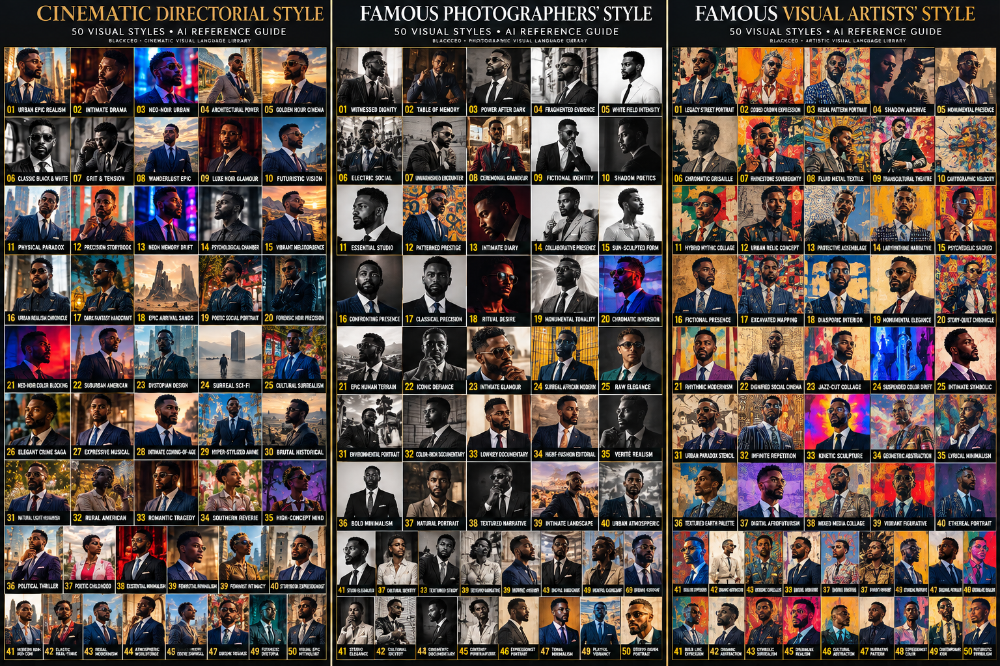

# BlackCEO Signature Image Intelligence & Prompt Creation Guide
## Page Art Direction Router + BlackCEO Secret Super Sauce Aesthetic Engine + Visual Reference Guide

**Version:** 5.0 | **Date:** October 1, 2026  
**Owner:** Trevor Otts / BlackCEO  
**Use:** Detailed visual-intelligence, art-direction, prompt-authoring, and QC instructions for individual images and typography-as-image assets used in standard and long-form signature funnel pages.  
**Primary technical authority:** The current onboarding repository's Graphics Image Protocol, Prompt Author, Prompt QC, and relevant Design Intelligence category rules.  
**Companion:** [BlackCEO Signature Landing Page Production and QC SOP](BlackCEO-Signature-Landing-Page-Production-and-QC-SOP-v1.md).
**Creative Direction libraries:** `BlackCEO-Famous-Photographers-DNA-Style-Library-v1.1.md`, `BlackCEO-Visual-Artists-AI-Style-Intelligence-Guide-v1.0.md`, and `BlackCEO-Cinematic-Image-Style-Systems-v2.0.md`. These are governed references; select one family/style per page, never all three.


**Quick navigation:** [Creative Director Mode](#creative-director-mode---mandatory-operating-stance) | [Visual Intelligence Stack](#the-blackceo-visual-intelligence-stack) | [Page Art Direction Router](#blackceo-page-art-direction-router---one-style-one-page) | [Visual Reference Guide](#blackceo-visual-reference-guide) | [Secret Super Sauce](#blackceo-secret-super-sauce---adaptive-aesthetic-engine) | [Engine/intake](#2-collect-only-the-missing-creative-decisions) | [Prompt anatomy](#4-the-canonical-ten-element-prompt-anatomy) | [Camera/lens/aperture](#6-camera-lens-aperture-framing-and-positioning-intelligence) | [Black Representation Intelligence](#7-human-expression-fashion-and-black-representation-intelligence) | [Color grade](#8-color-correction-and-deliberate-oversaturated-color-grading) | [Typography-as-image](#9-typography-as-image-visual-rhythm-and-anti-template-page-intelligence) | [Section intelligence](#10-write-for-the-actual-section-not-just-its-number) | [QC/repair](#12-assemble-count-qc-and-repair-the-actual-final-prompt) | [Pixel QC](#13-qc-and-repair-the-generated-pixels-not-just-the-prompt) | [Examples](#15-complete-teaching-prompts)

## Start here

Write a complete, image-specific production prompt, not a short wish list. The picture must perform the persuasive job assigned by the actual page copy and wireframe. It must also belong to the client's visual world. Neither beautiful generic photography nor a long prompt that describes the wrong scene passes. **By default, the finished visual must pass the active page-level Art Direction fidelity gate and the applicable BlackCEO Secret Super Sauce blend gate. If no external Art Direction is selected, the Secret Super Sauce is the default governing aesthetic.**

**Every individual final image prompt must use 95 to 100 percent of the chosen model's character maximum and never fall below 80 percent of it** (owner order 2026-10-05, `07-kie-setup/references/kie-common-rules.md` rule 12; this replaces the earlier 5,000-20,000 house range). The maximum comes from `python3 74-kie-live-adapter/scripts/kie_live_adapter.py prompt-budget --model <id>` (live schema, registry fallback), never from memory. For GPT Image 2.5 (maximum 20,000) the floor is 16,000 and the target is 19,000 to 20,000. This is not the combined length of the prompt document. Two short prompts do not become compliant by being put in one file. A prompt over the maximum fails. The same rule applies to complete replacement/edit prompts used to repair an image; do not quietly send a short repair instruction that discards the approved specification. Verbatim fields (text a model speaks or sings exactly) follow their own rule and have no floor.

The five teaching prompts near the end are shorter than this budget and are teaching models only; a real production prompt is expanded with real scene, light, material, crop and negative detail until it lands in the budget, never padded.

**One image-map entry -> one complete prompt -> one independently generated asset -> one correctly named file.** A page may need zero, one, or several images within a persuasive section. Image count comes from the actual layout inventory, not a forced twelve-image rule. One approved group photograph is one scene, not a collage. Desktop/mobile export crops of one master are distinguished from separately generated compositions.

The following sections are authoring instructions, not text to print on the images or website. Instructional fragments are explicitly labeled as fragments. Five complete, length-checked teaching prompts appear near the end; the fifth demonstrates typography-as-image. Do not use a fragment, template, or unresolved placeholder as a production prompt.


## Creative Director Mode - mandatory operating stance

Do not behave like a generic prompt helper, template filler, or stock-image selector. For this workflow, operate in **Creative Director Mode**: bring the judgment of a veteran creative director, art director, photographer, typographer, fashion stylist, and conversion-focused page designer. The point of the role is not to pretend the model has a human biography; the point is to enforce an unusually high creative standard.

The operating philosophy is simple: **attention is scarce, boring is a defect, generic AI aesthetics are a defect, and every visual choice must earn its place.** Refuse work that is merely clean, trendy, symmetrical, or technically competent when it still looks like a generic AI landing page. Make intentional decisions about composition, typography, color, lighting, subject, fashion, texture, scale, and emotional effect. A passing image should feel art-directed rather than auto-generated.

This creative stance never overrides the client's brief, the current Graphics SOP, safety rules, real-person identity requirements, model limits, or the QC gates in this guide. Creativity operates **inside** those boundaries.

## The BlackCEO Visual Intelligence Stack

Every generated asset is planned through the following intelligences. These are not separate prompts. They are lenses for making one coherent creative decision.

| Intelligence | What it decides |
|---|---|
| **Story Intelligence** | What emotional or persuasive job the image performs beside the current QC-passed copy. |
| **Brand Intelligence** | Which approved colors, materials, type personality, logo rules, and visual cues belong in the scene. |
| **Page Art Direction Intelligence** | Selects exactly one governing creative direction for the page: one photographic style, one cinematic/directorial style, one visual-artist style, or no external style. It locks the chosen visual grammar across the entire page. |
| **Style Fidelity Intelligence** | Converts the chosen style into hard page-level locks/anchors, prevents cross-style drift, and verifies that section-to-section variation still belongs to one coherent visual world. |
| **Composition Intelligence** | Focal hierarchy, negative space, asymmetry, thirds, crop safety, visual tension, and where the eye lands first. |
| **Positioning Intelligence** | The subject's specific zone in a 3x3 grid: upper/middle/lower x left/center/right, plus text-safe and CTA-safe zones. |
| **Camera Intelligence** | Shot distance, viewpoint, angle, orientation, motion treatment, and emotional purpose of the camera position. |
| **Lens Intelligence** | Full-frame-equivalent focal-length look, perspective compression/expansion, aperture intent, depth of field, focus plane, and bokeh quality. |
| **Lighting Intelligence** | Physical direction, size/quality of light, key/fill/rim relationship, shadow behavior, exposure priority, and skin/material rendering. |
| **Human Intelligence** | Expression, gaze, posture, gesture, hand safety, wardrobe, age, styling, and identity continuity. |
| **Black Representation Intelligence** | Specific Black/African-descended skin tone, undertone, hair construction, and, for illustrative Black men, facial-hair treatment when relevant. |
| **Fashion Intelligence** | Silhouette, materials, tailoring, cultural or editorial category, accessories, and how wardrobe carries brand color. |
| **Color-Grade Intelligence** | Hyper-saturation, contrast, tonal separation, selective color emphasis, protected skin, clean whites, rich blacks, and mood progression. |
| **Secret Super Sauce Intelligence** | Applies the Hyperchromatic Luxury Editorial DNA: hero-color authority, neutral architecture, black-point strength, controlled highlights, microtexture, focal microcontrast, sculptural lighting, tactile materials, restrained background complexity, and premium idealization. |
| **Typography-as-Image Intelligence** | When words themselves should become the visual; hierarchy, contrast, arrangement, spelling locks, safe margins, and restrained text effects. |
| **Set Distinctness Intelligence** | What must remain coherent across the page and what must change so neighboring assets never feel like variations of the same AI shot. |
| **Engine Intelligence** | Which generation engine/model is selected, its current verified limits, supported ratios, references, and output settings. |

### Strict rules versus creative freedom

The AI gets meaningful creative latitude, but not everywhere.

**Strict / non-negotiable:** the current QC-passed copy; client identity and real-person references; brand facts; exact required text; image-map slot and purpose; private-label exclusion; individual prompt-budget rule (95 to 100 percent of the model maximum, never below 80 percent); current runtime validator limits; actual supported aspect ratios and resolutions; spelling locks; skin/hair specificity when Black subjects are used; no demographic percentage defaults; safe margins; no text over faces; QC thresholds; three-attempt repair rule for failed work only; and, once chosen, exactly one page-level Creative Direction family plus exactly one branded style. Cross-family mixing and multi-style stacking are prohibited in this signature-page workflow. The Secret Super Sauce is the only default blend layer and is applied only where compatible.

**Creative / art-directable:** when the user delegates the choice, selection of the single best Creative Direction family and branded style; shot distance; angle; focal-length look when the active family uses optics; aperture intent when photographically meaningful; subject zone; lighting pattern; posture; wardrobe category; styling; environmental versus conceptual treatment; typography treatment; saturation emphasis; which supported aspect ratio best serves the wireframe; and whether a section is best served by a person, environment, object/still life, conceptual image, typography-as-image, or no generated image at all.

The creative decision must always be explainable in relation to the page's copy, layout, audience, and emotional arc.


## BlackCEO Page Art Direction Router - one style, one page

This router governs how the three BlackCEO style libraries work with the Secret Super Sauce. It exists to prevent a high-quality page from becoming a collage of unrelated aesthetics.

### The non-negotiable One-Style Rule

For a single signature page, activate **one and only one** external Creative Direction system:

1. **Photographic Direction** - select one branded style from the BlackCEO Famous Photographers DNA Style Library; or
2. **Cinematic / Directorial Direction** - select one branded style from the Cinematic Image Style Systems library; or
3. **Visual-Artist Direction** - select one branded style from the Famous Visual Artists AI Style Intelligence Guide; or
4. **No external direction** - the BlackCEO Secret Super Sauce becomes the primary aesthetic engine.

Do **not** combine a photographic style with a cinematic style. Do **not** combine a photographic style with a visual-artist style. Do **not** combine a cinematic style with a visual-artist style. Do **not** stack two branded styles from the same library. Any hybrid instructions that appear inside a companion library are inactive for the BlackCEO Signature Page workflow unless Trevor explicitly changes this master rule in a later revision.

The **BlackCEO Secret Super Sauce is not counted as a second style family**. It is the house aesthetic/quality layer that may enrich the one selected Creative Direction wherever the two are compatible.

### Family roles

| Family | What it primarily governs | When it is usually the strongest fit |
|---|---|---|
| **Photographic Direction** | Camera relationship, focal-length/depth behavior, lighting architecture, tonal/color behavior, pose, environment, texture, print/digital finish. | Pages that need human credibility, portrait authority, documentary/editorial realism, fashion photography, social observation, or a strongly photographic identity. |
| **Cinematic / Directorial Direction** | Story beat, camera placement, lens/space, production design, motivated lighting, color architecture, environment, character blocking, implied movement, scale and narrative tension. | Pages that should feel like one film world, where atmosphere, space, tension, story and production design matter as much as the subject. |
| **Visual-Artist Direction** | Composition, material/mark logic, palette, value, spatial logic, symbolism, conceptual engine, abstraction/figuration, surface and physical-making behavior. | Pages that benefit from metaphor, painting/collage/assemblage/stencil/graphic language, surreal construction, symbolic art, or a deliberately non-photographic visual world. |
| **Secret Super Sauce only** | Hyperchromatic luxury editorial rendering, contrast architecture, dimensional skin/materials, tactile texture, focal hierarchy and anti-generic finish. | When the client wants the BlackCEO house look without another named Creative Direction system. |

### Selection order

Use the following order. Do not jump to style selection before understanding the page.

1. **Lock the page facts.** Read the QC-passed copy, audience, offer, brand, image inventory, wireframe, required people/objects, identity references, typography needs and intended action.
2. **Honor an explicit choice.** If the user supplies a branded style or a source reference that maps to one of the libraries, use the corresponding branded system. The downstream image prompt receives the branded system and descriptive grammar, not the human source name.
3. **Honor an explicit family.** If the user says photographic, cinematic/directorial, or visual-artist but does not name a style, select only inside that family.
4. **If the owner explicitly writes that the choice is delegated** (intake field `creative_direction: "delegated"`), choose the family first. Decide whether the page's strongest organizing idea is photographic credibility, cinematic world/story, or visual-art/material/concept language. Absent that explicit delegation, no external style is selected and the page is `SECRET_SAUCE_ONLY`.
5. **Choose one branded style.** Compare candidates by page-story fit, brand fit, audience fit, emotional-arc fit, section versatility, representation compatibility, typography compatibility, engine feasibility, and ability to remain distinctive across the whole page.
6. **Lock the style for the page.** Once selected, do not switch style systems by section simply because another style seems convenient.
7. **Compile the Page Visual Bible.** Record the style's non-negotiable visual anchors, the Secret Sauce blend profile, continuity rules, allowed variation and anti-drift rules before authoring any production prompt.

### Plain-language intake question when direction is missing

Ask only when the answer is not already available:

> "Do you want one photographic direction, one cinematic/directorial direction, one visual-artist direction, or should I choose the best fit for this page? If you already know the branded style you want, tell me the name."

Do not make the client inspect all 149 systems unless they ask. The agent may shortlist internally and present a concise recommendation when the user delegates selection.

### Never use a second style to fill a missing dimension

A style family does not need to define every possible visual variable. Missing information is **not** permission to borrow another style.

- If a visual-artist system does not define a photographic lens, use neutral BlackCEO viewing/framing logic only if the generator needs it. Do not import a photographer or director style.
- If a cinematic system does not define painterly marks, do not borrow a visual-artist system. Use the cinematic material/texture rules plus the compatible Secret Sauce layer.
- If a photographic style does not define symbolic set language, use the page story, brand and Secret Sauce. Do not import a cinematic or visual-artist style.

This rule is the primary defense against accidental aesthetic soup.

### Page Visual Bible - mandatory style manifest

Create one private `PAGE-VISUAL-BIBLE` before the first image prompt. Every asset on the page inherits it.

```text
PAGE-VISUAL-BIBLE
PAGE: [page name]
ACTIVE_FAMILY: PHOTOGRAPHIC | CINEMATIC | VISUAL_ARTIST | SECRET_SAUCE_ONLY
ACTIVE_STYLE: [one branded style name]
STYLE_ID: [VDL / CIS / ART alias when available]
SELECTION_MODE: user-selected | agent-selected
CORE_INTENT: [one concise statement]

PAGE-LEVEL STYLE LOCKS / ANCHORS:
1. [signature anchor]
2. [signature anchor]
3. [signature anchor]
4. [signature anchor]
5. [signature anchor]

SECRET_SAUCE_BLEND_PROFILE:
- hero_color_chroma: FULL | ADAPT | SUPPRESS
- neutral_blackpoint_architecture: FULL | ADAPT | SUPPRESS
- skin_microtexture_and_depth: FULL | ADAPT | SUPPRESS
- controlled_highlights: FULL | ADAPT | SUPPRESS
- focal_microcontrast: FULL | ADAPT | SUPPRESS
- sculptural_lighting: FULL | ADAPT | SUPPRESS
- subject_background_separation: FULL | ADAPT | SUPPRESS
- tactile_material_rendering: FULL | ADAPT | SUPPRESS
- luxury_editorial_idealization: FULL | ADAPT | SUPPRESS
- restrained_background_complexity: FULL | ADAPT | SUPPRESS
- anti_generic_art_direction: FULL

CONTINUITY ANCHORS:
- palette corridor: [what must recur]
- light corridor: [what remains recognizably related]
- texture/material corridor: [what remains related]
- human representation corridor: [identity/hair/skin/fashion continuity]
- environment/set corridor: [recurring world logic]
- typography corridor: [how type-led images inherit the same world]

ALLOWED SECTION VARIATION:
[shot distance, angle, ratio, scene type, subject presence, intensity, environment, posture, expression, typography/image treatment]

PROHIBITED DRIFT:
[style-specific avoid rules + page-specific anti-template rules]
```

For the Photographic family, use the selected profile's five hard locks when supplied: composition, camera, light, palette/tonal behavior and subject behavior. For Cinematic systems, use the selected profile's five core anchors and compiler. For Visual-Artist systems, normalize the entry into five art locks: **core mechanism, composition/spatial logic, material/mark behavior, palette/light-value behavior, and concept/subject treatment**. Do not invent photographic EXIF-like specifications for a non-photographic art system unless the output method truly needs a viewing/capture instruction.

### Secret Sauce Blend Resolver

The selected Creative Direction controls its defining visual grammar. The Secret Super Sauce enriches that grammar where compatible. Resolve the blend **dimension by dimension**, not by averaging two styles into a generic midpoint.

For each Secret Sauce dimension, assign one status:

- **FULL** - the selected style is compatible; use the Secret Sauce treatment at normal BlackCEO strength.
- **ADAPT** - the selected style wants a different implementation; preserve the BlackCEO quality goal but translate its surface treatment into the selected style's language.
- **SUPPRESS** - the selected style's defining mechanism directly conflicts; do not force that Secret Sauce treatment into this page. Suppression is local to that dimension, not permission to turn off the rest of BlackCEO quality control.

#### Conflict examples

| Selected style requirement | Secret Sauce handling |
|---|---|
| Monochrome or near-monochrome is defining | `hero_color_chroma = SUPPRESS/ADAPT`; translate color authority into deep tonal architecture, rich midtones, controlled highlights and material separation. |
| Restrained or pastel color is defining | `hero_color_chroma = ADAPT`; keep color intentional and dimensional without forcing jewel-tone hyperchroma. |
| Flat/direct flash is defining | `sculptural_lighting = ADAPT/SUPPRESS`; preserve skin/material fidelity and controlled highlight behavior without replacing the flash logic with beauty lighting. |
| Broad even light is defining | Do not add dramatic rim/key separation merely to satisfy the Sauce. Preserve clarity, skin depth and tonal control inside the chosen light. |
| Deep focus/environmental readability is defining | `subject_background_separation = ADAPT`; separate through value, color, composition and hierarchy instead of forcing shallow bokeh. |
| Raw/minimal retouching is defining | `luxury_editorial_idealization = SUPPRESS`; keep microtexture, material credibility, tonal richness and anti-generic composition. |
| Grayscale or intentionally transformed skin is the concept | Preserve Black identity, hair, facial structure, dignity and dimensionality; allow the selected system's intentional chromatic transformation. Do not treat this as accidental ashiness. |
| Painterly/graphic flatness is defining | Translate depth/separation into figure-ground, value, edge, pattern, scale or mark hierarchy. Do not force photographic depth effects. |
| High saturation is already defining | Use the Secret Sauce containment logic: one dominant chromatic authority, supporting accents, protected neutrals/skin/materials, and no global color wash. |
| Gloomy, solemn or painful story beat | Reduce saturation territory and brightness without abandoning intentional color, tonal richness, readable skin/materials or art direction. |

### Conflict authority rule

When a real conflict exists, apply this order **for the affected dimension only**:

1. locked user/client factual requirement or identity requirement;
2. selected page-level Creative Direction's defining signature trait;
3. BlackCEO representation fidelity and dignity requirements, translated if the selected system intentionally changes color/material appearance;
4. compatible Secret Sauce treatment;
5. section-level creative preference.

Do not use this list to erase unrelated Secret Sauce qualities. A conflict in color is not a conflict in hair fidelity. A conflict in depth of field is not a conflict in material rendering.

### Style-family deployment rules

#### Photographic Direction

- Use exactly one VDL style block.
- Preserve its composition, camera, light, palette/tonal and behavior locks.
- Use technical focal-length/aperture language only when it produces the visible optical behavior the style needs.
- The Secret Sauce may enhance skin, hair, material, tonal depth, highlight control, microcontrast and premium finish only where those enhancements do not destroy the selected photographic grammar.
- If the library says restrained color, natural light, deep focus, raw retouching or direct flash, those are style-defining controls and must not be overwritten by default Sauce habits.

#### Cinematic / Directorial Direction

- Use exactly one CIS style block.
- Preserve subject/action locks and at least four of the five system anchors visibly; all five should be encoded unless a locked requirement conflicts.
- Let the cinematic system control camera placement, lens/space, motivated light, production design, environment, character direction and story-specific color architecture.
- Use the Secret Sauce to improve tactile realism, skin/material fidelity, tonal authority, contrast discipline and visual magnetism only when the style does not explicitly require another treatment.
- Do not reduce the cinematic system to a LUT or a few adjectives. The page should feel like one coherent production world.

#### Visual-Artist Direction

- Use exactly one branded art system.
- Preserve the selected system's composition, material/mark logic, palette, light/value, spatial logic and concept engine.
- For contemporary-reference systems, follow the source guide's independent-synthesis/originality rules: use broad formal principles without copying signature characters, famous compositions, exact motifs or protected source images.
- Do not force camera, lens, aperture or photographic bokeh language when the active system is fundamentally painterly, graphic, collage-based, sculptural or abstract. Use viewpoint, scale, perspective and edge/value logic instead.
- Apply the Secret Sauce only through compatible dimensions such as chromatic authority, black-point/neutral structure, tactile material richness, controlled highlights, figure-ground hierarchy, skin/hair fidelity when people are present and anti-generic visual force.

### Typography-as-image inside a locked style

Typography-as-image is a treatment type, **not a fourth style family** and not an excuse to change Creative Direction.

- Under a Photographic page direction, typography may inherit the style's palette, grain, contrast, material surface, negative-space behavior or photographed-sign/print logic without introducing another photographer or artist system.
- Under a Cinematic direction, typography may inherit production-design materials, title-card restraint, architectural geometry, practical-light color, weather or environmental texture from the active film world.
- Under a Visual-Artist direction, typography may inherit the active system's mark, material, palette, layering, spatial or collage behavior while remaining original and readable.
- Under Secret-Sauce-only pages, use the existing BlackCEO typography-as-image rules.

A typical page may still use one or two typography-led sections when appropriate. They must feel like deliberate interruptions **inside the same world**, not imported poster styles.

### Section variation without style drift

Harmony does not mean repetition. Across the page, deliberately vary:

- shot distance or viewing scale;
- camera angle or spatial viewpoint when the style permits it;
- subject position in the 3x3 grid;
- aspect ratio and crop architecture;
- person vs environment vs object/still life vs conceptual vs typography-as-image vs no generated image;
- posture, gaze and expression;
- color emphasis inside the locked palette corridor;
- environment or prop strategy;
- visual intensity as the emotional arc moves from pain to solution to outcome.

Do not vary the defining style grammar merely to make two adjacent images look different. Distinctness must happen **inside** the locked page world.

### Page-level style fidelity gate

Before any prompt is allowed to generate, verify:

1. Exactly one family is active.
2. Exactly one branded style is active.
3. The correct full style block was read from the correct companion library.
4. Human research/source names and source-work titles are not used as downstream style tokens.
5. The page-level locks/anchors are explicit and observable.
6. The Secret Sauce Blend Profile marks each important dimension FULL, ADAPT or SUPPRESS.
7. No prompt imports traits from another style family.
8. Section variation preserves the active style's signature.
9. The prompt can still communicate the intended visual grammar if the branded style name is deleted.
10. The result remains BlackCEO-level: intentional, representation-aware, non-template, materially credible and visually distinctive.

For Photographic and Cinematic families, at least four of five style locks/anchors must be visibly dominant in the result. For Visual-Artist systems, every required quality category in the selected system must score at least 8, and the five normalized art locks must remain legible. The signature-page workflow's **three focused repair attempts for failed work** supersede any shorter or unlimited local retry language inside a companion library.

### Companion library loading rule

Do not paste all style systems into every production prompt. Keep the three libraries as governed references and load only:

1. this master Image Intelligence guide;
2. the selected family's library;
3. the one selected style block;
4. the page's `PAGE-VISUAL-BIBLE`;
5. the current image entry.

This preserves the hyper-specific style intelligence without flooding the working context with 149 unrelated systems or inviting accidental cross-style contamination.

### Branded style indexes

The indexes below are navigation aids only. The descriptive style block in the companion library remains authoritative.

#### Photographic Direction - 49 systems

| ID | Branded style |
|---|---|
| `VDL-001` | **WITNESSED DIGNITY** |
| `VDL-002` | **TABLE OF MEMORY** |
| `VDL-003` | **POWER AFTER DARK** |
| `VDL-004` | **FRAGMENTED EVIDENCE** |
| `VDL-005` | **WHITE FIELD INTENSITY** |
| `VDL-006` | **ELECTRIC SOCIAL** |
| `VDL-007` | **UNVARNISHED ENCOUNTER** |
| `VDL-008` | **CEREMONIAL GRANDEUR** |
| `VDL-009` | **FICTIONAL IDENTITY** |
| `VDL-010` | **SHADOW POETICS** |
| `VDL-011` | **ESSENTIAL STUDIO** |
| `VDL-012` | **PATTERNED PRESTIGE** |
| `VDL-013` | **INTIMATE DIARY** |
| `VDL-014` | **COLLABORATIVE PRESENCE** |
| `VDL-015` | **SUN-SCULPTED FORM** |
| `VDL-016` | **CONFRONTING PRESENCE** |
| `VDL-017` | **CLASSICAL PRECISION** |
| `VDL-018` | **RITUAL DESIRE** |
| `VDL-019` | **MONUMENTAL TONALITY** |
| `VDL-020` | **CHROMATIC INVERSION** |
| `VDL-021` | **EPIC HUMAN TERRAIN** |
| `VDL-022` | **ICONIC DEFIANCE** |
| `VDL-023` | **INTIMATE GLAMOUR** |
| `VDL-024` | **PRIMARY SYMBOLISM** |
| `VDL-025` | **HUMAN COLOR** |
| `VDL-026` | **ORNATE SOVEREIGNTY** |
| `VDL-027` | **MIDNIGHT FLASH** |
| `VDL-028` | **CONSTRUCTED KINSHIP** |
| `VDL-029` | **HAUNTED COLLODION** |
| `VDL-030` | **PASTORAL FREEDOM** |
| `VDL-031` | **HUMAN EVIDENCE** |
| `VDL-032` | **BEAUTIFUL PRIDE** |
| `VDL-033` | **POP REVELATION** |
| `VDL-034` | **STREET CEREMONY** |
| `VDL-035` | **RAW ELEGANCE** |
| `VDL-036` | **ARCHIVE OF SELF** |
| `VDL-037` | **GEOMETRIC INSTINCT** |
| `VDL-038` | **SITE OF MEMORY** |
| `VDL-039` | **SYSTEM PANORAMA** |
| `VDL-040` | **DREAMED IDENTITY** |
| `VDL-041` | **PLAYFUL PROVOCATION** |
| `VDL-042` | **REGAL PATTERN SOVEREIGNTY** |
| `VDL-043` | **HYPERREAL SATIRE** |
| `VDL-044` | **POP ICON RECODE** |
| `VDL-045` | **EDITORIAL METAMORPHOSIS** |
| `VDL-046` | **INTIMATE INDUSTRY** |
| `VDL-047` | **CRAFTED WONDER** |
| `VDL-048` | **COSMIC BODY** |
| `VDL-049` | **SHADOW ABSTRACTION** |

#### Visual-Artist Direction - 50 systems

| ID | Branded style |
|---|---|
| `ART-01` | **LEGACY STREET PORTRAIT** |
| `ART-02` | **CODED CROWN EXPRESSION** |
| `ART-03` | **REGAL PATTERN PORTRAITURE** |
| `ART-04` | **SHADOW ARCHIVE TABLEAU** |
| `ART-05` | **MONUMENTAL BLACK PRESENCE** |
| `ART-06` | **CHROMATIC GRISAILLE PORTRAIT** |
| `ART-07` | **RHINESTONE RETRO SOVEREIGNTY** |
| `ART-08` | **FLUID METAL TEXTILE** |
| `ART-09` | **TRANSCULTURAL COSTUME THEATRE** |
| `ART-10` | **CARTOGRAPHIC VELOCITY FIELD** |
| `ART-11` | **HYBRID MYTHIC COLLAGE** |
| `ART-12` | **URBAN RELIC CONCEPTUALISM** |
| `ART-13` | **PROTECTIVE SPECTACLE ASSEMBLAGE** |
| `ART-14` | **LABYRINTHINE SKIN NARRATIVE** |
| `ART-15` | **PSYCHEDELIC SACRED PATTERN** |
| `ART-16` | **FICTIONAL PRESENCE PAINTING** |
| `ART-17` | **EXCAVATED URBAN MAPPING** |
| `ART-18` | **DIASPORIC INTERIOR TRANSFER** |
| `ART-19` | **MONUMENTAL STREET ELEGANCE** |
| `ART-20` | **STORY-QUILT CHRONICLE** |
| `ART-21` | **RHYTHMIC NARRATIVE MODERNISM** |
| `ART-22` | **DIGNIFIED SOCIAL CINEMA** |
| `ART-23` | **JAZZ-CUT MEMORY COLLAGE** |
| `ART-24` | **SUSPENDED COLOR DRIFT** |
| `ART-25` | **INTIMATE SYMBOLIC REALISM** |
| `ART-26` | **FRACTURED VIEWPOINT CONSTRUCTION** |
| `ART-27` | **PRECISION DREAM LOGIC** |
| `ART-28` | **SERIAL POP TRANSFER** |
| `ART-29` | **ATMOSPHERIC LIGHT MOSAIC** |
| `ART-30` | **IMPASTO EMOTIONAL CURRENT** |
| `ART-31` | **URBAN PARADOX STENCIL** |
| `ART-32` | **INFINITE REPETITION FIELD** |
| `ART-33` | **KINETIC ALL-OVER TRACE** |
| `ART-34` | **MAGNIFIED ORGANIC ESSENTIALISM** |
| `ART-35` | **QUIET VISUAL PARADOX** |
| `ART-36` | **GILDED ORNAMENTAL FIGURE** |
| `ART-37` | **FLAT POP MYTHOS** |
| `ART-38` | **MIRROR-FINISH MONUMENTAL POP** |
| `ART-39` | **LUMINOUS MULTI-PERSPECTIVE MODERNISM** |
| `ART-40` | **BAROQUE HEROIC CHIAROSCURO** |
| `ART-41` | **TENEBRIST IMMEDIATE DRAMA** |
| `ART-42` | **CUT-COLOR ARABESQUE** |
| `ART-43` | **CINEMATIC SOLITUDE REALISM** |
| `ART-44` | **PANORAMIC MORAL FANTASIA** |
| `ART-45` | **ANGULAR NERVOUS FIGURATION** |
| `ART-46` | **DISTORTED EXISTENTIAL CHAMBER** |
| `ART-47` | **GESTURAL FIGURE-FIELD COLLISION** |
| `ART-48` | **LUMINOUS EMOTIONAL FIELD** |
| `ART-49` | **PSYCHOLOGICAL DOMESTIC MONUMENT** |
| `ART-50` | **CONCEPTUAL CRAFT DISRUPTION** |

#### Cinematic / Directorial Direction - 50 systems

| ID | Branded style |
|---|---|
| `CIS-01` | **SOVEREIGN HUMAN LIGHT** |
| `CIS-02` | **PHYSICAL PARADOX CINEMA** |
| `CIS-03` | **URBAN VOLTAGE FRAMING** |
| `CIS-04` | **PRECISION STORYBOOK GEOMETRY** |
| `CIS-05` | **SOCIAL DREAD REALISM** |
| `CIS-06` | **PULP DEEP-FRAME CINEMA** |
| `CIS-07` | **RADIANT INTERIORISM** |
| `CIS-08` | **CHROMATIC GOTHIC HUMANISM** |
| `CIS-09` | **INTIMATE EPIC REALISM** |
| `CIS-10` | **LUMINOUS ISOLATION** |
| `CIS-11` | **TACTILE SEVERITY** |
| `CIS-12` | **LIVING MEMORY NATURALISM** |
| `CIS-13` | **EMBODIED LIGHT REALISM** |
| `CIS-14` | **DOMESTIC UNCANNY NOIR** |
| `CIS-15` | **STREET PULSE CINEMA** |
| `CIS-16` | **SOMATIC SPIRAL** |
| `CIS-17` | **COMPOSED HERITAGE RADIANCE** |
| `CIS-18` | **NEON MEMORY DRIFT** |
| `CIS-19` | **PRESSURE-POINT REALISM** |
| `CIS-20` | **ELASTIC ABSURDIST OPTICS** |
| `CIS-21` | **NEIGHBORHOOD WITNESS REALISM** |
| `CIS-22` | **SOCIAL GEOMETRY ENGINE** |
| `CIS-23` | **GULF GOTHIC REVERIE** |
| `CIS-24` | **MONOLITHIC ATMOSPHERE** |
| `CIS-25` | **GRIOT SOCIAL CLARITY** |
| `CIS-26` | **POP CHIAROSCURO MELODRAMA** |
| `CIS-27` | **LIBERATION COLLAGE** |
| `CIS-28` | **WANDERING CINECRITURE** |
| `CIS-29` | **ARCHIVE-TRUTH REMIX** |
| `CIS-30` | **RAW SUBLIME FRICTION** |
| `CIS-31` | **SOVEREIGN ANGLE CINEMA** |
| `CIS-32` | **FORENSIC NOIR PRECISION** |
| `CIS-33` | **EVERYDAY POETIC WITNESS** |
| `CIS-34` | **OPERATIONAL IMMERSION** |
| `CIS-35` | **INVITATIONAL DISTANCE** |
| `CIS-36` | **SUBURBAN DREAM BREACH** |
| `CIS-37` | **TIDAL HAUNT REALISM** |
| `CIS-38` | **ORNATE GAZE MECHANICS** |
| `CIS-39` | **ANCESTRAL TIDE LYRISM** |
| `CIS-40` | **STORYBOOK EXPRESSIONIST GOTHIC** |
| `CIS-41` | **SAHEL SURREAL MONTAGE** |
| `CIS-42` | **ELASTIC REAL-TIME IMMERSION** |
| `CIS-43` | **DIGNIFIED HUMAN FOCUS** |
| `CIS-44` | **ATMOSPHERIC WORLDFORGE** |
| `CIS-45` | **CHADIAN LUMINOUS MINIMALISM** |
| `CIS-46` | **SENSUAL LANDSCAPE INTERIORISM** |
| `CIS-47` | **HISTORIC COUNTER-MONTAGE** |
| `CIS-48` | **FRAGMENTED SENSORY MEMORY** |
| `CIS-49` | **EQUATORIAL CIVIC WITNESS** |
| `CIS-50` | **PSYCHOLOGICAL FACE CHAMBER** |

## BlackCEO Visual Reference Guide

The image below is the **BlackCEO Visual Reference Guide**. It is the visual companion to the written Creative Direction libraries and the Page Art Direction Router. Its job is to let a human reviewer or AI agent see, at a glance, how the three selectable direction families can differ in composition, camera treatment, lighting, color, texture, environment, subject treatment, material language, and overall emotional register.

**How to use it:**

- Use the board for **visual orientation and comparison**, not as a substitute for the detailed written style block.
- For any production page, activate **one family and one branded style only**: Cinematic/Directorial, Photographic, or Visual-Artist. Never mix those three families on the same page unless Trevor explicitly changes this master rule.
- Once a direction is selected, keep it locked across the page so the hero, supporting imagery, typography-as-image moments, and final CTA all belong to the same visual world.
- Blend in the **BlackCEO Secret Super Sauce** wherever it is compatible. If a Sauce treatment conflicts with a defining trait of the selected direction, the selected direction wins for that dimension while the remaining compatible BlackCEO quality rules stay active.
- Use the visual board to understand the intended **difference in visual language**, then use the selected library's written instructions to author the actual production prompt.
- If any label, numbering detail, or visual shorthand in the reference board conflicts with the current written library, **the written library and its exact style ID/name remain authoritative**.

### Master visual reference board



### Visual-reference operating rule

The reference image is deliberately **not** a prompt template. It is a visual calibration aid. A production agent should never copy only the visible colors or surface effects from a tile and call the style complete. It must still load the corresponding written style block and preserve the governing visual grammar: composition, viewpoint or spatial logic, lens/depth behavior when applicable, lighting architecture, tonal/color system, subject behavior, environment/set language, texture/materiality, emotional register, and finish. The visual reference helps the agent recognize the destination; the written intelligence explains how to get there.

---

## BlackCEO Secret Super Sauce - adaptive aesthetic engine

This subsystem is the **BlackCEO Secret Super Sauce**. When no external Creative Direction is selected, it is the primary BlackCEO aesthetic engine. When one Photographic, Cinematic/Directorial, or Visual-Artist system is selected, the Secret Sauce becomes an **adaptive house layer**: preserve every compatible quality, translate what can be translated, and suppress only the dimensions that would damage the chosen style. It must never flatten 149 distinct visual systems into one generic house filter.

The compatible dimensions of the Secret Super Sauce should be applied by default to people, products, objects, environments, typography-as-image, architecture, food, vehicles, and other subjects through the appropriate genre translation. The goal is **shared BlackCEO quality DNA without making every image look identical or erasing the active Creative Direction**. Its full-strength reference mode uses selective hyperchroma, deep black-point architecture, preserved texture, sculptural light, strong dimensional separation, tactile materials, focal microcontrast, and premium editorial idealization; the Page Visual Bible determines which of those dimensions are FULL, ADAPT or SUPPRESS.

### Context-sensitive mood rule

The BlackCEO aesthetic does **not** mean every image must feel cheerful, bright, or equally saturated. A gloomy, painful, reflective, solemn, or tense scene may reduce the *amount* and *brightness* of the hero color, use darker jewel tones, heavier black architecture, cooler or lower-key light, and smaller areas of high chroma. When the active style is monochrome, restrained, pastel, raw or otherwise color-limited, preserve rich **tonal/material information** instead of forcing rich color. In every case preserve dimensional skin/materials when applicable, intentional hierarchy, readable shadows and a deliberate finish. **Mood may reduce chroma or brightness; it does not authorize accidental mud, lifelessness, generic stock treatment or unart-directed desaturation.**

### Priority and conflict rule

Use the Secret Super Sauce at full strength when no external style is selected or when the active style is fully compatible. When one page-level Creative Direction is active, use the Page Visual Bible and Secret Sauce Blend Profile above. If a dimension conflicts, the selected style controls that dimension; all compatible Sauce qualities stay active. Never respond to one conflict by disabling the whole BlackCEO quality system.

### How it fits the existing guide

The canonical Graphics ten-element prompt anatomy remains the **structure**. The BlackCEO Visual Intelligence Stack remains the **decision framework**. The Page Art Direction Router selects and locks the one governing visual system. The Secret Super Sauce then fills or enriches style, color, lighting, material, skin, texture, contrast and finish decisions only where compatible. None of these layers replaces the current Graphics SOP, prompt-length rules, engine validation, identity rules or independent QC.

**Important:** Any templates or short test prompts preserved in this subsection are calibration tools, not finished production prompts. Every real signature-page image still requires one complete prompt per generated asset, sized to the KIE prompt budget.

### The detailed BlackCEO Secret Super Sauce system


**Calibration status:** Finalized after blind fresh-chat testing with both human and non-human subjects.  

**Purpose:**  
This document defines a reusable image-styling intelligence system for creating imagery with the rich color, deep contrast, polished skin, strong dimensionality, and luxury editorial finish originally calibrated from visually distinctive Midjourney V5.1–V6.1-era outputs and now used as a vendor-neutral BlackCEO visual-language system.

This is **not a vendor feature or parameter specification**. It began as a visual-language study of distinctive Midjourney-era outputs, but the rules below are now treated as vendor-neutral BlackCEO art direction, not Midjourney syntax. It is a visual-language framework built from studying reference images and identifying the repeatable aesthetic decisions that make them feel powerful, expensive, hyper-vibrant, polished, and unmistakably stylized.

The goal is not to make every image look identical. The goal is to make different images share the **same visual DNA**.

---

### 1. THE CORE AESTHETIC

The target aesthetic is best described as:

> **Hyperchromatic Luxury Editorial Realism**

It combines:

- luxury beauty and fashion campaign photography
- cinematic contrast
- selective hyper-saturation
- deep, inky blacks
- polished but textural skin
- controlled specular highlights
- extreme subject/background separation
- high local contrast and microcontrast
- sculptural composition
- subtle fashion-illustration perfection
- rich, dimensional color rather than flat brightness

The result should feel:

**bold, expensive, commanding, polished, saturated, dimensional, glamorous, modern, tactile, cinematic, and visually magnetic.**

---

### 2. THE MOST IMPORTANT PRINCIPLE

#### Contrast is the engine. Color is the weapon.

Do **not** simply oversaturate the entire image.

The reference aesthetic works because highly saturated colors are placed against:

- deep blacks
- clean whites
- charcoal
- gray
- rich skin tones
- dark hair
- restrained neutral areas

This contrast makes the hero colors feel even more powerful.

The correct strategy is:

> **Aggressively saturate selected hero colors while protecting neutrals, skin, whites, blacks, and shadow detail.**

This is **selective saturation**, not uniform saturation.

---

### 3. COLOR INTELLIGENCE

#### 3.1 Use one dominant hero color

Most successful images in this aesthetic are organized around one major color family.

Examples:

- ruby red
- crimson
- carmine
- cobalt blue
- saturated cyan
- deep teal
- emerald
- violet
- royal purple
- saffron
- marigold
- burnt orange
- saturated gold

The hero color should feel unusually pure, dense, and authoritative.

Avoid weak language such as:

- colorful
- bright
- vibrant

Prefer stronger language such as:

- exceptionally rich high-chroma color
- dense pigment-like saturation
- pure jewel-tone color
- powerful color density
- richly saturated primaries
- luminous color volume
- deep chromatic intensity
- color with visual authority

---

#### 3.2 Add one supporting color

A second color may support the hero hue.

Strong combinations include:

- crimson + black
- ruby + gold
- teal + white
- cobalt + mustard
- violet + orange
- purple + black
- red + saffron
- cyan + charcoal
- emerald + gold
- magenta + deep blue

Do not automatically make the image rainbow-colored.

The visual system is usually strongest when it uses:

> **one dominant color + one supporting color + strong neutrals**

---

#### 3.3 Preserve neutral zones

Neutral zones make saturation feel expensive.

Useful neutrals:

- black
- charcoal
- white
- ivory
- gray
- warm brown
- natural skin
- dark wood
- restrained metallic tones

The eye needs somewhere to rest.

If every object is saturated, the image loses hierarchy.

---

### 4. BLACKS AND SHADOWS

Deep blacks are essential.

Use:

- inky blacks
- velvet blacks
- rich shadow density
- strong black-point contrast
- dimensional dark tones
- preserved shadow detail

Do **not** crush all shadow information.

Black hair should still show strands and shape.

Dark clothing should still show seams and fabric texture.

Dark skin should remain dimensional and chromatically rich.

The target is:

> **very deep blacks with preserved internal texture**

not:

> featureless black holes.

---

### 5. SKIN INTELLIGENCE

The skin treatment is one of the defining characteristics of this aesthetic.

It should not look like raw documentary photography.

It should look like:

> **luxury beauty-editorial realism**

#### 5.1 Preserve microtexture

The skin should retain:

- pores
- fine texture
- subtle facial surface variation
- delicate natural detail

But the overall complexion should remain polished.

Use the instruction:

> **Preserve fine skin microtexture while maintaining polished, flawless macro-level complexion.**

This means:

- realistic small detail
- idealized larger skin appearance

---

#### 5.2 Avoid plastic skin

Do not create:

- wax skin
- doll skin
- porcelain smoothing
- CGI plastic
- blurred pores
- over-airbrushed cheeks

Skin may be perfected, but it should still feel tactile.

---

#### 5.3 Melanated skin must retain chromatic depth

For darker skin tones, explicitly protect:

- warm brown depth
- golden undertones
- subtle red undertones
- rich tonal transitions
- reflective luminosity
- full color density

Use:

> **Rich melanated skin tones with full chromatic depth, warm brown, golden, and subtle red undertones; never gray, ashy, muddy, dull, or desaturated.**

---

### 6. SPECULAR HIGHLIGHTS AND LUMINOSITY

The faces in this aesthetic are not flat matte.

Use controlled highlights on:

- cheekbones
- bridge of nose
- forehead
- lips
- eyelids
- jewelry
- glasses
- metallic accessories

The goal is:

> **controlled luminous specular highlights**

not:

- oily skin
- sweaty skin
- blown-out white patches

Glossy lips and reflective accessories are especially useful because they give the image dimensionality.

---

### 7. LIGHTING

Lighting should feel deliberate and sculptural.

Useful descriptions:

- dimensional beauty lighting
- controlled studio key light
- sculpting facial light
- strong but elegant tonal separation
- cinematic edge light
- subtle rim light
- luminous highlights
- directional softbox quality
- controlled shadow shaping

The subject should feel carved out of the frame.

Avoid completely flat illumination.

---

### 8. SUBJECT/BACKGROUND SEPARATION

The subject should visually detach from the background.

Create separation using:

- tonal contrast
- color contrast
- rim light
- edge light
- depth of field
- darker background behind lighter subject
- lighter background behind darker subject
- selective sharpness
- atmospheric falloff

The image should have clear visual layers:

1. background
2. subject
3. face / focal detail

This creates the almost three-dimensional quality visible in the references.

---

### 9. SHARPNESS

Do not sharpen the entire frame equally.

The preferred aesthetic is:

> **selective precision**

The focal areas may be extremely crisp:

- eyes
- lashes
- lips
- facial contours
- hair
- jewelry
- fabric
- glasses
- microphone
- accessories

The background may become softer.

Use:

> **razor-defined focal subject with controlled depth falloff and creamy background separation**

Avoid:

- uniform digital crispness
- crunchy sharpening halos
- hyper-detailed background competing with the face

---

### 10. MICROCONTRAST

Microcontrast is extremely important.

It gives small details more separation without ruining smooth larger tonal areas.

Increase local definition in:

- hair strands
- brows
- eyelashes
- lip texture
- jewelry
- fabric fibers
- eyeglass frames
- reflective objects
- skin texture

Use:

> **high local contrast and microcontrast with smooth broad tonal transitions**

This is one of the best descriptions of the look.

---

### 11. FACIAL AND BEAUTY RENDERING

Faces should feel:

- photoreal
- glamorous
- sculptural
- commanding
- slightly idealized
- immaculately styled

The target sits between:

**high-end beauty photography + fashion advertising + subtle fashion illustration**

Useful phrase:

> **Hyperreal luxury beauty photography with subtle fashion-illustration perfection.**

That means the face can be exceptionally beautiful and composed without turning into a cartoon or obvious CGI render.

---

### 12. MAKEUP

Makeup should be clean and intentional.

Possible characteristics:

- precise lashes
- strong brows
- dimensional eye makeup
- rich lip color
- reflective gloss
- controlled highlights
- clean edges
- sophisticated color coordination

Makeup should reinforce the hero palette.

For example:

- orange background → warm metallic or orange eye accents
- purple wardrobe → plum or violet lip
- red fashion → crimson or burgundy lip
- teal styling → controlled cool eye accents

---

### 13. HAIR

Hair should behave as a graphic shape.

Prioritize:

- strong silhouette
- rich blacks or highly intentional color
- detailed strand structure where visible
- sculptural volume
- clean separation from background
- controlled highlights

Hair should add to the composition, not merely sit on the head.

---

### 14. MATERIALS AND SURFACE QUALITY

Materials should feel tactile.

Examples:

- velvet should feel dense
- leather should have controlled sheen
- metal should reflect sharply
- crystals should sparkle
- glass should refract
- satin should glow
- wool should retain fibers
- hair should catch light
- lips should appear dimensional

Use:

> **tactile material rendering with realistic reflective behavior and premium editorial polish**

---

### 15. COMPOSITION

The references tend to feel visually commanding because composition is simple and intentional.

Common traits:

- strong center weighting
- clear focal subject
- clean silhouette
- bold negative space
- symmetrical or near-symmetrical balance
- strong graphic shapes
- simple background architecture
- limited visual clutter
- direct visual hierarchy

The image should read immediately at thumbnail size.

---

### 16. DEPTH

Avoid a totally flat poster-like render unless intentionally desired.

Create depth through:

- foreground/background scale
- controlled blur
- tonal falloff
- edge lighting
- reflected light
- dimensional facial shadows
- specular highlights
- atmospheric separation

The subject should feel physically present.

---

### 17. WHAT THIS STYLE IS NOT

This style is **not**:

- pastel
- faded
- low contrast
- vintage-film washed out
- soft beige influencer photography
- muted editorial minimalism
- gray and lifeless
- oversaturated rainbow color
- fluorescent neon everywhere
- generic HDR
- plastic CGI
- waxy skin
- heavy haze
- flat natural-light photography

---

### 18. NEGATIVE STYLE CONTROL

**Integration rule:** Treat the block below as the *aesthetic defect vocabulary*. Deliver negatives using the current Graphics Negative Prompting SOP for the selected engine. Do not invent a separate `negative_prompt` field when the engine does not support one, and do not use obsolete Midjourney syntax.

Use this negative block when the model supports negative instructions:

> Avoid pastel grading, washed-out colors, muted fashion palettes, gray shadows, muddy browns, dull skin, ashy skin, desaturated melanated skin, flat lighting, low-contrast photography, excessive haze, uniform saturation across every object, uncontrolled neon, rainbow color overload, plastic CGI skin, wax skin, porcelain skin smoothing, excessive airbrushing, HDR halos, crunchy oversharpening, clipped highlights, crushed featureless blacks, muddy shadow detail, weak subject separation, flat composition, and generic stock-photo styling.

---

### 19. MASTER STYLE BLOCK

**Integration rule:** This is the default BlackCEO Secret Super Sauce style foundation for signature-page imagery when the brief does not require another aesthetic. Adapt it to the actual scene, emotional role, brand, and selected engine. Do not let a reusable block override identity, copy, aspect ratio, or section purpose.

The following block can be appended to a scene prompt.

> **Hyperchromatic luxury editorial realism with exceptionally rich high-chroma color, dense pigment-like saturation, powerful color authority, and dramatic luxury beauty-campaign polish. Use one dominant hero hue and one supporting accent hue, surrounded by deep blacks, pristine whites, charcoal, or restrained neutrals rather than distributing saturation equally throughout the frame. Hero colors should appear extraordinarily rich, pure, dimensional, and jewel-like. Deep inky blacks and strong black-point contrast should amplify the color while preserving texture and information inside dark hair, dark clothing, and shadow areas.**
>
> **Render skin as luxury beauty-editorial realism: preserve genuine fine skin microtexture, pores, and subtle surface detail while maintaining a polished macro-level complexion and smooth tonal transitions. Preserve rich chromatic skin depth, warm brown, golden, and subtle red undertones where appropriate; never allow skin to become gray, ashy, dull, muddy, or desaturated. Do not erase pore structure with beauty-filter smoothing. Use controlled luminous specular highlights across cheekbones, nose, forehead, lips, and reflective surfaces to create dimensionality without oily shine or plastic smoothing.**
>
> **Use extremely strong local contrast and microcontrast in the focal details, balanced by smooth broad tonal gradients. Keep the focal subject razor-defined with controlled depth falloff, rich subject/background separation, and selective sharpness rather than uniform sharpening. Preserve deep black anchors, brilliant controlled highlights, and visible neutral breathing room so the hero hue does not become a global color wash. For non-human subjects, translate the same color, contrast, lighting, and material intelligence into premium subject-appropriate realism rather than cartoon or mascot styling. Blend high-end editorial photography, cinematic dimensional lighting, tactile material rendering, and subtle idealization. The final image should feel expensive, commanding, tactile, saturated, sculptural, polished, and visually magnetic.**

---

### 20. SHORT STYLE BLOCK

**Integration rule:** This compressed block is an aesthetic shorthand for routes that genuinely require brevity. It is *not* permission for a signature-page production prompt to fall below the KIE prompt-budget floor (80 percent of the model's character maximum; rule 12).

When prompt length must be shorter, use:

> **Hyperchromatic luxury editorial realism; dense jewel-tone color; selective high-chroma hero hues; deep inky blacks; strong black-point contrast; protected neutrals; rich dimensional skin tones; visible fine skin microtexture with polished macro complexion; luminous controlled specular highlights; high microcontrast; sculptural beauty lighting; razor-defined focal subject; creamy depth falloff; strong subject/background separation; tactile materials; subtle fashion-illustration perfection; premium beauty-campaign finish.**

---

### 21. PROMPT-BUILDING ORDER

For consistent results, build prompts in this order:

#### Layer 1 — Subject
Who or what is in the image?

Example:

> A confident Black woman in her forties wearing a sharply tailored crimson suit.

#### Layer 2 — Composition
How is the subject framed?

Example:

> Centered waist-up portrait, direct gaze, sculptural pose, clean symmetrical framing.

#### Layer 3 — Environment
Where is the subject?

Example:

> Against a deep charcoal studio wall with minimal visual clutter.

#### Layer 4 — Hero Color
What color controls the image?

Example:

> Crimson is the dominant hero color, supported by black and subtle gold.

#### Layer 5 — Lighting
How is the subject illuminated?

Example:

> Strong dimensional beauty lighting with controlled cheek highlights and subtle edge separation.

#### Layer 6 — Skin
How should skin render?

Example:

> Fine visible skin microtexture with polished beauty-editorial complexion and warm, chromatically rich undertones.

#### Layer 7 — Material Detail
What surfaces should feel tactile?

Example:

> Dense wool tailoring, glossy lips, reflective gold earrings, individually defined hair strands.

#### Layer 8 — Master Style Block
Append the reusable style intelligence.

---

### 22. STYLE REASONING ENGINE / EXECUTION PROTOCOL

This section is the **decision-making layer** of the system.

The preceding sections define the visual ingredients of the aesthetic. This section defines **how an image model or creative agent should apply those ingredients to a completely new request with no prior conversation context**.

This is not hidden reasoning. It is an explicit visual execution protocol.

The goal is to prevent the model from treating this document as a list of adjectives. The model should actively translate every new scene into the Hyperchromatic Luxury Editorial Intelligence by making a sequence of deliberate styling decisions.

#### STEP 1 — IDENTIFY THE SUBJECT AND VISUAL PRIORITY

Determine:

- who or what the main subject is
- what must visually dominate the image
- the requested framing
- the intended mood
- the most important visible attributes

Do not style secondary objects before the focal subject is clear.

The subject must remain the strongest visual priority in the final frame.

---

#### STEP 2 — IDENTIFY OR CREATE THE HERO COLOR

Look for the strongest color already implied by the user's request.

Examples:

- pink sunglasses → pink can become the hero hue
- cobalt suit → cobalt becomes the hero hue
- red dress → red becomes the hero hue
- purple lipstick → purple may become the hero hue if compositionally appropriate

If no color is specified, intelligently choose one that supports the subject, mood, wardrobe, environment, and desired emotional effect.

Then deliberately elevate that hue.

The hero color should receive:

- the highest chroma
- the richest pigment density
- the most visual authority
- the cleanest color separation
- the strongest saturation emphasis

Do not distribute maximum saturation equally across the entire image.

---

#### STEP 3 — CHOOSE ONE SUPPORTING ACCENT COLOR

Select one compatible accent hue that enhances the hero color without competing with it.

Examples:

- pink + gold
- red + black
- teal + white
- cobalt + warm gold
- violet + burnt orange
- emerald + gold
- saffron + crimson

The accent color should support the composition and create luxury, contrast, or dimensionality.

**The accent must occupy less visual territory than the hero color.** It should function as punctuation, not become a second competing color system.

Do not automatically introduce many unrelated colors.

---

#### STEP 4 — BUILD THE NEUTRAL CONTRAST ARCHITECTURE

Introduce restrained neutrals to make the hero color feel more powerful.

Useful anchors include:

- black
- charcoal
- white
- ivory
- gray
- deep brown
- dark hair
- restrained metallics

The neutrals are not empty space. They are part of the color strategy.

Their purpose is to create chromatic contrast and visual hierarchy.

The model should ask:

> What neutral areas will make the hero color feel richer, cleaner, and more expensive?

##### Hero-Color Containment Rule

Do not let the hero color consume every major plane in the frame.

If the hero color already dominates two large visual surfaces — for example **wardrobe + chair**, **subject + background**, or **vehicle + environment** — force at least one other major plane into black, charcoal, white, deep brown, restrained metallic, or another low-chroma neutral.

This prevents the image from becoming a single-color wash and preserves the premium contrast architecture.

---

#### STEP 5 — PROTECT SKIN FROM GLOBAL SATURATION

Never apply the hero-color saturation logic directly to skin.

Skin should remain:

- warm
- dimensional
- chromatically rich
- believable
- polished
- textural

For melanated skin, preserve:

- deep brown tonal density
- golden undertones
- subtle red undertones
- warm reflected light
- natural tonal transitions

The hero color may reflect subtly into the skin through lighting, but it must not contaminate the complexion.

Do not allow skin to become:

- magenta
- orange
- gray
- ashy
- muddy
- fluorescent
- uniformly saturated

---

#### STEP 6 — ESTABLISH THE BLACK POINT WITHOUT DESTROYING DETAIL

Create deep, inky black anchor points.

Possible locations:

- hair
- wardrobe
- background
- shadows
- eyeglasses
- furniture
- negative space

The image should have a confident black point because deep blacks dramatically increase the perceived richness of surrounding color.

However:

> Deep does not mean empty.

Preserve visible detail inside:

- black hair
- dark fabric
- shadowed skin
- dark furniture
- dark backgrounds

The target is **deep black density with readable internal texture**.

---

#### STEP 7 — SCULPT THE SUBJECT WITH BEAUTY-EDITORIAL LIGHTING

Lighting must create form.

Use light to reveal:

- cheekbones
- jaw structure
- lips
- nose
- forehead
- hair volume
- wardrobe structure
- jewelry
- body shape

Favor:

- directional beauty lighting
- controlled studio key light
- soft but sculptural fill
- selective edge light
- dimensional shadow placement
- strong tonal modeling

Avoid flat, evenly illuminated portrait lighting unless the concept specifically requires it.

Avoid bathing the entire scene in one color temperature. Even in a warm or cool image, preserve **temperature separation** between skin, highlights, shadows, and background so the image does not collapse into a single orange, blue, or magenta wash.

The subject should appear physically carved out of the frame.

---

#### STEP 8 — PLACE CONTROLLED SPECULAR HIGHLIGHTS

Deliberately create small areas of luminous reflection.

Priority locations:

- cheekbones
- bridge and tip of nose
- lips
- eyelids
- jewelry
- glasses
- metallic accessories
- glossy hair
- satin or leather
- reflective props

These highlights create the luxurious, three-dimensional, polished finish.

They should be:

- bright
- clean
- controlled
- intentional

They should not become:

- oily
- sweaty
- blown out
- plastic
- metallic across the entire face

---

#### STEP 9 — APPLY MICROCONTRAST ONLY WHERE THE EYE SHOULD LOOK

Use strong local contrast selectively.

Prioritize:

- eyes
- lashes
- brows
- lips
- hair texture
- jewelry
- glasses
- fabric texture
- focal accessories
- important reflective objects

Do not make every surface equally sharp.

High microcontrast should guide attention.

Large tonal areas such as cheeks, forehead, background gradients, and soft fabrics should retain smoother transitions.

The goal is:

> **high-detail focal zones + smooth broad tonal structure**

For close and medium portraits, the face must retain enough fine texture to avoid a beauty-filter look. Pores and subtle surface variation should remain visible at full viewing size even when the complexion is highly polished.

---

#### STEP 10 — SIMPLIFY THE BACKGROUND AND MAXIMIZE SUBJECT SEPARATION

The background should support the subject, not compete with it.

Use:

- limited clutter
- simple geometry
- soft depth falloff
- tonal contrast
- color contrast
- negative space
- restrained texture
- darker or lighter value separation

If the background contains detail, reduce its contrast relative to the focal subject.

The viewer should be able to identify the subject instantly at thumbnail size.

##### Background Restraint Rule

Unless the user specifically requests a detailed environment, keep the background simpler, less contrasty, and less texturally aggressive than the focal subject. Decorative plants, furniture, props, architecture, reflections, and bokeh should support the subject rather than create a second focal point.

The model should actively create:

> **background → subject → face/focal detail**

as three readable visual layers.

---

#### STEP 11 — ADD LUXURY EDITORIAL IDEALIZATION

The image should not stop at competent photography.

Add the controlled idealization that gives the look its "wow" factor.

This may include:

- slightly sculptural facial perfection
- immaculate makeup
- exceptionally clean silhouettes
- highly intentional styling
- idealized wardrobe structure
- exaggerated but believable color purity
- luxurious surface rendering
- carefully coordinated accessories
- subtly larger-than-life presence

The image should remain believable, but it may be **more beautiful, polished, composed, and visually intentional than ordinary reality**.

This is the point where photorealism gains a subtle fashion-illustration intelligence.

##### Genre-Translation Rule

The luxury-editorial intelligence must adapt to the subject instead of forcing every subject into human beauty photography.

- **People:** luxury beauty / fashion editorial realism.
- **Animals:** premium cinematic editorial realism with believable fur, feathers, scales, anatomy, and movement.
- **Objects/products:** luxury campaign photography with tactile materials and controlled reflections.
- **Food:** premium advertising realism with rich texture and dimensional lighting.
- **Vehicles:** high-end automotive campaign realism.
- **Architecture/interiors:** cinematic architectural editorial realism.
- **Landscapes:** cinematic fine-art editorial realism.

For non-human subjects, **do not automatically turn the subject into a cartoon, mascot, Pixar-like character, toy, or children's-book illustration.** Preserve physical and material credibility unless the user explicitly requests stylization.

Do not invent novelty props, costumes, facial expressions, or anthropomorphic behavior merely to make the scene more entertaining. Add an unrequested prop only when it clearly strengthens the requested composition without changing the genre.

---

#### STEP 12 — RUN THE FINAL AESTHETIC CHECK

Before finalizing the image, verify the following four questions:

##### A. DOES IT LOOK EXPENSIVE?
The image should feel like a premium beauty, fashion, advertising, or editorial campaign.

##### B. DOES IT LOOK SATURATED WITHOUT LOOKING CHEAP?
The hero color should be intensely rich, but neutrals, skin, and secondary objects should remain controlled.

##### C. DOES IT LOOK DIMENSIONAL?
The subject should have real depth through lighting, black-point contrast, specular highlights, texture, and subject/background separation.

##### D. DOES IT LOOK COMMANDING?
The image should create immediate visual impact at first glance and retain detail when viewed closely.

If any answer is no, revise the relevant decision before final output.

---

#### EXECUTION RULE

When this document is used in a fresh conversation or by another image model, the system should not merely copy phrases from the style description.

It should:

1. interpret the new scene,
2. make the twelve visual decisions above,
3. translate those decisions into the composition,
4. then apply the Master Style Block.

The objective is not to reproduce one reference image.

The objective is to reproduce the **same visual intelligence across unlimited new subjects, colors, environments, and compositions**.

---

#### EXECUTION EXAMPLE

User request:

> Create a square three-quarter portrait of a Black woman wearing pink sunglasses.

The visual decision engine should interpret that request approximately as follows:

- Subject priority: Black woman, three-quarter editorial portrait
- Hero color: pink
- Supporting accent: warm gold
- Neutrals: black hair, small white or charcoal break, deep shadow structure
- Skin: warm dimensional melanated skin protected from pink contamination
- Black point: hair, eyewear lenses, shadow anchors
- Lighting: sculptural beauty key light with dimensional facial modeling
- Specular highlights: lips, skin, glasses, earrings
- Microcontrast: lashes, hair, lip texture, eyewear edges, jewelry
- Background: simplified pink or complementary neutral field with strong subject separation
- Idealization: luxury fashion-campaign polish, immaculate styling, subtle larger-than-life presence
- Final check: rich, expensive, saturated, dimensional, commanding

This is the difference between merely saying **"use vibrant pink"** and applying the full image intelligence system.

---

### 23. BLIND-TEST CALIBRATION — FINAL STYLE CORRECTIONS

This system was tested in a fresh conversation with no access to the original reference images. The test used deliberately simple prompts:

- "Create a blue duck dancing in the rain."
- "Create a woman with an orange pantsuit sitting in an orange chair."

The blind test confirmed that the system successfully transfers its core visual DNA to unrelated subjects. It also revealed several failure modes that must now be actively controlled.

#### 23.1 WHAT THE BLIND TEST PROVED

The style system successfully generated:

- very strong hero-color authority
- rich, dense chroma
- deep shadows
- cinematic dimensional lighting
- strong local contrast
- tactile reflective surfaces
- clear focal hierarchy
- dramatic subject separation
- premium, polished presentation
- immediate thumbnail impact

This means the system is not dependent on copying the original human portrait references. The aesthetic can generalize.

---

#### 23.2 FAILURE MODE: GLOBAL COLOR WASH

A hero color can become **too successful** and spread across wardrobe, furniture, background light, reflections, and environmental objects.

This produces a saturated image, but weakens the black/neutral architecture that made the original reference aesthetic feel expensive.

##### Correction

> **Hero color should dominate the image without colonizing the image.**

If two major planes already share the hero hue, make another major plane neutral, dark, white, metallic, or low-chroma.

Maintain visible separation between:

- hero hue
- skin/material color
- black point
- neutral structure
- highlight color

---

#### 23.3 FAILURE MODE: MIDTONE-HEAVY IMAGES

A scene can be richly colored but still feel flatter than the target if most of the frame sits in bright or warm midtones.

The target look needs a stronger tonal architecture:

> **deep shadow anchor → rich chromatic midtone → brilliant controlled highlight**

##### Correction

Do not rely on saturation alone.

Actively place:

- true deep-shadow anchors
- controlled near-black areas
- luminous highlights
- reflective pinpoints
- bright edge separation

This produces the visual snap associated with the target aesthetic.

---

#### 23.4 FAILURE MODE: BEAUTY-FILTER SKIN

A polished portrait can become slightly too smooth.

The target is not raw documentary skin, but it is also not beauty-filter skin.

##### Correction

For medium and close portraits:

- retain visible pores
- preserve fine texture around cheeks, nose, forehead, and lips
- preserve subtle tonal variation
- keep larger complexion transitions clean and polished

Use:

> **polished macro complexion with preserved microtexture**

Do not use:

> flawless poreless skin

---

#### 23.5 FAILURE MODE: WARM-LIGHT CONTAMINATION

When the hero palette is warm, the generator may make the entire scene warm: subject, skin, furniture, background, reflections, and ambient light.

That weakens color separation.

##### Correction

Even in a warm scene, maintain temperature diversity:

- warm hero color
- neutral or slightly cooler shadows
- natural skin color
- clean black anchors
- selective warm highlights

The image should be color-coordinated, not color-contaminated.

---

#### 23.6 FAILURE MODE: GENRE DRIFT ON ANIMALS OR OBJECTS

A non-human subject may drift toward whimsical animation, cartoon rendering, mascot design, or children's-book storytelling because exaggerated color and expression can trigger that visual language.

##### Correction

Unless explicitly requested:

> **Keep non-human subjects materially believable and photographically grounded.**

For an animal:

- feathers should look like feathers
- fur should look like fur
- anatomy should remain credible
- eyes should not become cartoonishly oversized
- expressions should not become human caricatures
- avoid invented clothing or novelty accessories unless requested

The color can be fantastical while the rendering remains premium and believable.

---

#### 23.7 FAILURE MODE: BACKGROUND COMPETITION

Rich bokeh, plants, furniture, decor, reflections, and environmental details can become visually attractive enough to compete with the focal subject.

##### Correction

The focal subject must always own:

- the strongest microcontrast
- the sharpest important edges
- the highest detail density
- the clearest color authority

Background details may be beautiful, but they should operate at lower visual priority.

---

#### 23.8 FINAL HIERARCHY RULE

Every finished image should have this hierarchy:

##### FIRST READ
**Subject + hero color**

##### SECOND READ
**Face / focal feature / action**

##### THIRD READ
**Accent color + jewelry / prop / material details**

##### FOURTH READ
**Environment**

If the environment reads before the subject, the hierarchy is wrong.

---

#### 23.9 TARGET LOOK GATE

Before output, silently inspect the finished composition against these eight criteria:

1. **Hero Color Authority** — Is one hue clearly dominant and exceptionally rich?
2. **Neutral Architecture** — Are blacks/whites/charcoal/low-chroma areas doing enough work?
3. **Black-Point Strength** — Are there genuinely deep anchors without lost detail?
4. **Highlight Energy** — Are there brilliant controlled highlights rather than only bright midtones?
5. **Texture Credibility** — Do skin, hair, feathers, fabric, metal, glass, and other surfaces feel physically real?
6. **Focal Microcontrast** — Is the strongest crispness concentrated where the viewer should look?
7. **Subject Separation** — Does the subject visually detach from the background?
8. **Genre Fidelity** — Does the image remain luxury editorial/cinematic rather than drifting into cartoon, generic stock, or synthetic CGI?

If one of these is clearly weak, revise that dimension before final output.

---

#### 23.10 THE FINAL CALIBRATED FORMULA

The target aesthetic should now be interpreted as:

> **Selective hyperchroma + deep black-point architecture + brilliant controlled highlights + protected natural material color + preserved microtexture + focal microcontrast + sculptural lighting + restrained background complexity + premium editorial idealization + subject-appropriate realism.**

This formula supersedes any interpretation of the system as merely "high saturation."

---

### 24. REUSABLE MASTER TEMPLATE

**Calibration/template warning:** The template below is a style-construction scaffold, not a complete production prompt. A real signature-page prompt must still use the canonical ten-element anatomy and land inside the KIE prompt budget (95 to 100 percent of the model maximum, never below 80 percent).

Copy and replace the bracketed sections:

> **[SUBJECT DESCRIPTION]. [POSE / EXPRESSION / ACTION]. [FRAMING / COMPOSITION]. [LOCATION OR BACKGROUND]. The dominant hero color is [HERO COLOR], supported by [SECONDARY COLOR] and restrained [NEUTRALS]. Use [LIGHTING DESCRIPTION]. Preserve [IMPORTANT MATERIAL / HAIR / ACCESSORY DETAILS].**
>
> **Hyperchromatic luxury editorial realism with exceptionally rich high-chroma color, dense pigment-like saturation, powerful color authority, and dramatic luxury beauty-campaign polish. Use one dominant hero hue and one supporting accent hue, surrounded by deep blacks, pristine whites, charcoal, or restrained neutrals rather than distributing saturation equally throughout the frame. Hero colors should appear extraordinarily rich, pure, dimensional, and jewel-like. Deep inky blacks and strong black-point contrast should amplify color while preserving internal shadow detail.**
>
> **Render skin as luxury beauty-editorial realism with genuine fine skin microtexture, visible pores, polished macro-level complexion, smooth tonal transitions, rich chromatic depth, and controlled luminous specular highlights. Use high local contrast and microcontrast in eyes, lashes, hair, brows, jewelry, fabric, reflective objects, and focal facial detail. Keep the subject razor-defined with controlled depth falloff and strong background separation. Blend high-end beauty photography, luxury fashion advertising, cinematic dimensional lighting, and subtle fashion-illustration perfection.**
>
> **Avoid washed-out colors, pastel grading, muddy shadows, ashy skin, flat lighting, uniform saturation, generic HDR, plastic skin, waxy smoothing, excessive haze, clipped highlights, crushed shadow detail, weak subject separation, and generic stock-photo styling.**

---

### 25. FIRST TEST PROMPT

**Calibration warning:** The test prompt below exists to verify aesthetic transfer. It is intentionally shorter than a full signature-page production prompt and must never be substituted for the required ten-element prompt sized to the KIE prompt budget.

Use this prompt to test whether an image model understands the system:

> **Create a commanding luxury editorial portrait of a sophisticated Black woman in her forties wearing a sharply tailored cobalt-blue suit with a structured silhouette and elegant gold earrings. She sits upright in a sculptural black chair, facing the camera with calm confidence and direct eye contact. The background is deep matte charcoal with no clutter. Cobalt blue is the dominant hero color, supported by subtle warm gold and deep black.**
>
> **Use dramatic dimensional beauty lighting with a controlled key light across the face, delicate cheekbone and nose highlights, gentle edge separation around the hair and shoulders, and rich shadow depth. Preserve individually visible hair texture, crisp lashes, refined brows, dimensional lips, tailored fabric texture, and jewelry reflections.**
>
> **Hyperchromatic luxury editorial realism with exceptionally rich high-chroma color, dense pigment-like saturation, powerful color authority, and premium beauty-campaign polish. Saturate the cobalt hero color aggressively while protecting skin tones and neutral areas. Use deep inky blacks and strong black-point contrast without crushing hair, fabric, or shadow information.**
>
> **Render her skin with genuine fine microtexture and subtle pores while maintaining a polished, flawless macro complexion. Preserve rich melanated skin with warm brown, golden, and subtle red undertones; never gray, ashy, muddy, or desaturated. Use controlled luminous specular highlights on cheekbones, nose, forehead, and lips without making the skin oily or plastic.**
>
> **Use high local contrast and microcontrast in eyes, lashes, hair, jewelry, fabric, and facial detail while preserving smooth broad tonal transitions. Keep the woman razor sharp with controlled depth falloff and strong subject/background separation. Blend luxury beauty photography, fashion advertising, cinematic dimensional lighting, and subtle fashion-illustration perfection. The final image should feel expensive, commanding, tactile, saturated, glamorous, sculptural, and visually magnetic.**
>
> **Avoid pastel grading, faded color, washed-out contrast, gray shadows, muddy browns, dull or ashy skin, flat lighting, uniform saturation, rainbow color overload, fluorescent neon, plastic CGI skin, porcelain smoothing, excessive airbrushing, HDR halos, crunchy oversharpening, clipped highlights, crushed featureless blacks, and generic stock-photo styling.**

---

### 26. QC CHECKLIST

**Integration rule:** Use this checklist as the BlackCEO Secret Super Sauce *style-fidelity sub-gate* inside the broader independent prompt/image QC. It does not replace the repository auto-fails, the 8.5 Graphics average, the >=8 house minimum per applicable criterion, or the three-attempt repair rule.

After generating an image, evaluate it against these questions.

#### Color
- [ ] Is there one obvious hero color?
- [ ] Does the hero color feel dense, pure, and expensive?
- [ ] Is saturation selective rather than spread equally across everything?
- [ ] Are neutrals still clean and controlled?
- [ ] Are blacks genuinely deep?

#### Contrast
- [ ] Does the image have a strong black point?
- [ ] Is there powerful tonal separation between subject and background?
- [ ] Are dark areas still detailed?
- [ ] Are highlights brilliant but controlled?

#### Skin
- [ ] Can fine skin texture still be seen?
- [ ] Does the complexion remain polished at the macro level?
- [ ] Does skin retain warm chromatic depth?
- [ ] Is the skin free from ashiness or grayness?
- [ ] Does the skin avoid plastic or waxy smoothing?

#### Lighting
- [ ] Are the face and body sculpted by light?
- [ ] Are cheekbones, nose, lips, and reflective surfaces dimensional?
- [ ] Is the subject clearly separated from the background?
- [ ] Does the lighting feel intentional rather than flat?

#### Detail
- [ ] Are eyes, lashes, hair, lips, jewelry, and fabric locally crisp?
- [ ] Does the background remain quieter than the subject?
- [ ] Is sharpness selective rather than uniform?
- [ ] Do materials feel tactile?

#### Overall Effect
- [ ] Does the image feel expensive?
- [ ] Does it feel editorial rather than generic?
- [ ] Does it feel bold without becoming cartoonishly neon?
- [ ] Does it have a subtle idealized fashion-illustration quality?
- [ ] Would the image still have visual impact at thumbnail size?
- [ ] Does the subject appear to almost separate physically from the frame?

---

### 27. FAILURE DIAGNOSIS

#### If the image looks washed out:
Increase:
- black-point contrast
- hero-color chroma
- local contrast
- rich midtone density

Use:
> **deeper inky blacks, stronger high-chroma hero color, denser midtone pigment, greater tonal separation**

---

#### If everything looks too colorful:
Reduce global saturation.

Use:
> **concentrate saturation only in the hero color and key accents; keep secondary objects and neutrals restrained**

---

#### If the skin looks plastic:
Use:
> **restore visible pores, fine skin microtexture, subtle tonal variation, natural surface texture; remove waxy smoothing**

---

#### If dark skin looks gray or ashy:
Use:
> **restore warm brown, golden, and subtle red chromatic undertones; increase skin color depth without increasing brightness**

---

#### If the image looks flat:
Increase:
- directional lighting
- subject/background separation
- edge lighting
- highlight/shadow structure
- depth falloff

---

#### If the image looks like generic photography:
Increase:
- sculptural composition
- fashion-advertising polish
- selective hyperchroma
- idealized beauty rendering
- microcontrast
- tactile surface detail

Use:
> **subtle fashion-illustration perfection within photoreal luxury editorial photography**

---

#### If the image looks like CGI:
Reduce:
- perfect smoothness
- uniform sharpness
- excessive reflectivity
- synthetic skin

Increase:
- skin microtexture
- subtle imperfection
- material realism
- natural tonal transitions

---

### 28. NON-NEGOTIABLE STYLE RULES

When using this image intelligence system:

1. **Do not confuse vibrancy with uniform saturation.**
2. **Always establish a hero color.**
3. **Use black, white, charcoal, or restrained neutrals to intensify the hero color.**
4. **Protect skin from global saturation.**
5. **Preserve skin microtexture.**
6. **Keep macro complexion polished.**
7. **Use deep blacks without destroying internal detail.**
8. **Use strong local contrast and controlled specular highlights.**
9. **Create obvious subject/background separation.**
10. **Keep focal features sharper than the background.**
11. **Make materials tactile.**
12. **Prioritize luxury editorial beauty over documentary realism.**
13. **Use subtle idealization without crossing into obvious CGI.**
14. **The final image must feel visually commanding at first glance.**

---

### 29. ONE-SENTENCE STYLE DEFINITION

> **Hyperchromatic Luxury Editorial Realism is a visual system built around selective high-chroma hero colors, deep inky blacks, rich dimensional skin, preserved microtexture, controlled luminous highlights, high microcontrast, sculptural lighting, tactile materials, and luxury beauty-campaign polish.**

---

### 30. INTERNAL STYLE NAME

For prompts, agent instructions, style libraries, or future image systems, this framework can be referenced as:

#### **BlackCEO Secret Super Sauce — Hyperchromatic Luxury Editorial Intelligence**

Short name:

#### **BlackCEO Hyperchromatic Editorial Intelligence**

A model or agent given this document should treat the style as a complete visual decision system, not merely a saturation preset.


## 1. What governs: current rules first, legacy aesthetic second

### A. Order of authority

1. The client's latest explicit assignment and Trevor's current workflow rules establish the requested output and any stated overrides. Do not reinterpret an explicit direction to make a task easier.
2. The onboarding Graphics SOPs govern prompt anatomy, role separation, reference handling, negative prompting, technical validation, and generated-image QC. Read their current versions before using them in a live workflow. [R1-R9]
3. The actual page copy, font map, client style board/style card, and image inventory determine each image's purpose, casting, palette, proportion, and placement.
4. The **Page Art Direction Router** governs the one external Creative Direction selected for the page. The chosen Photographic, Cinematic/Directorial, or Visual-Artist style controls its defining visual grammar and remains locked across the page. [P1, A1, C1]
5. The **BlackCEO Secret Super Sauce** is the default aesthetic authority when no external direction is active and the adaptive house-quality layer when one is active. It governs only compatible dimensions; its conflicting surface treatments are translated or suppressed rather than forced. [L2]
6. The earlier legacy Midjourney landing-page prompt document contributes section-storytelling, emotional sequencing, fashion-editorial presence, varied camera treatment, and audience-specific casting. It is not a current API guide. [L1]
7. The new creative recipes and examples in this manual translate those principles into explicit language. They are implementation guidance, not claims that the sources supplied these exact fictional scenes.

No repository file is changed merely because this manual was written. Do not report that live gates have been upgraded when only documentation has changed. **For signature-page work, this v5 master overrides companion-library hybrid permissions and retry counts:** one external style only; no cross-family or multi-style blend; failed work receives at most three focused repair attempts under the existing page workflow.

### B. Two source differences that must remain explicit

| Topic | Current retrieved repository | This signature-page workflow | Required handling |
|---|---|---|---|
| Prompt length | `visual_long`: 2,500-19,000; `text_bearing_long`: 5,000-19,000 (older repository bands) | Every individual prompt: 95 to 100 percent of the model maximum, never below 80 percent (rule 12) | Rule 12 governs signature-page KIE prompts and supersedes the older bands and the earlier 5,000-20,000 house range. Read the maximum from `prompt-budget`; fix exit 3 by adding the reported characters and exit 4 by cutting them. Never disable the gate or silently truncate. |
| Quality threshold | Prompt QC: average >=8.5, no criterion below 7; image QC: average >=8.5 plus zero auto-fails | Anything below 8 must be repaired | Retain the repository's stricter 8.5 average for prompts/images and raise every applicable individual criterion to >=8. General page-stage work requires >=8 on each required criterion. No average cancels an auto-fail. |

The model's own character maximum is the ceiling (20,000 for GPT Image 2.5). The older 19,000 runtime ceiling and 5,000 floor are superseded by rule 12. The teaching examples here are below the budget floor and are not production prompts. These differences are documented instead of silently reconciled. [R1, R3, R6, R8]

The repository's Social Planner 9,000-19,000 override is scoped to that system, not a rule that replaces all Graphics work. This guide is for signature-page assets. Do not import unrelated social-post routing automatically. [R8]

### C. Read before authoring

Read the current `NEGATIVE-PROMPTING-SOP.md`, the relevant category `_RULES.md`, and `SOP-GIP-01-PROMPT-ANATOMY.md`, then the requesting role's completed image entry. For page assets, `funnel-page-designs/_RULES.md` is the closest category; `single-image-designs/_RULES.md` supplies general-purpose supporting-image rules. Identity-specific work also uses the repository's designated likeness/Photo Shoot Director path. [R1, R2, R4, R5, R7]

Do not invoke workforce-installation procedures simply because these source files belong to a skills repository. Reading them to author a manual is not installing or running the workforce.

## 2. Collect only the missing creative decisions

Read the page materials before asking questions. Reuse answers already given. Ask a short combined question when several missing details belong together; do not make the client choose camera bodies or explain API parameters.

| Missing information | Plain-language question |
|---|---|
| Page art direction | "Do you want one photographic direction, one cinematic/directorial direction, one visual-artist direction, or should I choose the best fit for this page? If you already know the branded style, tell me the name." |
| Graphics engine | "Do you have a preferred graphics engine, such as Kie.ai, Agnes, or another one you already use?" |
| Visual references/palette | "Do you have a brand guide or example of the image style you want?" |
| People/audience | "Who should people see in these images? Any ages, skin tones, hairstyles, or appearances you want included or avoided?" |
| Real person versus illustrative casting | "Should any image show you or another specific person? If so, send the photo you want us to use." |
| Unclear grade | "Should the images feel bold and vivid, more natural, or follow the reference you sent?" |
| Unclear image text | "Should any words appear inside the image itself, or should all wording stay on the page?" |

**Engine-selection rule.** If the client already chose an engine, honor that choice unless it cannot perform the required asset. If no preference is supplied, use **Kie.ai with the newest GPT Image generation in KIE's live catalog** because that is the BlackCEO house preference for visual fidelity and long, highly structured prompts. Skill 66 resolves it with Skill 74 `latest-family --family gpt-image` (`kie-common-rules.md` rule 13; GPT Image 2.5 Sunburst today) and Skill 74 is the only transport (`71-blackceo-signature-page/references/kie-generation-route.md`). Do not permanently hardcode a model version into the skill or type a model id from memory. If live resolution is unavailable, Skill 66 falls back to its registry default and the model-currentness check is marked unresolved rather than inventing a newer model. N43 ratio rules apply (3:1, 1:3 and 9:21 use the legacy route; on the default route 5:4 becomes 4:3, 4:5 becomes 3:4, 2:1 becomes 16:9, 1:2 becomes 9:16). Agnes remains a supported alternative when the user chooses it. The creative prompt architecture stays the same; the technical block adapts to the selected engine.

Trevor's default creative direction for this system is vibrant, contrast-rich, deliberately color-graded imagery when relevant. A client-specific reference can require a quieter palette; do not silently turn a muted brand into neon. When the brief clearly asks for Black women with varied hair and skin tones, that information is already sufficient to plan appropriate variety. Do not ask again merely to fill a questionnaire.

The creative lead translates the available answers into an image inventory. The Prompt Author does not invent a missing real-person reference, logo, actual product, or event inclusion. Missing factual inputs remain internal blockers for the affected asset, not public placeholders and not invented content. Claim verification remains the human reviewer's responsibility; image QC checks conformity to supplied instructions, not a new audit of the client's claims.

## 3. Build the per-image entry before the prompt

Each entry has a stable ID, such as `IMG-07`, and a final filename such as `Image-07.png`. IDs are private production metadata. They must never be printed into the asset.

Required entry fields:

| Field | What to record |
|---|---|
| Private page position | Selected framework, section/panel, and matching desktop/mobile placement. |
| Page art-direction lock | Active family, one branded style/ID, the page-level style locks/anchors, and the current `PAGE-VISUAL-BIBLE` version. Every image on the page inherits this unless Trevor explicitly changes the page direction. |
| Secret Sauce blend profile | The FULL / ADAPT / SUPPRESS decisions that apply to this page, plus any per-image translation required by the story beat. A section may vary intensity but may not silently change the page-level blend logic. |
| Exact source passage | The current QC-passed copy this image supports, plus its version/hash. |
| Visual treatment type | `person`, `group`, `environment`, `object/still-life`, `conceptual`, `typography-as-image`, or `no-generated-image`. Do not force a person or a generated image into every section. |
| Image job | Recognition, specific solution, aspiration, inclusion, environment, personal connection, visual pause, typography statement, or emotional climax. |
| Concrete scene | One chosen subject/action/setting; not a list of alternatives. |
| People or no people | Count, age range, individual casting, hair, skin depth/undertone, facial hair when applicable, body/wardrobe, expression, posture, identity status. |
| Composition/positioning | 3x3 subject zone, focal order, negative space, text-safe zone, crop-safe margin, asymmetry/symmetry choice, and visual path. |
| Camera plan | Shot distance, viewpoint, angle, orientation, motion treatment, and emotional purpose. |
| Lens/aperture plan | Full-frame-equivalent focal-length look, aperture/depth intent, focus plane, bokeh or deep-focus treatment, and any perspective-compression goal. |
| Lighting plan | Key direction/height/size, fill ratio, rim/separation, shadow quality, exposure priority, practical sources, and skin/material protection. |
| Style/grade | Active page Creative Direction family + one branded style/ID; applicable style locks/anchors; Secret Sauce FULL/ADAPT/SUPPRESS profile; brand HEX values and roles; color temperature; saturation/tonal target; contrast curve; protected skin/whites/materials; texture/grain; and creative mode. |
| Fashion/wardrobe | Primary fashion category, silhouette, fabric/material, tailoring, accessories, and where brand color appears. |
| Text mode | `none`, `approved physical text`, or `typography-as-image`; exact strings and contrast relationship when present. |
| References | Each actual reference's role: style, identity, exact logo/product, pose, or composition. No invented URLs. |
| Engine plan | User-selected engine or house-recommended Kie.ai route; current verified model identifier and reason. |
| Technical plan | Verified endpoint, native `aspect_ratio`, requested master resolution, exact delivery width/height, format, crop plan. |
| Distinctness register | What this asset intentionally changes from adjacent images: shot, angle, placement, lighting mood, expression, dominant color, visual treatment type. |
| Current status | Authoring, prompt-QC, generation, image-QC, ready-for-upload; never treat these as the same state. |

The native generation ratio and the final delivery size serve different purposes. Put the authoritative ratio in the request/manifest field. The funnel category specifically makes per-entry `aspect_ratio` authoritative; describe the needed geometry in the prompt instead of copying obsolete `--ar` commands into its text. [R7]

If one master can serve both layouts without sacrificing the subject, specify the two delivery crops. If mobile needs a fundamentally different composition, create a separate derivative entry with its own complete prompt sized to the same KIE prompt budget. Do not present a separately generated image as a crop of the original.

Do not hardcode 22 images, Set for Life's colors, or its people into a universal page. These belong to that particular project, not this system.

## 4. The canonical ten-element prompt anatomy

Preserve the ten jobs defined by the Graphics SOP. The BlackCEO Visual Intelligence Stack is an **overlay**, not a competing prompt anatomy. Camera, lens, aperture, positioning, lighting, face, hair, tone, fashion, typography, grade, and distinctness decisions must be expressed inside the ten canonical jobs. [R1]

| Element | What the author must write | What weak writing looks like |
|---|---|---|
| A. Asset class and band | First line: `ASSET: <actual class> | BAND: <actual band>`. Keep job metadata outside the rendered scene. | "Make a beautiful picture." |
| B. Subject and scene | Exactly who/what, doing what, where, why this moment supports the adjacent copy; materials and physical action. | Generic successful person with no relationship to the passage. |
| C. Composition grid | Focal priority, explicit 3x3 subject zone, text-safe/negative-space zone, crop-safe margins, shot distance/viewing scale, viewpoint, posture, and visual path. Add focal-length/aperture/depth instructions when the active Photographic or Cinematic system uses optical behavior; for painterly/graphic/sculptural Visual-Artist systems, use perspective, scale, edge/value and spatial logic instead of fake camera metadata. | Ten contradictory angles or "cinematic" without composition. |
| D. Locked style block | State the one active page Creative Direction family and branded style/ID; encode its locks/anchors in descriptive language; include the page-level Secret Sauce Blend Profile; then add actual brand HEX roles, materials, visual treatment and typography/logo notes. If no external style is active, the Secret Super Sauce is the primary locked style. Never paste traits from a second style family. | Random palette, style stacking, generic "premium", or blindly appending the full Secret Sauce when it contradicts the active style. |
| E. Typography and verbatim copy | Explicit no-text mode, or every authorized string with its own spelling lock, placement, size, contrast and surface. | "Add a slogan" or copied website headline inside photography. |
| F. Lighting and color grade | Start with the active style's governing light and color/tonal logic. Then apply only the compatible Secret Sauce dimensions from the Blend Profile: hero-color authority when allowed, neutral/black-point architecture, skin/material protection, controlled highlights, focal microcontrast, tonal separation and grade intensity. A monochrome, pastel, direct-flash, flat-light or other defining style rule must not be overwritten by default hyperchromatic beauty treatment. | "Good light, HDR, colorful," or forcing the Sauce over a conflicting style. |
| G. People/representation | Individual casting, age, face, exact skin-tone description, hair construction, facial hair for illustrative Black men when applicable, posture, expression, hand plan, wardrobe; or explicitly no people. | A fixed demographic percentage, generic "Black person," repeated face, or unplanned styling. |
| H. Logo/reference direction | Actual reference roles and permitted use; correct identity/brand-art handling; style-only directive where applicable. | Treating a style board as a founder's identity reference. |
| I. Technical | Match the separate request record: verified route, native ratio record, master resolution, exact export, format and supported settings. | Pretending "4K" text or a camera model changes actual API output dimensions. |
| J. Negative block | Final section of specific "Do not..." statements reflecting universal, category and style-specific defects. | "No bad image" with no actionable constraints. |

For text-bearing images, use the repository's per-string lock:

> Render this exact string, letter-for-letter, correctly spelled, with no added, dropped, doubled, or substituted characters: 'THE ACTUAL AUTHORIZED STRING'.

That line is an instructional pattern, not a production string. Substitute the real approved wording before generating. Its complete final wording counts toward the individual prompt's length.

For visual-only images include the funnel category's exact direction:

> No text, no letters, no words anywhere in the image.

For attached references used only for style, include the repository's directive:

> Use the attached images only as style reference for color grading, lighting, and composition -- do not copy their subjects, faces, or text.

When multiple reference roles exist, explicitly bind that instruction to the style-reference files only. It must not contradict an approved identity or exact-logo instruction. Preserve a supplied Identity Lock Block verbatim; do not invent one or apply it to the wrong person. The general prompt ends with its negative block; the repository's separately supplied identity block follows in the position required by its identity workflow. [R2]

## 5. Translate the legacy document without importing Midjourney syntax

The legacy file is an aesthetic source, not a current model contract. Its parameter explanations, fixed ratios, automatic variations and historical examples do not govern the new generation pipeline. [L1]

| Legacy ingredient | Retain, translate, or remove | Current instruction |
|---|---|---|
| Each section as a fashion-show artwork | Retain | Make each scene intentional, distinct and tied to its persuasive purpose; preserve one campaign language. |
| Vibrant high-contrast color | Retain and specify | Describe selected saturated hues, lighting, tonal contrast and protected skin/material texture. |
| Emotion/facial expression/location | Retain and deepen | Name a visible gesture, gaze and micro-expression anchored in the actual copy. |
| Camera, film-stock, lens, angle | Translate | Describe one coherent photographic treatment and its visible result; do not pretend it is a literal camera/API control. |
| Ten camera-angle alternatives in braces | Translate | Use the list as a planning menu across the image set. Select one main viewpoint per generated scene. |
| `--s`, `--c`, `--q`, `--style raw`, bare numeric tokens | Remove | Replace with specific realism, variation, composition and texture directions. No numerical equivalence is claimed. Resolution belongs in the real endpoint field, not stylization prose. |
| `--ar 16:9` everywhere | Replace | Use each actual wireframe slot and supported native ratio. Tall portraits, landscapes and details need not all match. |
| `--sref` and old `s.mj.run` links | Replace | Use the client's actual current reference through the documented KIE reference field; distinguish style from identity. Do not reuse unrelated historic subjects. |
| Braced/spintax casting options | Resolve before generation | Choose a single cast for that asset; store other concepts in the plan, not in one contradictory prompt. |
| Photographer/director/artist source names and weighted style tokens | Translate | Resolve the request to the appropriate branded BlackCEO style system, then state its observable light, composition, palette, texture, material and storytelling traits. Do not send human source names downstream or rely on stylistic impersonation as the prompt mechanism. |
| Designer labels in wardrobe | Translate | Describe tailoring, silhouette, material and color. Use an exact logo only when its supplied artwork and use are authorized. |
| CGI, Unreal Engine, "trending" tags, flawless plastic skin | Remove as defaults | Choose a coherent photo or illustration mode. Photographic work needs realistic texture, not a pile of incompatible quality tags. |
| Random race/gender when unspecified | Remove | Use captured audience direction; resolve a missing core casting decision instead of choosing a demographic at random. |
| Forced makeup/heels/sexy poses for all women | Remove as defaults | Match the client, person, story and setting. Fashion-forward does not require sexualization or a single beauty convention. |
| Section 11 always two gallery images | Make conditional | Onboarding may need icons or no image. Gallery art is appropriate only when it serves this page and an actual slot exists. |
| Section 12 always a spiritual painted figure | Make conditional | Founder connection normally calls for the supplied founder likeness or an expressly chosen non-identity image. Spiritual/painted treatment needs relevant creative direction. |
| One prompt per framework section | Replace | One prompt per actual generated asset in the image inventory. Zero-image sections are valid. |

This translation keeps the intent while removing stale machinery. It does not promise identical output to Midjourney. The desired aesthetic is expressed in observable details and assessed in the actual generated image.

## 6. Camera, lens, aperture, framing and positioning intelligence

A BlackCEO image prompt never stops at "cinematic portrait." It defines **how the viewer experiences the subject**. For Photographic and Cinematic directions, treat camera language as visual art direction: shot distance + viewpoint + 3x3 placement + focal-length look + aperture/depth intent + focus target + lighting + emotional purpose. For a Visual-Artist direction that is fundamentally painterly, graphic, collage-based, sculptural or abstract, translate these ideas into **viewing scale + viewpoint + perspective + figure-ground + edge/value + spatial logic** and omit fake lens/aperture language. The numerical camera language is an appearance specification for the generator, not a claim that the resulting pixels contain literal EXIF data or physically exact optics.

### A. Keep shot distance, camera angle and frame position separate

They solve different problems:

- **Shot distance** decides intimacy versus environmental information.
- **Camera angle/viewpoint** decides power, equality, observation, tension, or motion.
- **Frame position** decides where the subject lives in the composition and where negative space/text can live.
- **Lens/aperture** decides perspective feel, compression, depth, and subject separation.

Do not call "lower third" a camera angle. It is a **positioning decision**. Do not call "85mm" a shot type. It is a **lens/perspective decision**. One coherent prompt names each applicable layer.

### B. Shot-distance intelligence

| Shot | Visible framing | Best use | Watch for |
|---|---|---|---|
| Extreme close-up | Eyes, eye/cheek detail, lips, hand/object detail | Intensity, sensory detail, a decisive emotional beat | Do not use when hairstyle, posture, fashion, or environment carries the story. |
| Close-up | Face and upper shoulders | Intimacy, recognition, facial micro-expression | Preserve hairline, chin, earrings and enough shoulder context. |
| Medium close-up | Head to chest / upper torso | Expression plus gesture, polished editorial portrait | Keep hands simple if they enter frame. |
| Three-quarter close-up | Head to roughly mid-torso or waist, depending composition | Fashion/editorial authority with more body language than a close-up | Do not crop at awkward joints. |
| Medium shot | Waist-up | Gesture, conversation, work/action, fashion | Make background meaningful rather than generic office filler. |
| Three-quarter portrait | Roughly knees/thighs up | Strong fashion, posture, movement, editorial presence | Protect hands and garment silhouette. |
| Full-length | Entire body with floor/ground relationship | Fashion, movement, environment, power stance | Protect feet, hair, hands, and natural body proportions. |
| Wide/environmental | Full figure or group within meaningful setting | Story, context, aspiration, lifestyle, architecture | Subject must remain visually important, not lost in scenery. |
| Extreme wide / cinematic break | Environment dominates, subject intentionally smaller | 21:9 page breaks, atmosphere, scale, emotional transition | Use only when the scene itself carries meaning. |

### C. Camera-angle intelligence

| Angle | Emotional purpose | Strong use |
|---|---|---|
| Eye-level | Equality, connection, direct conversation | Recognition, founder presence, benefits, conversational portraits. |
| Slight low angle | Elevated confidence without caricature | Hero, authority, breakthrough, leadership. |
| Low-angle power | Monumental presence and scale | Select hero/final-climax moments; use sparingly. |
| Slight high angle | Reflection, process, quiet observation | Desk/work moments, intimate pain, step/action scenes. |
| High-angle context | Reveal environment or pattern around the subject | Conceptual struggle, workflow, group/environment. |
| Dutch angle | Controlled tension and kinetic disruption | Select bold/creative moments; never as a default gimmick. |
| Side profile | Contemplation, focus beyond frame | Pain, anticipation, thought, movement. |
| Three-quarter profile | Facial dimension plus directional gaze | Editorial portraits, intimate recognition. |
| Over-the-shoulder | Participation, process, viewpoint | Writing, designing, reading, coaching, event participation. |
| Back view / entering frame | Forward movement, destination, scale | Transformation, journey, aspiration. |
| Silhouette | Symbolic/atmospheric pause | Only when facial/identity detail is not required. |

### D. 3x3 positioning intelligence

Use a mental nine-zone grid: **upper-left / upper-center / upper-right; middle-left / center / middle-right; lower-left / lower-center / lower-right.** Record the subject anchor and the text-safe area separately.

Examples:

- Subject anchored in **middle-right**, eyes near upper-right intersection, generous left-third negative space reserved for page copy.
- Full-length figure grounded in **lower-left**, architecture rising into upper-center and upper-right, giving the page a cinematic 21:9 break.
- Close-up face positioned **upper-center/right**, avoiding dead-center symmetry, with wardrobe color carrying the lower-third visual weight.

Default safe margins are 5-10% from the image edge; text-bearing designs use the stricter requirement appropriate to the platform. Never let model-generated text or critical facial features sit against crop boundaries.

### E. Lens intelligence: choose the perspective, not a prestigious camera name

Use full-frame-equivalent focal length as visual language. Camera body names are optional creative references; they are less important than the perspective and depth decision.

| Focal-length look | Visual character | Typical use |
|---|---|---|
| 20-28mm | Expansive, dramatic perspective, strong environment, edge stretch | Architecture, motion, cinematic environmental portraits; keep faces away from edges. |
| 35mm | Immersive environmental portrait, energetic but believable | Founder-in-environment, lifestyle, work/action, groups with context. |
| 50mm | Natural perspective, balanced context and intimacy | General editorial portrait, medium shot, two-person interaction. |
| 70-85mm | Flattering compression, facial separation, polished portrait feel | Close/medium close portraits, hero/founder, fashion beauty. |
| 105-135mm | Stronger compression, luxurious separation, graphic background layering | High-end editorial portrait, controlled outdoor or architectural compression. |
| 70-200mm telephoto look | Compressed layers, isolated subject, premium candid/editorial feel | Lifestyle, movement, outdoor success/benefit scenes. |
| 90-105mm macro look | Precise detail, material/hand/object storytelling | Jewelry, pen, receipt, product detail, texture, typography physical surface. |

Avoid wide-angle facial distortion unless it is intentionally disruptive and flattering to the concept. Do not combine multiple incompatible lens looks in one scene.

### F. Aperture and depth-of-field intelligence

Aperture numbers communicate intended focus behavior; always describe the visible result too.

| Aperture intent | Visual result | Use |
|---|---|---|
| f/1.2-f/1.8 look | Very shallow focus, strong bokeh, intense subject isolation | Single-face close-up, luxury beauty portrait, emotional micro-moment. |
| f/2-f/2.8 look | Shallow but more usable depth, premium separation | Medium close portraits, fashion, small interaction. |
| f/4 look | Balanced subject separation and contextual readability | Waist-up, two people on similar plane, editorial environment. |
| f/5.6-f/8 look | More environment/group clarity | Groups, rooms, desks, full-body scenes, lifestyle context. |
| f/8-f/11 look | Deep architectural/environmental clarity | Wide scenes, typography installations, location-led compositions. |

Never demand f/1.2-style blur while also requiring four people at different depths to be razor sharp. For groups, place faces on coordinated focus planes or use deeper-focus intent. Describe bokeh quality when it matters: creamy, luminous, clean-edged, and color-rich rather than muddy.

### G. Optional motion/shutter intelligence

When motion matters, specify the visual treatment: **frozen decisive movement** with crisp limbs/fabric, or **controlled directional motion blur** in the environment while the face remains readable. Do not insert technical shutter numbers unless they clarify the appearance; the generator is judged on the visible result.

### H. Lighting intelligence must be physically explicit

Use directional, believable lighting instructions rather than "beautiful lighting."

- **Golden hour:** low warm key, long soft shadows, amber edge light, luminous skin, controlled highlights.
- **Rembrandt portrait:** key 45 degrees to one side and slightly above eye line, readable shadow-side detail, small cheek triangle, sculptural depth.
- **Soft beauty:** large diffused frontal/45-degree source, even wrap, natural skin texture, gentle jaw definition.
- **Dramatic backlight/rim:** bright rear source outlining hair/shoulders, softer frontal fill preserving facial detail.
- **Moody low-key:** dark environment, selective pools of light, deep open shadows, face/skin still readable.
- **Window editorial:** large side window as key, subtle opposite fill, realistic falloff across face and wardrobe.
- **Color-gel editorial:** one or two controlled colored sources tied to brand palette; never contaminate skin into unnatural hue unless the artistic concept explicitly requires it.

State key direction, fill, rim/separation, shadow quality, exposure priority, and what skin/material detail must be preserved.

### I. Body-position and posture intelligence

When enough of the body is visible, posture carries meaning.

**Power:** grounded shoulder-width stance; confident lean against a surface; tall posture with hands clasped behind back; wide stance with hands on hips when appropriate.

**Approachable:** slight forward conversational lean; relaxed seated position with open torso and natural limbs.

**Dynamic:** mid-stride purposeful motion; body angled into action; turning gesture; fabric/hair responding naturally to movement.

Do not assign a power pose to every image. Pain can show held shoulders, a paused hand, a subtle inward turn, or physical tension without humiliating the subject. Hands must be simple, visible enough to judge, and anatomically plausible.

### J. Plan variation across the image set

Before prompt writing, compare neighboring assets. Vary **shot/viewing scale, angle/viewpoint, 3x3 position, lens/depth behavior when applicable, posture, lighting mood, color emphasis inside the locked palette corridor, and treatment type**. Coherence comes from the active Page Visual Bible plus the brand/story, not from repeating the same 85mm eye-level portrait twelve times or changing style systems section by section.


## 7. Human, expression, fashion and Black Representation Intelligence

### A. Subject-diversity rule

Use Black Representation Intelligence **only** when the request, BlackCEO brand context, supplied audience, cultural context, or client direction calls for Black/African-descended subjects. Do not assume every client's audience is Black. For non-Black subjects, use equally specific skin, hair, wardrobe, lighting, and casting direction appropriate to the actual person/audience.

For **BlackCEO brand materials**, Black subjects are the default unless the brief says otherwise. For client work, follow the client's audience/brand guidance. For a real person, identity/reference fidelity outranks any random library choice.

**Style-translation exception:** Black Representation Intelligence records the subject's actual/illustrative identity before stylistic transformation. If the one selected Creative Direction deliberately uses warm grayscale flesh, chromatic inversion, silhouette, hard-shadow abstraction, painterly simplification or another conceptually necessary transformation, preserve Black identity through facial structure, hair, styling, body, cultural specificity, dignity and dimensional form while allowing the selected system's intentional rendering. Do not misdiagnose an intentional style transformation as accidental ashiness; equally, do not use "style" as an excuse to erase identity or degrade skin/hair detail when the active system expects them to remain visible.

### B. Mandatory specificity for Black/African-descended illustrative subjects

Whenever an illustrative Black/African American person or person of African descent appears, do not stop at "Black woman" or "Black man."

- **Black woman order:** role -> skin tone -> hairstyle -> attire -> expression/posture.
- **Black man order:** role -> skin tone -> hairstyle -> facial hair -> attire -> expression/posture.

If the exact appearance is not specified, select from the approved libraries below using the set-diversity register. A randomizer may choose among eligible options, but the result must still fit the context and must not repeat a nearby combination. **Never randomize a real person's complexion, hair, or facial hair away from their supplied reference.**

Across a multi-image illustrative set, do not repeat the same skin-tone + hairstyle + facial-hair combination unless deliberate recurring-character continuity has been recorded. Diversity is not a fixed demographic percentage and never overrides the actual audience.

### C. Facial expression intelligence

Replace generic emotion labels with visible physical cues: gaze, eyelids, brow tension, mouth/jaw, shoulder position, hand behavior, head angle, and interaction with the environment.

| Page moment | Expression/posture direction |
|---|---|
| Pain/pressure | Specific tension related to the problem: fixed gaze, slightly drawn brows, paused hand, held shoulders, restrained exhale; challenged, not defeated. |
| Recognition | Attention shifting toward a meaningful object/person, softened brow, small pause, subtle release. |
| Solution/breakthrough | Shoulders lowering, posture opening, eyes more alert, purposeful movement, expression of possibility rather than miracle euphoria. |
| Benefit/outcome | Satisfaction tied to the specific benefit: grounded confidence, relaxed joy, presence, spaciousness, human connection. |
| Hero/authority | Direct or purposeful gaze, stable stance, deliberate chin/head angle, controlled confidence. |
| Founder/intimacy | Unperformed expression, subtle asymmetry, conversational gaze, restrained gesture, real skin texture. |

Do not default every subject to a broad camera smile. Do not use tears, hands-on-head stock poses, or humiliating disarray unless the actual story requires them.

### D. Black skin-tone intelligence: 25-entry library

Use these as prompt-ready descriptive labels for **illustrative casting**. Each label should also be understood as a depth/undertone cue, not a value judgment. Preserve natural gradients across face, neck and hands; do not lighten deep skin in aspirational scenes or darken it for pain. Lighting changes; identity does not.

1. **Butter cream skin** - pale yellow-beige with golden warmth.
2. **Light caramel complexion** - soft tan-brown, warm and creamy.
3. **Honey wheat skin tone** - light golden-brown with sun-warmed undertone.
4. **Cafe au lait complexion** - smooth beige-brown, cream-and-coffee balance.
5. **Golden pecan skin** - light brown with distinct yellow-gold undertones.
6. **Cinnamon sugar tone** - warm medium brown with subtle reddish warmth.
7. **Butterscotch complexion** - rich golden-brown with amber warmth.
8. **Caramel bronze skin** - medium brown with golden-bronze sheen.
9. **Toffee brown complexion** - smooth medium brown with warm neutral depth.
10. **Copper penny skin tone** - reddish-brown with copper/orange warmth.
11. **Milk chocolate complexion** - creamy medium brown with balanced warmth.
12. **Chestnut brown skin** - rich medium-deep brown with red highlights.
13. **Cocoa powder tone** - matte medium-deep brown with neutral warmth.
14. **Burnt sienna complexion** - deep reddish-brown with clay warmth.
15. **Coffee bean skin** - deep roasted brown with natural luster.
16. **Dark amber complexion** - deep brown with golden-orange depth.
17. **Mahogany wood tone** - rich deep reddish-brown with warm red undertone.
18. **Espresso brown skin** - intense very deep brown with neutral-rich depth.
19. **Dark chocolate complexion** - deep brown-black with cacao richness.
20. **Ebony wood skin tone** - very deep brown-black with natural luster.
21. **Midnight brown complexion** - extremely deep brown approaching black.
22. **Charcoal velvet skin** - deep black-brown with soft matte appearance.
23. **Obsidian black tone** - deepest black-brown with subtle cool/blue undertone.
24. **Onyx stone complexion** - very deep black with restrained reflective quality.
25. **Jet black skin** - deepest rich black complexion with cool undertone.

**Natural-skin texture rule for every human subject:** visible pores, age-appropriate fine lines, subtle color/texture variation, believable highlight rolloff, no airbrushed plastic, no waxy smoothing. For deep skin, preserve dimensional midtones and highlights; do not render it ashy, grey, flat, or blown out.

### E. Black women's hair intelligence

Choose one coherent style and describe construction, length, volume, parting, texture, color, hairline, motion, and interaction with wardrobe/light.

**Professional/corporate library**

1. Classic relaxed straight - waist-length, jet-black, pressed pin-straight, crisp middle part.
2. Soft body waves - mid-back rich chocolate-brown hair with loose even S-waves.
3. Sleek side-part ponytail - long ponytail anchored high with a deep side part.
4. Blunt-cut bob - jaw-length inky bob, sharp center part, ruler-straight hem.
5. Layered shoulder cut - shoulder-skimming hair with subtle face-framing layers.
6. Feathered pixie - short tapered sides with longer crown layers in wispy feathers.
7. Finger-wave pixie - very short crop with tight glossy finger waves.
8. Tapered curly crop - low-faded natural cut with defined coils on top.
9. Defined spiral wash-and-go - shoulder-length corkscrew curls, clumped and shiny with natural texture.
10. Flat-twist crown and low bun - two neat flat twists resolving into a compact sleek bun.

**Lifestyle/creative library**

11. Goddess faux locs - soft wavy-ended locs, mid-back or longer, natural movement.
12. Waist-length honey-blonde waves - long center-parted extensions in warm blonde.
13. Iconic cropped pixie - close-cropped sides with feathered crown texture.
14. Side-shaved undercut with curls - one side buzzed, remaining hair in defined coils.
15. Boho jumbo box braids - tailbone-skimming braids with loose bohemian ends.
16. Knotless waist-length braids - lightweight tension-free braids, clean parting.
17. Teeny Weeny Afro (TWA) - carefully shaped short coils.
18. High Afro puff - curls gathered into a cloud-like crown puff.
19. Sleek high ponytail - glass-smooth roots and a high snatched ponytail.
20. Vibrant colored bob - chin-length blunt cut in a deliberate bold hue.
21. Platinum-blonde buzz cut - one-length clipper cut in icy blonde.
22. Crochet spiral curls - large bouncy pre-curled spirals.
23. Beaded Fulani braids - feed-in cornrows with selected wooden/cowrie accents.
24. Halo crown braid - single braid wrapped elegantly around the head.
25. Half-up half-down curls - top section gathered, remaining curls flowing.
26. Pastel mermaid waves - long layered waves in a deliberate fantasy palette.
27. Voluminous twist-out - two-strand twists unraveled into fluffy defined curls.
28. Braided Bantu knots - small braided sections wrapped into mini-knots.
29. Bubble ponytail - sleek pony segmented into intentional rounded bubbles.
30. Free-form natural afro/twist-out - large airy coils picked for volume.

**Protective/cultural library**

31. Micro braids - very fine braids creating a dense curtain of delicate strands.
32. Passion twists - chunky bohemian twists with curled ends.
33. Marley twists - textured twists with natural loc-like surface.
34. Senegalese twists - sleek rope-like twists in selected length.
35. Triangle-part box braids - box braids with geometric triangle parting.
36. Feed-in cornrows with design - deliberate curved/zigzag patterns.
37. Stitch braids - cornrows with visible stitch-like parting technique.
38. Crochet locs - installed locs with believable texture and density.
39. Butterfly locs - distressed faux locs with wrapped/looped texture.
40. Spring twists - springy pre-twisted coils with visible bounce.

Do not fuse braids into shoulders or jewelry. Do not turn coils into a smooth helmet. Do not crop away the hairstyle if it is part of the asset's distinctness plan.

### F. Black men's hair and facial-hair intelligence

**Professional/business hair**

1. Low Caesar with taper - even length brushed forward, subtle taper at sides.
2. Short textured crop - natural 1-1.5 inch texture on top with low fade.
3. Executive contour cut - precisely shaped to head contour, low skin fade at temples.
4. Maintained short locs - neat palm-rolled 3-4 inch locs with clean temple fade.
5. Business buzz cut - uniform length with clean low-faded edges.
6. Conservative crew cut - graduated front length with clean side fade.

**Lifestyle/creative hair**

7. High-top freeform locs with blonde tips - thick 4-6 inch locs, lower third/tips bleached platinum.
8. Two-strand twist-out with taper fade - defined springy texture and clean taper.
9. 360 wave pattern with mid fade - continuous brushed wave pattern and precise mid fade.
10. Burst-fade frohawk - natural curls shaped into a defined frohawk with burst fade around ears.
11. Box braids with undercut - shoulder-length braids swept back above a clean undercut.
12. Bleached mini afro with skin fade - compact platinum mini-afro with high-contrast fade.
13. Cornrow design with man bun - deliberate cornrow pattern leading to a small crown bun.
14. Sponge curls with drop fade - tight defined coils with drop fade curving below occipital.

**Facial-hair library**

1. Pristine clean-shaven.
2. Intentional five-o'clock shadow, evenly distributed 1-2mm stubble.
3. Defined goatee circle connecting mustache and chin beard.
4. Modern goatee / Van-Dyke-inspired separated mustache and pointed chin beard.
5. Crisp chin strap following jawline.
6. Short boxed beard, 0.5-0.75 inch with carved cheek line.
7. Tapered beard fade, fuller at chin fading toward sideburns.
8. Groomed full beard, roughly 1.5-2 inches shaped to face structure.

For an **illustrative** Black male, select a facial-hair state when the face is visible enough for it to matter. Clean-shaven counts as a deliberate selection. For a real person, preserve the supplied identity/reference.

### G. Fashion and wardrobe intelligence

Select one primary fashion language for a coherent set, then vary silhouettes and details within it. Useful categories include: Minimalist, Techwear, Urban, Haute Couture, High Fashion, Hip-Hop Luxury, Streetwear, Afrofuturism, Business Power, Creative Professional, Athleisure Luxe, and intentionally chosen Steampunk when the concept genuinely calls for it.

Describe **silhouette, fabric, tailoring, color, texture, accessories, footwear, and status cues** rather than relying on a brand/designer name to do the work. Designer references may be used as shorthand when appropriate, but the prompt must still explain the visible design language. Do not reproduce protected logos unless supplied and authorized.

Weave the brand's primary color into every prompt's **palette plan**, but let the active Page Visual Bible decide how visibly it can appear. It may become dominant wardrobe, background plane, architectural accent, accessory, practical light, typography, a tiny counterpoint, or - in a defining monochrome/restrained system - a documented suppressed render color that remains part of page/CSS continuity rather than being forced into the pixels. Brand continuity must not destroy the selected Creative Direction.

### H. Set-diversity register

For each illustrative human asset, track: age band, face shape, skin-tone label, undertone, hair, facial hair, body type, wardrobe, pose, expression, angle, shot distance, and dominant color. Use it to stop accidental cloning.

**Continuity exception:** when the page intentionally follows the same protagonist across pain -> solution -> outcome, preserve their identity, skin, hair, and core wardrobe logic. Distinctness then comes from posture, light, environment, camera, styling evolution, and emotion rather than changing the person.


## 8. Color correction and deliberate oversaturated color grading

In `SECRET_SAUCE_ONLY`, the prompt's color-grade element starts with the Signature Grade Block from `assets/brand/signature-grade-block.txt`, verbatim.

**Color correction** establishes believable exposure and color balance. **Color grading** establishes the creative look and mood. In `SECRET_SAUCE_ONLY`, the default look is the full BlackCEO Secret Super Sauce: selective hyperchroma, deep black-point architecture, controlled highlight energy, protected natural skin/material color, rich chromatic depth, focal microcontrast, and sculptural separation. When an external Creative Direction is active, **its palette/tonal system governs first** and the Secret Sauce contributes only the FULL/ADAPT dimensions recorded in the Page Visual Bible. Do not force hyperchroma, deep blacks, warm skin, a LUT-like grade or beauty separation into a style whose defining logic requires something else.

### A. Specify the grade in useful terms

Write the dominant brand hue, secondary contrast hue, neutral resting area, key-light temperature, shadow character, saturation targets, protected skin and material detail, and the intended visual mood. Distinguish the image's grade from the webpage's CSS color tokens. An image may be expressive while the site's actual brand HEX values remain unchanged.

Instructional fragment, not a complete prompt:

> Increase saturation deliberately in the emerald wardrobe and magenta background accent. Hold the ivory surfaces clean and preserve deep brown skin with its natural neutral-red undertone. Keep fabric folds and hair separation visible. Use strong midtone contrast, rich open shadows and softly rolled highlights. The result should feel boldly art-directed, not globally orange, fluorescent or waxy.

### B. Saturate selectively rather than damaging every surface

When saturation is compatible with the active style, use saturated wardrobe, set, painted architecture, carefully chosen lighting gels or color blocks intentionally. Protect skin, whites, paper, teeth, metallic reflections and fine material detail. When the selected system is intentionally monochrome, grayscale, inverted or otherwise non-natural, protect identity and material structure according to that system instead of forcing natural color back into the image. Do not apply a green cast simply because evergreen is the brand color.

Adobe distinguishes uniform saturation from vibrance adjustments that protect already saturated colors and typical skin tones. That distinction supports the selective approach; it is not a claim that a text prompt invokes an actual Lightroom slider or supplies a universal numerical grade. [W3]

No fixed "+50 saturation" rule applies to every image. State the appearance, inspect the result, and repair actual clipping, skin drift or dullness. If a real editing tool is used, record that edit and inspect the exported image again. Do not claim a LUT or color-correction pass occurred when only prompt prose requested it.

### C. Three adaptable grade recipes

| Recipe | Intended role | Direction |
|---|---|---|
| Vivid editorial | Hero, purpose, desire | Bold selected colors, crisp separation, restrained neutral space, tactile materials, intact skin texture. |
| Cinematic pressure | Pain and inner conflict | Strong color relationships remain, but tighter light and deeper surroundings express pressure; the person stays readable and dignified. |
| Warm, open possibility | Matching solution and human benefit | More open light/composition, controlled warm accents, saturated brand details, relaxed posture; no automatic yellow/orange wash. |

These are creative recipes, not forced stage colors. A business can have a different approved style. Keep a shared grade anchor across the image set without repeating the same face, clothes and camera composition.

### D. Avoid the generic AI finish through visible controls

Do not merely write "not a ChatGPT image." Write what to avoid and what replaces it: waxy skin -> pores and natural tonal variation; identical models -> cast register; default orange light -> specified key and grade; arbitrary bokeh -> coherent depth of field; over-polished plastic props -> named materials; featureless beige room -> meaningful environment; loud collage -> one scene; generic stock smile -> section-specific expression.

The result is judged by the pixels. A tool name or high character count does not establish the aesthetic.


### E. Four BlackCEO creative modes

These are **micro-direction/intensity modes, not Creative Direction families**. Use them freely on `SECRET_SAUCE_ONLY` pages. On a Photographic, Cinematic or Visual-Artist page, use a mode only when it is compatible with the locked style and treat it as a section-level intensity cue rather than a second aesthetic. Do not use a mode to override the Page Visual Bible.

When compatible, choose one dominant mode per asset and keep the page family coherent:

- **Electric Impact:** maximum controlled saturation, bold geometry, aggressive diagonals, unexpected scale, high visual tension. Use for statements, hero interruptions, launches, and select typography-as-image.
- **Luxe Editorial:** rich deep colors, confident restraint, elegant negative space, sophisticated fashion, rule-of-thirds composition, premium tactile materials.
- **Creative Explosion:** intentional collision of organic/geometric forms, layered depth, unusual cropping, gradients, expressive type, controlled visual surprise.
- **Cinematic Storytelling:** meaningful environment, dramatic but believable lighting, selective shallow depth, atmospheric grade, story-first subject placement.

Do not apply every mode to every image. The set should feel related without looking templated.

### F. Hyper-saturation with skin protection

BlackCEO's full-strength Secret-Sauce preference is **vivid, vibrant, high-contrast, strongly color-graded imagery**. That preference is subordinate to an active external style when the style requires restrained color, monochrome, pastel, raw film, documentary naturalism, flat graphic treatment or another conflicting palette. Hyper-saturation does not mean globally pushing every channel. Direct the saturation toward chosen surfaces: wardrobe, set paint, foliage, graphics, lights, or background fields. Protect natural skin, paper/ivory, teeth, metallic highlights, and fine fabric texture.

Pain imagery may reduce global color intensity while keeping one or two brand accents vivid; transformation can open the light and increase chroma; benefits/final aspiration can reach the richest grade. This creates an emotional color arc without abandoning the brand.

### G. Anti-generic finish test

An image that is clean but looks like a standard AI ad is not good enough. Reject or repair: beige featureless rooms, orange-and-teal applied by habit, centered front-facing smiling subjects in every asset, identical 85mm bokeh portraits, plastic skin, repetitive office/laptop props, arbitrary neon glows, impossible glass/metal, cloned faces, and generic luxury with no relationship to the copy.

Replace each generic default with a specific art-direction decision from the Visual Intelligence Stack.

## 9. Typography-as-image, visual rhythm and anti-template page intelligence

A signature page does **not** need a photographed person in every section. The image system exists to build an emotional visual journey, not an "image, image, image" checklist.

### A. Treatment mix

For a full people-led landing page, a useful starting rhythm is:

- human-centered imagery for many of the emotionally important moments,
- environmental/object/conceptual imagery where the setting or idea can carry the story better,
- **one or two typography-as-image treatments** on a typical full page when the message supports them,
- and zero-image/typography-only page sections when the copy or layout is stronger without another generated asset.

The legacy 80% people heuristic is a starting point, not a quota. Never add a person just to satisfy a percentage. The wireframe decides which sections actually need generated assets.

### B. Typography-as-image definition

Typography-as-image means **the words themselves are the visual art**. No photographed human is required. It can use a solid field, gradient, abstract texture, atmospheric blur, dimensional geometry, or other non-representational background treatment.

Possible treatments:

- massive-scale type pushing against the frame,
- dimensional/extruded letters,
- staggered or curved artistic arrangement,
- mixed weights or serif/sans/script counterpoint,
- texture-filled letters,
- knockout/reveal lettering,
- restrained shadow, stroke, embossed/debossed, or cutout effects.

Use text effects to enhance readability and expression, not to show off effects. If the effect is noticed before the words, reduce it.

### C. Contrast and readability commandments

For every text-bearing image, explicitly state **both the text color and the exact background/surface color behind it**. Never leave contrast implicit.

Use dark text over light surfaces or light text over dark surfaces unless a tested high-contrast alternative is explicitly designed. On complex imagery, create a readable zone with one of these restrained methods: semi-transparent color block, subtle drop shadow, thin contrast stroke, localized blur/darken zone, or gradient fade.

Never place generated text over a face. Maintain 5-10% or greater safe margins from frame edges depending on platform/crop risk. Every verbatim string uses a spelling lock and is QC'd pixel-for-pixel.

### D. Two-font power dynamic for typography-led images

Use a primary type personality for the main message and a secondary accent personality only when it improves hierarchy. The exact web font map does not guarantee an image generator will reproduce that font perfectly; describe the visual characteristics and, when exact font identity is mission-critical, use the approved compositing/design path instead of accepting a near-match.

Primary examples: heavy geometric sans for commanding scale; sophisticated contrast serif for premium/editorial authority. Secondary examples: elegant script for warmth; condensed all-caps accent for edge. Keep the secondary role subordinate.

### E. Visual-rhythm rule across the page

Before prompts are authored, build a private visual-rhythm map with one row per section/panel: treatment type, aspect ratio, dominant color, shot distance, angle, subject zone, lighting mood, and emotional target. Use it to prevent monotony.

Do not use the same 16:9 card shape everywhere. When supported by the current engine and the wireframe, intentionally mix cinematic **21:9** breaks, landscape 16:9/3:2/4:3 frames, portrait 3:4/2:3/9:16 treatments, detail crops, full-bleed fields, and typography-led blocks. The wireframe remains authoritative; the generation engine uses the closest supported native ratio and an explicit crop plan when necessary.

### F. Distinctness requirements for multi-image sets

Every neighboring asset must differ meaningfully in several dimensions: composition, angle, shot distance, lighting mood, posture, emotional expression, dominant palette emphasis, and/or treatment type. "Same layout, different person" does not count as distinct.

Harmony comes from the brand, emotional arc, typography system, recurring material world, and color-grade family. Distinctness comes from art direction.


## 10. Write for the actual section, not just its number

The next section lessons retain the legacy document's copy-to-image connection, pain intensity, fashion presence, and distinct benefit treatment. The long-form solution lessons are new translations required by the newer framework. The three short applications in each lesson are **concept fragments**, not full prompts. Expand a chosen concept into all ten elements and 5,000-20,000 characters before generation.

Do not assign an image where the wireframe specifies typography only. Do not generate extra images to satisfy an obsolete "one image per section" instruction. The public images contain none of the private section titles below.

### 1 - The Big Bold Claim

**Image job:** Make the opening possibility or explicitly requested opening conflict visually arresting. The image supports the actual claim; it does not replace it.

**Direction:** Choose one confident editorial focal point. Establish scale through framing, wardrobe, environment and color, not random luxury props. The copy has first priority in the above-the-fold layout. Preserve the assigned negative space or the separate text column. A client-requested pain-led opening remains pain-led; do not force a victory portrait over contrary copy.

| Teaching context | A useful concept fragment |
|---|---|
| Life coach | An original mature woman pauses at an open studio doorway with a purposeful posture and vivid tailored clothing, suggesting ownership of her next chapter. |
| Business owner | A founder in an uncluttered working studio turns toward a meaningful project rather than posing with money or a luxury car. |
| Author hosting a virtual retreat | An author looks toward an open, unlettered notebook in a richly colored home writing space; the visual is personal voice, not an invented book deal. |

**Wrong:** A smiling stock model with a floating wealth chart and the entire page headline printed across the face.

**QC and repair question:** Does the scene support this exact opening, keep room for live text, and create a strong focal point without inventing an outcome?

### 2 - The Big Bold Pain 1

**Image job:** Make the first specific pain recognizable at the moment it is felt. Preserve the person's dignity.

**Direction:** Use a meaningful gesture, context and facial micro-expression. A close or medium scene is useful when the action is small. Do not make everyone happy in a pain scene, but do not equate pain with tears or collapse. Color can remain intense while light and framing convey pressure.

| Teaching context | A useful concept fragment |
|---|---|
| Life coach | A woman closes her personal sketchbook to make room for someone else's task, with a paused hand and a restrained expression. |
| Business owner | An owner reaches for a vibrating, unlettered phone while a personal conversation continues beyond focus. |
| Author hosting a virtual retreat | A writer hesitates above a nearly blank page, with the pen held still rather than a theatrical head-in-hands pose. |

**Wrong:** A person laughing beside the very work the copy says is exhausting them.

**QC and repair question:** Can the viewer recognize the actual pressure from the action, not merely from a sad face?

### 2A - Solution to Pain 1 - long form only

**Image job:** Show the first specific response to the preceding pain. Relief must have a visible cause.

**Direction:** Use the offering's actual practice, participation or meaningful result without fabricating a tool. Change the person's relationship to the problem: hand releases the phone, responsibility changes hands, a decision has space. One clear scene is better than a before/after collage. Keep any intended same-person continuity explicit.

| Teaching context | A useful concept fragment |
|---|---|
| Life coach | A participant gives a calm boundary response while keeping her own open notebook in front of her. |
| Business owner | The owner completes a clear handoff with a capable operations lead; the owner's attention can leave the task. |
| Author hosting a virtual retreat | A writer uses the supplied exercise and begins a scene in their own voice, with natural concentration rather than a trophy. |

**Wrong:** A yacht, cash, or celebratory portrait unrelated to the first response described by the copy.

**QC and repair question:** What visible action makes this a response to Pain 1 rather than a generic success picture?

### 3 - The Big Bold Pain 2

**Image job:** Show a second, genuinely distinct pressure, including its private emotional cost.

**Direction:** Read the second pain independently. Change the meaningful situation, not just the first image's outfit. A profile, over-the-shoulder or environmental view can reveal a different kind of pressure. Use a visual metaphor only if it is clear and compatible with the declared photographic treatment.

| Teaching context | A useful concept fragment |
|---|---|
| Life coach | A woman sits apart after a group gathering, attentive to everyone's needs but absent from her own plans. |
| Business owner | An owner considers a future project while the immediate workload occupies the foreground; no fabricated dashboard claims. |
| Author hosting a virtual retreat | A writer covers an intensely personal notebook page before another person sees it, showing fear of exposure rather than difficulty starting. |

**Wrong:** The first pain image regenerated with a different jacket and the same hand-on-head expression.

**QC and repair question:** Is the second pain distinguishable without reading an image label?

### 3A - Solution to Pain 2 - long form only

**Image job:** Make the second response understandable and emotionally different from Solution 1.

**Direction:** Show an act of planning, supported participation or renewed agency that is actually offered. Use a second type of gesture and context. The image need not include a person if a meaningful object/environment better serves the response. Do not add a button or a new image slot merely because it is a solution.

| Teaching context | A useful concept fragment |
|---|---|
| Life coach | A participant reserves protected time in an unlettered calendar alongside an object representing her own goal. |
| Business owner | A leader and teammate focus on the same project materials with clear shared attention, rather than a frantic solo desk. |
| Author hosting a virtual retreat | A writer shares a page with a small, attentive virtual-feedback setting where screen text is not fabricated. |

**Wrong:** A made-up proprietary app screen with fake metrics presented as part of the offer.

**QC and repair question:** Does the scene show the actual second response, without adding an unsupported product or confusing it with Solution 1?

### 4 - The Big Bold Pain 3

**Image job:** Show the third consequence, often what the recurring problem takes away from life.

**Direction:** Use time, space, an interrupted relationship or a postponed experience when the copy supports it. A wider setting or a carefully chosen empty object can tell this story. Do not automatically require an extreme camera angle, shattered-glass metaphor or the darkest grade in the campaign.

| Teaching context | A useful concept fragment |
|---|---|
| Life coach | An unused pair of walking shoes waits near a doorway while the participant is still taking care of another obligation. |
| Business owner | The owner remains at the desk as a family meal sits ready in a separate part of the room. |
| Author hosting a virtual retreat | A closed manuscript box sits beside a packed-away writing corner, suggesting a story repeatedly postponed. |

**Wrong:** A third generic worried portrait with no distinct consequence or relevant setting.

**QC and repair question:** What does this image reveal that the previous two pains did not?

### 4A - Solution to Pain 3 - long form only

**Image job:** Show regained room for the part of life the third pain threatens.

**Direction:** Connect the scene to the actual promise or discovery, not a guaranteed outcome. Use relaxed posture, more open space or a resumed activity. A benefit-like image can work here only if it answers Pain 3 specifically. Do not turn the response into a fabricated testimonial.

| Teaching context | A useful concept fragment |
|---|---|
| Life coach | A woman resumes the walk she has repeatedly postponed, fully present in a vibrant outdoor setting. |
| Business owner | The owner hears a family story at dinner with the phone placed aside and the conversational gesture intact. |
| Author hosting a virtual retreat | A writer returns to an active writing corner and opens the manuscript with intent, not an invented publishing contract. |

**Wrong:** A luxury estate and sports car attached to a basic writing retreat.

**QC and repair question:** Is the improvement the one the third pain actually made the reader want?

### 5 - The Big Bold Why, including optional 5A/5B/5C

**Image job:** Translate conviction and the offering's human purpose into presence, not another feature illustration.

**Direction:** The legacy source's individual/group fashion treatment is useful as a choice, not a mandatory pair of images. Use the exact slots in the expanded Why. One may show presence, another shared purpose, and another a meaningful detail. Maintain a coherent grade while varying scale and posture. Any founder depiction needs the actual reference.

| Teaching context | A useful concept fragment |
|---|---|
| Life coach | An intentionally varied group of Black women listens to one participant rather than posing with four identical smiles. |
| Business owner | A business team attends to a shared goal through meaningful work, not a staged handshake lineup. |
| Author hosting a virtual retreat | A single author or small, varied group is immersed in storytelling, with distinct emotional responses and no fake endorsements. |

**Wrong:** Adding three extra portraits merely because the copy has three subparts.

**QC and repair question:** Do the images express why this exists and maintain one connected purpose without inventing proof?

### 6 - The Big Bold Who

**Image job:** Help the intended reader recognize people or situations the offering serves.

**Direction:** Use captured audience details, not random casting. An individual, group or small existing image set can represent relevant lives. Do not create one photo for every persona unless the layout requests it. Inclusion can be conveyed by distinct roles and contexts without costumes or caricature.

| Teaching context | A useful concept fragment |
|---|---|
| Life coach | Adults with distinct ages, hair and body types in contemporary settings relevant to the coaching audience. |
| Business owner | An owner in a believable service-business workspace instead of default skyscraper finance imagery. |
| Author hosting a virtual retreat | Writers with varied backgrounds and accessible home writing spaces, consistent with a virtual retreat. |

**Wrong:** Identical young models in identical suits for an audience of adults over fifty.

**QC and repair question:** Can the client's intended audience recognize itself without stereotypes or demographic quotas?

### 7 - The Big Bold What

**Image job:** Show the actual inclusion, session or experience associated with each mapped card.

**Direction:** Each card image is assigned to its real title and full description. A journal, worksheet, tool or physical product must be supplied or clearly authorized in the brief, not invented because it photographs well. A thematic portrait is acceptable only if it supports that item. Do not automatically force every inclusion to be a close-up beauty portrait. Keep card copy as live text.

| Teaching context | A useful concept fragment |
|---|---|
| Life coach | A boundary-practice card uses a specific conversational gesture; a workbook image appears only if that workbook is actually included. |
| Business owner | A handoff lesson shows shared task materials; a strategy session shows the relevant working scene, not an unrelated influencer portrait. |
| Author hosting a virtual retreat | A supplied retreat journal is photographed with its exact title and a spelling lock; a feedback session uses a separate scene. |

**Wrong:** Six beautiful portraits assigned randomly to five inclusions, or a book bundle not present in the offer.

**QC and repair question:** Does each image help explain its own inclusion, and does the asset count match the actual inventory?

### 8 - The Big Bold Benefits 1

**Image job:** Picture the first meaningful human payoff, rather than repeat the list of tools.

**Direction:** Read why this benefit matters. Choose a visible changed moment and a compatible expression. It may be a portrait with meaningful context or an active scene. Do not default to the same image used in Solution 1; any deliberate reuse is recorded in the map.

| Teaching context | A useful concept fragment |
|---|---|
| Life coach | A woman stays present with an activity she chose, with calm attention rather than a performative smile. |
| Business owner | An owner gives sustained attention to a creative decision instead of reacting to interruptions. |
| Author hosting a virtual retreat | A writer reads a newly drafted scene with quiet recognition, not a staged bestseller pose. |

**Wrong:** A close-up of the same worksheet already used in the What, with no human payoff.

**QC and repair question:** What becomes desirable in lived experience, beyond receiving the inclusion?

### 9 - The Big Bold Benefits 2

**Image job:** Make the second payoff distinct from the first in both meaning and image treatment.

**Direction:** Use relationship, confidence, future choice or another benefit actually named by the copy. Deliberate changes in cast, setting and framing can distinguish this image. If a group is used, direct each person and protect all faces in the crop. A future/aspirational image is not presented as proof of results.

| Teaching context | A useful concept fragment |
|---|---|
| Life coach | A participant enters a conversation with an unforced, grounded stance instead of shrinking from it. |
| Business owner | A business owner spends engaged time with family, visually different from the earlier strategy-focused image. |
| Author hosting a virtual retreat | A writer shares their words with attentive listeners and retains their own presence in the exchange. |

**Wrong:** Another version of Benefit 1 with a different background and an identical smile.

**QC and repair question:** Would swapping this image with Benefit 1 erase a meaningful distinction? If not, refine it.

### 10 - The Big Bold Benefits 3

**Image job:** Complete the benefit sequence with a third specific reason to want the experience.

**Direction:** The legacy night/fashion treatment becomes an optional visual choice, not a mandatory Matrix scene. Use vivid wardrobe, blue hour or asymmetric framing only when it fits this benefit. Keep the image in the campaign's palette and emotional trajectory. Do not manufacture a third unrelated outcome to justify a striking picture.

| Teaching context | A useful concept fragment |
|---|---|
| Life coach | A personal activity or connected outing shows a fuller life in a way distinct from confidence or boundaries. |
| Business owner | A relaxed weekend scene shows time retained, without a claim of wealth or ownership of luxury assets. |
| Author hosting a virtual retreat | An author returns to their manuscript with sustained creative momentum in a visually specific home setting. |

**Wrong:** A fashionable night portrait unrelated to the benefit simply because the old prompt prescribed a jacket.

**QC and repair question:** Is this the third benefit's human meaning, rather than a styling exercise?

### 11 - The Big How To

**Image job:** Support the visitor's understanding of what to do and what happens next.

**Direction:** Often the correct image count is zero photographs. Use simple consistent icons or an expressly required illustrative asset. Steps remain readable live text in order. The legacy gallery idea is optional only when purposeful. Never generate fake form screenshots, inaccessible text-only instructions, or a gallery slogan in place of actual onboarding.

| Teaching context | A useful concept fragment |
|---|---|
| Life coach | A consistent simple calendar or notebook icon supports a real participation step. |
| Business owner | An actual supplied tool screenshot may be used faithfully when that interface is truly part of onboarding. |
| Author hosting a virtual retreat | A calm home-attendance scene can support a virtual-event step if the wireframe has that slot; no invented venue. |

**Wrong:** Seven unrelated decorative photos that bury the seven instructions, or a made-up registration screen.

**QC and repair question:** Does the visual reduce uncertainty without obscuring, replacing or contradicting the real steps?

### 12 - The Big Bold Heartfelt Message

**Image job:** Support a personal connection while the letter remains the central reading experience.

**Direction:** Use the actual founder's approved reference for a founder portrait. Do not copy a design-board face and name it as the founder. If an illustrative non-identity image has been explicitly chosen, record that privately and do not imply it is the founder. The standing versus seated pose comes from the actual brief. Keep the full letter separate from photography.

| Teaching context | A useful concept fragment |
|---|---|
| Life coach | A real coach's supplied portrait is adapted through the identity workflow with a natural, attentive expression. |
| Business owner | An approved founder image shows grounded presence beside the uninterrupted letter, not manufactured wealth props. |
| Author hosting a virtual retreat | The author's actual supplied likeness or an expressly selected personal writing-space still life supports the closing. |

**Wrong:** A random glamorous model labeled as the founder, or six image panels replacing the six movements of the letter.

**QC and repair question:** Is the identity truthful to the supplied material and is the letter still complete, readable and unlabelled to visitors?

## 11. Negative prompting and text protection

Merge three layers: the repository's universal baseline, the category's baseline, and the chosen style's actual avoid-list. Deduplicate and remove contradictions. Critical prohibitions need a positive instruction earlier in the prompt: "preserve deep brown skin with its actual undertone" plus "do not grey or bleach it." [R4]

The negative block covers at least six of the repository's eight classes: text errors, logo mutation, anatomy, contrast/legibility, placeholder tokens, demographic defaults/skin fidelity, watermarks, and style drift. Name the actual risk rather than using vague "bad anatomy." All relevant classes should be addressed. On a people-free image, the anatomy rule becomes no introduced hands/faces or impossible object construction; do not fill the prompt with irrelevant hair directions. [R1, R2]

For the long-budget GPT route, the repository permits the fuller defect-mapped block; do not apply its short-model top-ten negative limit indiscriminately. Use inline negative instructions for a route that requires them. Only use a separate `negative_prompt` field if the selected endpoint actually supports it. Midjourney `--no` syntax is not a substitute. [R4]

Production identifiers stay in filenames and private manifests. They never appear as a watermark, corner tag, caption, badge, or footer on a deliverable. If text is allowed on a mug, book or typographic artwork, its approved wording is the only allowed text. A no-text image cannot acquire a caption because the scene looked empty.

## 12. Assemble, count, QC and repair the actual final prompt

### A. Authoring sequence

Read the required source rules and the complete current image entry. Select the section lesson. Resolve one scene, one cast, one main shot and one grade. Write all ten elements, including the complete exact text locks when needed. Count the fully assembled normalized prompt after reference and negative instructions have been added.

Aim for 95 to 100 percent of the model maximum (never below 80 percent) using `prompt-budget --check`. Every added sentence should disambiguate the scene or prevent a specific defect. Do not pad a simple scene by repeating "beautiful," copying unrelated paragraphs, or describing objects that are not present. If a prompt is under the floor, expand missing composition, material, expression, light, crop, reference or output details by the exact characters the check reports. If it is over the maximum, re-author redundancies without deleting required content, then recheck it.

### B. Exact counting convention

Count Unicode code points in the NFC-normalized, trimmed final prompt string. Include spaces, punctuation, internal newlines and all ten elements. Exclude the document title, surrounding Markdown fences, metadata table, source discussion and request JSON escaping. Normalize once, validate once, then submit that exact string. If the operator adds another sentence or reference directive, recount and recheck the changed prompt.

Python reference: `len(unicodedata.normalize("NFC", final_prompt).strip())`.

JavaScript parity: `Array.from(finalPrompt.normalize("NFC").trim()).length`.

Hash the normalized submitted string. Keep the count, SHA-256 and image ID in the private handoff so a generic shortened prompt cannot silently replace the passed one.

### C. Prompt QC

Prompt QC remains independent from prompt authorship. Score each applicable criterion 1-10 and apply repository auto-fails. **Pass requires average >=8.5 for Graphics prompts, every applicable individual criterion >=8 under Trevor's house rule, and zero auto-fails.**

Required criteria:

1. **Copy/purpose fidelity** - scene serves the exact current page passage and image job.
2. **Composition intelligence** - deliberate focal order, 3x3 positioning, negative space, crop safety, text zone where applicable.
3. **Camera/viewpoint intelligence** - coherent angle, viewing distance and spatial reason. For non-photographic Visual-Artist systems, score viewpoint/scale/perspective rather than fake camera technique.
4. **Lens/aperture or spatial-material intelligence** - for Photographic/Cinematic systems, focal-length look, depth intent and focus plane are coherent; for Visual-Artist systems, the selected system's spatial, edge, mark, material and value logic is coherent.
5. **Lighting intelligence** - physically explicit key/fill/separation/shadow direction, not vague "cinematic light."
6. **Representation intelligence** - audience-accurate casting; for Black subjects, specific skin/hair/facial-hair treatment and natural skin texture.
7. **Expression/posture intelligence** - visible emotion and body language match the section; hands are planned safely.
8. **Fashion intelligence** - wardrobe belongs to audience/setting and supports the brand rather than reading as generic AI luxury.
9. **Color/tonal intelligence** - the active style's palette or monochrome logic is deliberate; compatible Secret Sauce saturation/contrast is applied only where allowed; skin/material/identity detail and brand continuity are protected or deliberately translated.
10. **Typography/readability intelligence** - if text-bearing, exact copy, spelling locks, explicit text/background colors, safe margins, hierarchy and restrained effects.
11. **Distinctness intelligence** - asset is genuinely different from neighboring images without breaking the campaign world.
12. **Technical/engine compliance** - selected engine, current verified model/endpoint, supported ratio/resolution, format/reference rules, and final prompt length are valid.
13. **Anti-template creative standard** - prompt contains enough art-direction specificity to prevent a generic centered stock-photo or default AI-card result.
14. **Page Creative Direction fidelity** - exactly one family/style is active; its locks/anchors are concrete and visible; no second style family has leaked into the prompt; the prompt would still communicate the intended grammar without the branded style name. Photographic/Cinematic systems must preserve at least four of five page anchors; Visual-Artist systems must preserve all required selected-system quality dimensions at >=8.
15. **BlackCEO Secret Super Sauce blend fidelity** - score only dimensions marked FULL or ADAPT in the Page Visual Bible. FULL dimensions should be clearly present. ADAPT dimensions must achieve the BlackCEO quality goal through the selected style's own language. SUPPRESS dimensions are N/A and must not be reintroduced merely to improve a score.
16. **Negative-block integrity** - relevant defect classes are covered without contradicting positive instructions.

Automatic failures include, when applicable: prompt below 80 percent or above 100 percent of the model's character maximum (`prompt-budget --check` exit 3 or 4); missing canonical element; wrong/unsupported route; unresolved placeholders; unapproved/garbled required text; private image/section labels instructed to render; text over a face; a Black illustrative subject described generically without required skin/hair specificity; a repeated illustrative skin/hair/facial-hair combination that violates the set plan without continuity rationale; identity drift; or contradictory technical instructions.

A creatively weak but technically valid prompt can still fail the scored criteria. Length is never a substitute for art direction.

### D. Three-attempt repair rule: failed work only

Initial creation receives QC. Passing work advances immediately. A failed item returns with specific defects, and the author gets up to three focused repair-and-recheck attempts. Stop repairing as soon as it passes, including on the first attempt. Do not rewrite passing prompts, re-review an unchanged asset three times, or add filler to pursue an arbitrary score of 10.

If the same defect persists, escalate to the Graphics lead/Chief Design Officer with the failed versions and exact blocker. The existing repository also has an earlier trigger of three consecutive failed assessments for certain recurring defects; honor that trigger rather than bypassing it. Escalation is not acceptance, an automatic human approval requirement, or permission to change the brief. Continue unaffected independent work, but do not let a dependent stage consume the failed item. [R2, R3, R6]

A repaired prompt becomes the current prompt only after it passes. The old version stays out of the ready-to-generate folder. Keep a small private repair record; no lengthy client report or approval queue is required.

### E. Generation handoff

The Generation Operator receives the exact prompt file, the matching metadata, and real QC result. Recheck the final payload mechanically before the paid call; this quick check protects against payload mutation and is not another creative review. Use the client's own configured KIE account. Never send credentials to the browser, include them in documents, or reuse another client's assets/keys.

Resolve the model through Skill 66 and Skill 74 `latest-family` at job start and pin the exact route for this job. An example endpoint in this guide is not a permanent promise that it remains latest. Do not silently replace it with ChatGPT's image tool or another provider. A missing tool/credential is reported honestly. The live schema (Skill 74 `validate`) is the schema source, not permission to change the creative brief. [W1]

Per image the Generation Operator runs the Skill 74 sequence: `validate`, `preflight` (price x 1.30), `prompt-budget --check`, `submit --mode active`, `wait`, `save` immediately. The KIE limit is 20 createTask requests per 10 seconds per account (`kie-common-rules.md` rule 3), shared across every job using the same KIE account. One asset per task makes accounting clear. Retries use the same limiter; obey 429 backoff. This is a submission limit, not a promise that 20 images finish in 10 seconds. The earlier 20-per-15-second house ceiling is retired. [W2]

Before retrying an uncertain accepted request, check its existing task status to avoid duplicate paid generations. Preserve the actual task ID and receipt, download completed images promptly, and record the real returned dimensions. Batch file packaging is separate from the account-wide request limiter.

## 13. QC and repair the generated pixels, not just the prompt

Open every generated asset. The primary Graphics image SOP requires 100% visual review for external deliverables, independent of the model that authored/generated them, and actual task/receipt provenance. A report based only on filenames or the prompt is not image QC. [R6]

Check the following against the actual image entry: subject/count, scene/action, mapped crop, focal point, camera treatment, expression, distinct faces, hair construction, skin fidelity, brand/grade, text spelling, logos, anatomy, resolution/format and fitness for desktop/mobile placement. Compare the full set for near-cloned casting and repetitive compositions while preserving any intentional same-person continuity.

### Page Creative Direction pixel gate

Before scoring the Secret Sauce, score the actual rendered image against the one active page style. A visually beautiful image fails if it drifted into a different visual system.

- **Photographic Direction:** verify the selected profile's composition, camera, light, palette/tonal and behavior locks. At least four of five must be visibly dominant.
- **Cinematic / Directorial Direction:** verify at least four of the five selected CIS anchors, plus correct camera/space, motivated light, environment/production design and character direction.
- **Visual-Artist Direction:** verify the selected system's core mechanism, composition/spatial logic, material/mark behavior, palette/light-value behavior and concept/subject treatment. Apply that system's own quality categories; every required category must be >=8.
- **Secret-Sauce-only:** skip this external-style gate and use the Secret Sauce pixel gate as the governing style check.

Any visible trait imported from a second Creative Direction family is a style-drift defect. Repair the leaked dimension; do not rewrite successful content.

### BlackCEO Secret Super Sauce blend pixel gate

Score the eight checks below according to the Page Visual Bible. A dimension marked **FULL** uses the normal Secret Sauce expectation. A dimension marked **ADAPT** is scored against its documented translation target. A dimension marked **SUPPRESS** is N/A and must not be reintroduced merely to chase a higher score.


1. **Hero Color / Tonal Authority** - when FULL, one hue or tightly controlled color family owns the composition without colonizing every major plane; when ADAPT for monochrome/restrained systems, an equally deliberate tonal or limited-palette authority must replace it.
2. **Neutral Architecture** - black, white, charcoal, deep brown, restrained metallics, or other low-chroma areas create contrast and visual rest.
3. **Black-Point Strength** - genuinely deep anchors exist without destroying texture in hair, fabric, skin, furniture, or shadows.
4. **Highlight Energy** - controlled luminous highlights create dimensionality without clipping, grease, or plastic shine.
5. **Texture Credibility** - skin, hair, fabric, glass, metal, feathers, food, architecture, or other materials remain tactile and believable for the subject.
6. **Focal Microcontrast** - the strongest local detail sits where the eye should look, while large tonal areas and backgrounds remain quieter.
7. **Subject / Figure-Ground Separation** - preserve hierarchy through the means allowed by the active style: light, value, color, focus, atmosphere, edge, pattern, scale, mark or spatial organization. Do not force shallow focus into deep-focus or graphic systems.
8. **Genre and Style Fidelity** - the image remains faithful to the selected visual system and BlackCEO anti-generic standard rather than drifting into stock, waxy CGI, generic AI illustration, unrelated cartoon language, or another Creative Direction family.

A gloomy or pain-oriented image can pass with darker jewel tones, smaller areas of high chroma, lower-key lighting, a more restrained hero color, or - when the active style requires it - a deliberately monochrome/restrained treatment. It fails if the result is accidentally flat, muddy, generic, materially weak or visually unart-directed rather than intentionally faithful to the selected system.

**Pass:** every applicable dimension >=8, repository image-QC average >=8.5, and no automatic failure. Automatic failures include production labels on the image, missing or extra people, a collage instead of an individual asset, incorrect required text, invented/mutated logo, anatomy defects, wrong dimensions, unapproved identity substitution, or missing actual generation provenance. If a format conversion/crop is done after an earlier pass, inspect the final delivery pixels too; this is a changed artifact, not an unnecessary repeat review.

Repair the actual defect. The Prompt Author changes failed direction; the Generation Operator does not improvise a new scene. An authorized local crop or grade preserves the master and records the operation. A targeted image edit must keep unaffected content and repeat the full governing image specification. Do not secretly remove a required person or prop to make a crop easier. Apply the same failed-only repair rule and existing stricter repository escalation trigger.

Do not issue a new image-QC PASS here in a writing-manual task: no images have been generated by this manual. The teaching prompts below are author examples, not independent QC-certified production work.

## 14. Required output: what the prompt-writing AI delivers

Deliver `PageName-Image-Prompts.md` containing the current image inventory and one complete prompt per actual generated asset. Also provide individual `IMG-01.txt`, `IMG-02.txt` files plus a small manifest when the generation workflow needs machine input. Each single file contains the exact prompt that was counted; filenames are not part of its renderable content.

A per-asset entry contains its ID, purpose, source passage, mapped placement, target dimensions, native ratio field, references, text mode, endpoint pin, count/hash, and QC status outside the prompt fence. The full ten-element prompt follows. Do not deliver the teaching manual instead of the client's actual prompts. Do not claim a held founder-reference brief is a finished prompt.

The generation output later uses `Image-01.png`, `Image-02.png` and so on. Deliver each requested batch as a ZIP with separate files, not a composite preview. A private index can identify assets without marking the image pixels. The subsequent Image Map records each final file and hosted GHL URL. No prompts, keys, private section names, QC scores or developer annotations are published on the client's website.

## 15. Complete teaching prompts

Unless an example explicitly demonstrates a selected external Creative Direction, treat it as **SECRET_SAUCE_ONLY** and read it together with the BlackCEO Secret Super Sauce engine above. If a Photographic, Cinematic or Visual-Artist style is later selected for a real page, recompile the scene through that page's Visual Bible rather than stacking the example's default treatment on top. The examples remain teaching models, not reusable client prompts.

These four fictional briefs demonstrate the full output, not a client campaign. They use independent palettes, scenes, casts and shapes. They are not instructions to generate these images now. Each full prompt is also provided as a separate TXT file. The sizes are illustrative output targets, not universal dimensions. The model IDs are examples read from the repository and require live compatibility checking before paid use.

### EX-01 - Life coach: pain made visible without degrading the reader

**Private placement:** 2 / The Big Bold Pain 1  
**Purpose:** Illustrate the cost of always making room for everybody else.  
**Fictional source passage:** You keep making room for everyone else. Your own plans are the first thing you move.  
**Request metadata:** `aspect_ratio=16:9`; requested master `4K`; final `1600 x 1000` PNG; endpoint `gpt-image-2-5-sunburst-text-to-image`.  
**Measured final prompt:** 9,779 characters; 710 distinct lexical words.  
**Status:** teaching example, author mechanical checks only; not independent Prompt QC.  
**Separate file:** [examples/EX-01.txt](examples/EX-01.txt).

```text
ASSET: editorial pain-scene photograph without baked text | BAND: visual_long

2. SUBJECT + SCENE
Create one original editorial photograph of a Black woman in her mid-forties at her own dining table after the family meal. Her clothing is considered and contemporary: a saturated plum blouse with softly structured sleeves, small brushed-gold earrings, and an ordinary wristwatch without visible branding. She has just closed her personal sketchbook to make space for a stack of practical household paperwork. Her fingertips still touch the cloth cover. The emotional event is the almost invisible moment in which her own intention becomes the thing that waits again. The papers are secondary; the person, the interrupted gesture, and the unfinished personal work are the story.
Her expression is restrained frustration rather than despair. Let the inner ends of the brows draw together slightly; let the lips rest without a performed smile; show a small pause in the shoulders and a gaze directed toward the closed sketchbook. Her near hand rests naturally on the book with individually separated fingers. The other hand is relaxed on the table. Do not pose her with both hands clutching her head. She is thoughtful, tired of a pattern, and still self-possessed. There is no crying performance, disheveled-house stereotype, or suggestion that she has failed at life.
The room is a real, well-used home rather than a showroom. A single empty chair faces her. A ceramic bowl, folded napkin, and one water glass recall the meal without turning the table into a mess. A small arrangement of deep-green foliage appears behind her and gives the plum a deliberate complementary relationship. Include one softly textured cream wall and a doorway falling into shadow. No other people are visible. This is illustrative campaign imagery, not a portrayal of the coach or a participant testimonial.

3. COMPOSITION GRID
Build one landscape composition designed for the delivery crop in the external technical record. Position the woman's eyes near x=61%, y=31%. Her head, textured hair, and upper torso occupy the center-right area, with the full hairstyle safely below the top edge. Keep the closed sketchbook and both visible hands within x=40-76%, y=57-80%. The empty chair anchors the left third but stays visually subordinate. Leave calm wall and softly shadowed space in the upper-left zone; the site will place its actual copy in a separate live-text panel beside the photograph, not inside it.
Use an intimate seated eye-level viewpoint and the perspective of a 50mm lens on a full-frame camera. The frame is medium close, not an extreme facial macro and not a full-room wide shot. Place the camera far enough back to avoid enlarged hands or a distorted near cheek. Aim for the visual depth of field of approximately f/3.2: both eyes, the near hand, and the book cover should read clearly, while the doorway and far chair soften. These are photographic appearance directions, not promises about physical camera settings or metadata.
Keep all essential action inside the central safe area so a modest top-and-bottom delivery crop cannot amputate fingers, cut off the hair, or remove the closed book. Table edges, chair legs, and doorway verticals must share coherent perspective. Do not tilt the horizon for drama. The emotion is conveyed by the interrupted action, not a Dutch-angle camera trick. Preserve useful space between the book and the border.

4. STYLE BLOCK
The fictional teaching brand uses Plum #64235F, Deep Green #173F35, Cream #F6F0E6, Gold #C09B52, and Ink #252326. This palette belongs only to this example and must not be inherited by other clients. The intended finish is vibrant fashion-editorial realism: a richly saturated blouse against controlled deep greens, naturally dimensional skin, matte cream plaster, and restrained metallic highlights. Color has presence even though the emotion is quiet.
Show material differences. The blouse has broad soft reflections without becoming plastic. The sketchbook is woven bookcloth. The table has real wood grain. Earrings give small, warm highlights rather than distracting starbursts. The color grade is deliberate and high contrast but not an all-over orange filter. Avoid the indistinct beige stock-photo finish this campaign is not asking for. At the same time, do not turn every object purple to prove the palette was used.
The webpage will use Google Fonts selected in its separate font map. There is no text-bearing surface in this photograph, so neither those font names nor any display lettering belong in the pixels. Preserve a photograph of one moment, not an advertisement already flattened into an image.

5. TYPOGRAPHY + VERBATIM COPY
No text, no letters, no words anywhere in the image. The paperwork may have soft, nonlinguistic marks that indicate printed material, but there must be no readable names, balances, prices, dates, journal entries, or invented personal details. The sketchbook cover is completely unprinted. The mug, if a vessel is visible, is plain. Do not render the source copy, framework title, image number, filename, dimension labels, camera model, or prompt headings. Spelling locks are not applicable because this is a visual-only asset. Page headlines and button labels stay editable in the webpage.

6. LIGHTING + COLOR GRADE
Use one broad window source from camera left, just forward of the subject. A modest neutral bounce from the tabletop opens the far cheek without flattening its contour. Let the doorway fall darker, but preserve separable values in the hair, blouse folds, and near shoulder. The eyes have a small coherent catchlight consistent with that window, not several unrelated studio reflections.
First establish believable exposure and neutral cream surfaces. Then apply the creative grade: increase the plum blouse's chroma and the green foliage's depth so they feel deliberately more saturated than ordinary documentary capture. Keep the woman's skin a deep brown with a neutral-red undertone, not magenta from the blouse or green from the foliage. Warmth should appear where the window and wood physically reflect it; do not replace her undertone with a universal gold coating. Preserve pores, small facial lines, and natural lip color.
Maintain a cinematic contrast curve with detail in shadows, a clean middle range, and gently rolled highlights. No clipped white patch across the cheek or forehead. Saturated fabric must still contain folds and tonal variation. The grade should intensify this specific scene rather than make sadness equal to a grey, drained person.

7. PEOPLE / REPRESENTATION
Cast one fictional Black woman, approximately 44-49, with deep brown skin and neutral-red undertones, a broad nose, a softly rounded face, and a medium-to-full build. Her hairstyle is a short tapered natural cut: tight coils with more height at the crown, softly tapered sides, and a realistic hairline. The coils form an organic silhouette with fine irregularity, not a smooth helmet. Preserve the distinction between the coiled top and shorter sides. No braid pattern, straight bob, or loc extensions is substituted for this named hairstyle.
She is not copied from a brand-board face and is not identified as the founder. Do not alter her body size or facial structure to fit a generic beauty template. Small differences between the two sides of her face are natural. Eyes look in the same direction, earrings attach to the ears, and fingers connect to their own hand. Her dignity is unchanged by the pain-themed section. The casting description is specific to this asset; it is not a demographic quota for the campaign.

8. LOGO / REFERENCE DIRECTIVE
No reference image is supplied for this teaching example. Generate an original fictional subject from the written direction. Do not copy a public figure or fabricate the coach's likeness. There is no logo to reproduce, and no brand logo may be approximated on the notebook, blouse, cup, or wall. If this prompt is adapted to a client job that supplies style references, add the repository's exact style-reference-only directive and bind those references through the documented image-to-image route. An identity reference must be separately identified and governed; it is not a style reference.

9. TECHNICAL
Produce one independent image, not a panel set, contact sheet, or collage. The external request record supplies the generation aspect_ratio, resolution, and final pixel dimensions; use that record as the authority and do not render any of those settings as text. The example route is the repository-listed GPT Image 2.5 text-to-image endpoint and must be revalidated before a real paid request. Save the unmodified returned master. Create the final PNG with a subject-safe proportional crop and resize, never a stretch. Use no watermark. Do not silently upscale an undersized return or report a requested resolution as a measured one.

10. NEGATIVE BLOCK
Do not render text, garbled letters, captions, watermarks, signatures, filenames, image numbers, framework labels, placeholders, or a decorative border. Do not invent or mutate a logo. Do not add extra people, duplicate faces, merged hands, extra fingers, misplaced eyes, or a hairstyle different from the tapered coils described above. Do not lighten, grey, blur, or uniformly recolor the woman's skin; retain her deep brown neutral-red undertone and natural texture. Do not crush shadow detail or lose the face against its background. Do not turn quiet frustration into a smile, tears, helplessness, or humiliation. Do not apply demographic percentage defaults. Do not replace the scene with generic money icons, illustration, CGI, a collage, or a different color universe. Do not crop away the book-and-hand action that carries the meaning.
```

### EX-02 - Business owner: a matched solution, not another generic success portrait

**Private placement:** 2A / Solution to Pain 1  
**Purpose:** Answer constant interruption with a visible, calm transfer of responsibility.  
**Fictional source passage:** Hand over the work. Keep room to lead.  
**Request metadata:** `aspect_ratio=4:3`; requested master `4K`; final `1400 x 1050` PNG; endpoint `gpt-image-2-5-sunburst-text-to-image`.  
**Measured final prompt:** 9,730 characters; 725 distinct lexical words.  
**Status:** teaching example, author mechanical checks only; not independent Prompt QC.  
**Separate file:** [examples/EX-02.txt](examples/EX-02.txt).

```text
ASSET: editorial matched-solution photograph without baked text | BAND: visual_long

2. SUBJECT + SCENE
Create one original editorial scene in a small creative-business studio. A Black male owner in his early fifties is completing a calm handoff with a Black woman operations lead in her late thirties. They stand on opposite sides of a warm oak worktable. A single open project folder sits between them. The operations lead's hand rests on her side of the folder as she studies the physical materials. The owner's near hand has moved away from it and rests loosely by his side. His body turns slightly toward an uncluttered work area beyond the table. That small transfer of attention is the action; it conveys responsibility becoming shareable rather than a staged celebration.
The owner wears a saturated cobalt overshirt with a plain ivory crew-neck underneath. The operations lead wears a deep rust, tailored sleeveless waistcoat over a light long-sleeved shirt. Both outfits fit naturally and are suitable for a working studio. No tie, luxury watch display, brand-name bag, or invented logo is needed to communicate authority. A real cutting mat, material samples, and one blank storage box establish the work without making a false claim about a particular software product.
Show restrained relief in the owner: his brow has relaxed, his lips are gently parted as though finishing a sentence, and his shoulders are no longer raised. The operations lead looks engaged and capable, not deferential or posed as a silent assistant. She is focused on the folder, with her elbow and wrist forming a natural gesture. This is a moment of competent collaboration. It is not a handshake, a thumbs-up, a money celebration, or a fabricated customer-results scene.

3. COMPOSITION GRID
Compose an environmental medium two-person photograph. The owner occupies the left-center zone with his eyes near x=34%, y=30%; the operations lead occupies the right-center with eyes near x=67%, y=32%. Keep both heads well inside the frame and the shared folder at x=43-61%, y=60-76%. The worktable leads the eye between them but does not hide all of their arms. Trace every visible limb to its correct torso. Leave a clean slice of softly lit studio wall above the folder so their gestures have room to read.
Use a slightly oblique eye-level viewpoint and a 50mm full-frame-equivalent perspective. Keep the two faces approximately on the same focus plane, with enough depth to resolve both people and the handoff object. Request the visual depth of field of f/5.6 rather than extreme blur that would erase one participant. The camera sits across the table, not inches from the owner's face. The background work area is recognizable but subdued. Do not make the scene an impossibly sharp computer rendering.
The external delivery record controls the master ratio and export size. Keep important action inside x=15-85%, y=12-86% to permit a minor crop without removing fingers, the folder, or the operations lead's hair. No generated text area is reserved because the page's solution paragraph remains live text beside the picture. Negative space is used to clarify the gesture, not to invite a caption the prompt did not request.

4. STYLE BLOCK
The fictional teaching brand uses Cobalt #234FCC, Rust #BA5039, Cream #F7F1E6, Charcoal #24272B, and Brass #B89248. Use vivid cobalt as the dominant wardrobe color, rust as the contrasting secondary, and natural oak as a warm bridge. Keep the surrounding studio subdued enough that these colors feel purposeful. This is a strong editorial palette, not a requirement to place five flat swatches in the photograph.
Favor tactile realism: cotton twill in the overshirt, matte woven tailoring in the waistcoat, a paper folder with realistic thickness, a cutting mat with nonlinguistic texture, and visible grain in the table. Polished styling comes from deliberate color relationships, the two people's posture, and the way light describes materials. The goal is expressive commercial-editorial photography rather than anonymous corporate stock.
There is no artificial teal-orange overlay, no money symbolism, no lens-flare halo, and no softened plastic skin. The website's headline uses the selected Google Font in the separate type map; this photograph contains no lettering. Keep the image compatible with both the light solution panel and an adjacent darker brand panel through clear tonal separation.

5. TYPOGRAPHY + VERBATIM COPY
No text, no letters, no words anywhere in the image. The project folder and sample labels remain unprinted or contain nonlinguistic marks only. Do not fabricate a process name, numbered checklist, dashboard, phone notification, company logo, or slogan. The phrase from the source copy is contextual guidance for the scene, not text to reproduce. There is no badge, CTA button, asset number, dimension label, or diagram inside the photograph. This is one visual-only asset; all page copy stays outside its pixels.

6. LIGHTING + COLOR GRADE
Light the room with a large north-facing studio window on camera right and a restrained neutral bounce on camera left. Both people must have believable catchlights from the same direction. Add separation through the wall's value and a subtle reflected rim on the owner's dark locs; do not draw a glowing outline. The folder's pale interior is a small bright focal support, not a blown-out white rectangle.
Correct exposure and white balance first so the ivory clothing and cream wall retain a neutral foundation. Apply a vibrant editorial grade second: cobalt and rust become intentionally bold, with selective oversaturation that preserves folds, seams, and texture. Midtone contrast should be crisp without making pores or small facial lines harsh. Let the brass accent on a distant desk lamp remain a small highlight, not the brightest object in the frame.
The owner has medium-deep brown skin with warm-neutral undertones; the operations lead has dark brown skin with a cooler neutral undertone. Keep those differences visible under the same light. Do not make both faces identical orange, red, or tan. Preserve the natural range between cheeks, forehead, lips, and hands. The emotional release is expressed through more open posture and a clear, spacious composition, not a magic change in complexion.

7. PEOPLE / REPRESENTATION
Cast two distinct fictional adults. The owner is approximately 50-54, medium-deep brown, with an angular face, a broad forehead, and short salt-and-pepper locs ending above the collar. His close beard has visible grey through the chin. His build is broad-shouldered and solid. The locs have individual cylindrical structure, varied thickness within a believable range, and a natural hairline; they are not braids or straight grey hair.
The operations lead is approximately 37-41, with dark brown neutral-cool skin, a heart-shaped face, and shoulder-length medium box braids pulled into a low half-up arrangement. Show a believable sectioned scalp near the front without excessive scalp exposure. Her braids have consistent construction and plausible attachment. She has a narrower build than the owner and simple stud earrings. Preserve her age and distinct facial structure instead of making her a gender-swapped version of his face.
Their professional relationship is demonstrated by the shared work, not assigned as a biography. They are not the actual founder and employee. Each subject is individually directed; do not generate a demographic formula or duplicate cast members from another asset. Their expressions are capable and human, without uniform advertising grins.

8. LOGO / REFERENCE DIRECTIVE
No input photograph, logo, or identity reference is attached to this teaching example. Generate original illustrative people. Do not reproduce a famous person's face or claim that the scene is a real client's workplace. In an adapted client job, any style reference must be explicitly restricted to palette, lighting, materials, and composition; a supplied company logo requires its real artwork and the correct reference workflow, not a text-to-image approximation. Never use the prior pain image's identity as an accidental face template unless continuity of the same subject has been explicitly requested.

9. TECHNICAL
The request metadata supplies aspect_ratio, resolution, final dimensions, and the pinned model endpoint. This example is planned for the repository-listed GPT Image 2.5 text-to-image route; confirm current compatibility before dispatch. Return one scene per task. Save the original master, record actual dimensions, then make the specified PNG delivery export by proportional resizing or safe cropping. The export should preserve both people and the folder. A successful task-creation response is not proof of a completed image. No watermark, no aspect-ratio text, and no interface controls appear in the artwork.

10. NEGATIVE BLOCK
Do not render lettering, garbled text, logos, watermarks, signatures, production labels, bracket placeholders, or filenames. Do not replace the handoff with a handshake, thumbs-up, stacks of cash, a chart, or a generic success portrait. Do not merge arms, duplicate hands, distort fingers, detach jewelry, or create impossible folder geometry. Do not blur the operations lead because of an inappropriate ultra-shallow focus effect. Do not lighten either person's skin, erase the difference in their undertones, make faces waxy, or substitute hairstyles. Do not encode demographic percentage defaults or clone a face across the pair. Do not lose color separation, clip the cobalt or rust into flat patches, or make the whole frame orange. Do not generate a collage, vector illustration, plastic CGI, border, or missing-person crop.
```

### EX-03 - Author virtual retreat: a text-bearing still life for a real inclusion

**Private placement:** 7 / The Big Bold What  
**Purpose:** Show the supplied fictional retreat journal without inventing additional products.  
**Fictional source passage:** A guided writing journal to help you begin the story in your own voice.  
**Request metadata:** `aspect_ratio=3:4`; requested master `4K`; final `1200 x 1600` PNG; endpoint `gpt-image-2-5-sunburst-text-to-image`.  
**Measured final prompt:** 9,475 characters; 670 distinct lexical words.  
**Status:** teaching example, author mechanical checks only; not independent Prompt QC.  
**Separate file:** [examples/EX-03.txt](examples/EX-03.txt).

```text
ASSET: editorial product still life with printed journal title | BAND: text_bearing_long

2. SUBJECT + SCENE
Create one vertical editorial still-life photograph of a clothbound writing journal resting on a light oak desk. The fictional retreat brief explicitly includes this journal, and its only authorized cover title is the exact phrase supplied below. A dark aubergine linen cloth is folded beneath one corner. A plain ivory ceramic cup and a brass-bodied pen sit nearby. A small stem of green leaves enters the background from the upper left, with enough distance that it never crosses the title. The emotional role is a tangible place to begin a personal story, not a claim that the participant has already become a published author.
The journal cover is a saturated persimmon orange. It lies at a gentle diagonal that creates a composed still life without making the title difficult to read. The cover's woven texture is fine and dimensional. Its corners are intact. Show realistic page thickness along the right edge and a subtle cream ribbon bookmark resting beside, rather than through, the paper block. Keep the journal as one physical object. Do not accidentally generate several intersecting spines, a box set, or additional books with invented titles.
The cup is unprinted, the pen carries no maker's logo, and the background contains no certificates, candles with labels, sales badges, or promised bonuses. The desk feels like a considered home writing space. There is no laptop screenshot because this image is not an interface demonstration. The virtual retreat itself takes place online; do not imply that attendance includes travel to this room or ownership of props that the brief did not include.

3. COMPOSITION GRID
Use a gentle three-quarter overhead viewpoint, approximately thirty-five degrees above the desk, with the perspective of a 60mm lens on a full-frame camera. The journal is the hero object, centered around x=48%, y=55%, its cover occupying roughly x=17-76%, y=25-80%. The cup occupies the upper-right support zone and remains fully inside the frame. The pen rests to the journal's right with a clear gap, not fused into the cover. The linen forms a color field behind the lower-left edge; the leaf stays in the upper-left background.
Compose for the portrait dimensions in the external request record. Keep the whole journal, title, cup handle, and pen tip within the delivery safe area. The bottom edge needs enough oak surface to breathe rather than slicing the book exactly at the frame. The title should be readable in the final crop and in the page's intended card size. Use a working depth of field resembling f/8 so the cover title and journal edges are clear while the distant foliage softens. This is appearance guidance, not a literal command to a physical camera.
Maintain coherent planar perspective. All three title lines share the same cover plane, with matching angle and spacing. The book's rectangle must stay plausible even where perspective shortens the far edge. Show modest, natural shadows beneath the journal and cup. Do not flatten the scene into a vector product diagram or center every object symmetrically.

4. STYLE BLOCK
The fictional teaching brand uses Persimmon #D7542E, Aubergine #4B2447, Cream #F8F2E8, Forest #224B3C, and Brass #BD9548. The orange cover and purple textile should have confident, oversaturated editorial presence while the cream mug and oak remain a neutral relief. The palette is specific to this fictional teaching brief; do not treat it as the default palette for all author retreats.
The look is tactile, color-rich product photography with fashion-editorial art direction. Preserve the difference between matte fabric, fibrous paper, glazed ceramic, brushed metal, and wood. The journal title is simple and typographically controlled rather than a decorative calligraphic illustration. The separate website can use script accents from its own Google Fonts map; this physical title is not script.
Keep the image as one photographed composition. No mockup frame, browser chrome, surrounding page headline, feature checklist, CTA button, or package-price badge. The image's job is to show the one journal the brief names, not turn the entire Big Bold What into a raster image. The live webpage will explain what the journal helps the attendee do.

5. TYPOGRAPHY + VERBATIM COPY
Render this exact string, letter-for-letter, correctly spelled, with no added, dropped, doubled, or substituted characters: 'BEGIN YOUR STORY'. This is the only readable text in the photograph. Set it on the journal cover in three centered lines: BEGIN, then YOUR, then STORY. Preserve the word order. Use a bold, classic editorial serif with a treatment similar in proportions to Cormorant Garamond 700, not a copied logo or a handwriting effect. The letters are deep aubergine #4B2447 on persimmon, with sufficient light-dark separation to stay readable; if the orange is too dark, lighten the physical cover's value within its hue rather than recolor the title arbitrarily.
At the final 1200-pixel-wide delivery, principal capital letters should have an apparent height around 70-90 pixels. Keep generous line spacing and at least one capital-letter height of unprinted margin around the title. Center the words within the visible cover plane, respecting its mild perspective. Every letter should be complete, without duplicate stems or merged serifs. The title is physically printed on the fabric cover, not floating above it. Do not add an author name, subtitle, brand name, ISBN, numbered step, or tiny illegible filler copy. Book edges and the cup remain unlettered. The title is authorized in the teaching brief; production identifiers are not.

6. LIGHTING + COLOR GRADE
Light the arrangement with a large diffused window from the upper-left side of the scene. A restrained bounce on the right opens the journal's page edge and the cup's shadow without removing dimensionality. The ceramic cup has one coherent highlight and an elliptical rim consistent with its angle. The brass pen has a long controlled reflection, not a star flare. Keep the title outside specular glare.
Correct white balance first so the cream cup reads cream and the paper edges do not look blue-green. Then increase selective color intensity in the persimmon cover and aubergine linen. This is intentionally richer than neutral catalogue photography, but each fold and weave must remain visible. Do not clip the orange into a uniform digital patch. Preserve separation between aubergine shadow and ink-black void.
Use strong but refined contrast: an illuminated title area, rich surrounding color, and softly falling background values. The final image should feel warm and inviting, not hazy, washed-out, sepia, or neon. There are no skin tones to protect in this people-free still life, but paper, cream ceramic, and brass must retain their own material colors rather than being covered by one global tint.

7. PEOPLE / REPRESENTATION
No people, no faces, no hands, and no human silhouettes appear in this asset. The absence is intentional. The page already has people imagery elsewhere, and this inclusion needs a clear object-based visual pause. Do not add a hand holding the pen to make the photograph seem more active. Do not place a miniature figure or face on the book cover. Hair, facial expression, and skin-tone instructions are not applicable here. Do not insert demographic defaults into a people-free scene.

8. LOGO / REFERENCE DIRECTIVE
No reference image or logo is attached to this teaching example. The journal is a fictional teaching product expressly described by the fictional brief, not an imitation of an existing publisher's cover. Build it from these instructions. If a real client supplies an actual journal cover, preserve that artwork through the authorized reference workflow rather than redesigning it. Exact logo artwork is never reconstructed from a name. A style reference, when used on a real assignment, guides palette, lighting, and composition only; its text and subjects are not copied.

9. TECHNICAL
The external metadata supplies the portrait aspect_ratio, requested master resolution, final pixel dimensions, and repository-listed GPT Image 2.5 text-to-image endpoint. Verify the current route before paid generation. Produce one independent image. Keep the unmodified master, then export the exact final size as PNG without stretching the journal or degrading title legibility. No watermark. An API setting is submitted only if the actual endpoint documents it; PNG is a delivery requirement, not an invented request parameter. Compare the rendered title against the locked phrase after generation.

10. NEGATIVE BLOCK
Do not misspell, paraphrase, abbreviate, duplicate, reorder, or add characters to the locked title. Do not add other readable text, a logo, author name, watermark, signature, border, filename, image number, dimension label, or bracket placeholder. Do not invent additional products, certificates, bonus bundles, or purchase claims. Do not add people, hands, demographic defaults, faces, or silhouettes. Do not warp the book, multiply its spine, merge the pen into the cover, or give the cup an impossible handle. Do not obscure lettering with glare, foliage, shallow focus, low contrast, or cropping. Do not crush the purple shadows, flatten the orange weave, or bleach the cream surfaces. Do not drift into CGI, a poster, an interface, or a multi-image collage.
```

### EX-04 - Life-coach purpose image: an intentionally varied group in one scene

**Private placement:** 5 / The Big Bold Why  
**Purpose:** Show recognition and mutual presence without cloning faces or inventing testimonials.  
**Fictional source passage:** You do not have to keep doing this alone.  
**Request metadata:** `aspect_ratio=3:2`; requested master `4K`; final `1800 x 1200` PNG; endpoint `gpt-image-2-5-sunburst-text-to-image`.  
**Measured final prompt:** 9,906 characters; 708 distinct lexical words.  
**Status:** teaching example, author mechanical checks only; not independent Prompt QC.  
**Separate file:** [examples/EX-04.txt](examples/EX-04.txt).

```text
ASSET: editorial group-purpose photograph without baked text | BAND: visual_long

2. SUBJECT + SCENE
Create one original fashion-editorial group photograph of four Black women in a bright creative lounge. They are arranged around a low circular table, with two seated and two standing nearby at naturally different heights. The image expresses a moment of being heard: one seated woman is finishing a thought, one standing woman has turned toward her with an attentive expression, and the other two are engaged without all looking at the camera. This is a single coherent moment, not four independent portraits pasted together.
Their clothing uses deliberate blocks of emerald, fuchsia, ivory, and warm ochre. Each outfit has a different silhouette: a softly draped blouse, a tailored trouser suit, a structured shirt dress, and a textured knit with wide-leg trousers. The clothes are stylish and individual, not a uniform. Accessories are small and specific: sculptural gold studs, an unbranded watch, narrow glasses on one subject, and a plain bangle. Do not add identical hoop earrings or identical facial makeup to everyone.
The room contains a woven chair, a curved sofa, an oak side table, and a small green plant. A closed unprinted notebook on the central table grounds the gathering without implying a particular workbook is sold or included. The picture is an illustrative expression of the offer's purpose. It is not a photograph of confirmed attendees, a testimonial, a staff roster, or an assertion that the event takes place in this physical lounge. The copy beside it will explain the actual experience.

3. COMPOSITION GRID
Use a group environmental composition with a 50mm full-frame-equivalent perspective and a camera positioned at seated-to-standing mid-height. Keep the four faces near x=20%, 40%, 62%, and 81%, with deliberate differences in height but no face directly behind another. Place the speaker just left of center. Arrange shoulders and eye-lines so attention returns to her rather than scattering out of the frame. Keep enough side margin to preserve every hairstyle and visible hand in the final crop.
Use the depth of field of roughly f/8 with the people arranged in a shallow arc. All four faces must remain readable. The background can soften modestly, but the rear subjects must not become blurred extras. Do not request an extreme wide-angle view from close range. Place the subjects far enough from the camera to avoid an enlarged near arm or stretched edge face. Furniture legs and table edges need consistent perspective.
One principal gesture should dominate: the speaker's hand rests open near her own knee while the others listen. Do not give every person a different dramatic hand sign. Trace arms to their owners, especially around the sofa. The closed notebook is secondary. Leave quiet upper background and a clean lower edge so the final image remains clear as a full-width page insert. The external metadata governs the ratio and crop; a multi-subject scene must not be squeezed into a portrait slot without a separately planned composition.

4. STYLE BLOCK
The fictional teaching brand uses Emerald #13634E, Fuchsia #C22B77, Ochre #D49A32, Ivory #F7F0E6, and Ink #262327. This is the boldest grade in the example set: rich fashion-color blocks, crisp separation, tactile furniture, and real skin. Emerald and fuchsia lead; ochre is a smaller accent. Ivory provides breathing room. Avoid matching every garment to the exact same swatch or giving all four subjects the same outfit in different colors.
The image should have the editorial confidence of a deliberately art-directed campaign, not the flat evenness of a generic corporate team photo. Use asymmetric grouping, layered heights, visually varied fabrics, and a clear narrative focal point. Polished does not mean uniformly retouched. Retain skin texture, distinct face shapes, and authentic hair construction.
This is one photograph with natural depth and controlled color. It is not a magazine cover, poster, collage, painted portrait series, beauty-pageant lineup, or product advertisement. No graphic frame surrounds the group. The site's selected Google Fonts remain in the webpage; no headings, sidebars, or typography are generated inside this image.

5. TYPOGRAPHY + VERBATIM COPY
No text, no letters, no words anywhere in the image. The notebook, cups, cushions, clothing, and wall remain unprinted. Do not render the source sentence as a wall slogan. Do not add attendee names, job titles, quotes, ratings, stars, badges, numbered labels, or an event logo. The gathering must not be presented as social proof through invented text. There is no caption or image identifier burned into the pixels. All actual purpose copy and its CTA will be separate live webpage elements.

6. LIGHTING + COLOR GRADE
Use one broad studio-window key from camera left with a large neutral fill to maintain detail in every face, including the deepest skin tone and the people farther from the window. A subtle background separation light may outline hair texture but must remain physically consistent. Each person's eyes have coherent catchlights. Do not make the far-right woman dark and unreadable while exposing only the nearest face correctly.
Balance whites and skin exposure before applying the creative grade. Then drive the emerald and fuchsia wardrobe and selected decor into a confident, deliberately oversaturated editorial range. Preserve weave, folds, and transitions within each color. Do not push all reds and oranges globally; the skin range must remain visibly different across the four women. Saturation serves the fashion and atmosphere without turning skin orange, pink, grey, or green.
Maintain rich shadows with recoverable detail and clean, softly rolled highlights on cheeks and fabric. Ivory stays recognizably ivory. Gold jewelry remains a small source of warm reflection. Keep healthy contrast around dark hair and deep clothing so silhouettes do not merge. The image should feel vivid, intimate, and socially alive rather than neon, beige, hazy, or excessively glossy.

7. PEOPLE / REPRESENTATION
Exactly four original fictional Black women appear. Subject A, the seated speaker, is approximately 46 with deep brown skin and cool-neutral undertones, an oval face, a plus-size build, and a rounded natural afro with tightly coiled texture. Give the afro a believable porous edge and crown volume, not a perfectly circular solid mass. She wears emerald.
Subject B, standing left, is approximately 35 with light brown skin and warm-golden undertones, a square jaw, an athletic build, and waist-length knotless braids gathered over one shoulder. Show plausible individual braid thickness and a natural scalp transition. She wears fuchsia; her full braid length must not become fused with the garment.
Subject C, seated right, is approximately 58 with medium brown skin and neutral undertones, a long face, a slender build, and a close-cropped silver natural cut. Keep the hair short, textured, and visibly silver, with no attempt to make her look thirty. She wears ivory and narrow glasses with readable eyes.
Subject D, standing right, is approximately 41 with medium-deep brown skin and olive-neutral undertones, a round face, a curvy build, and a silk-pressed shoulder-length side-parted bob with realistic density and a natural hairline. She wears ochre. The straight hairstyle is intentional and distinct from the three others, not the default imposed on every woman.
Preserve all four identities as different people. Skin depth, undertone, hairstyle, age, and body type are independently described, not shorthand for status or personality. None is the founder unless a real founder reference is later supplied through the identity workflow. No demographic percentages are prescribed.

8. LOGO / REFERENCE DIRECTIVE
No actual person or brand-logo reference is attached to this teaching example. Generate four original illustrative subjects without copying faces from previous campaign outputs. If a client later supplies a style board, use it for color, light, composition, and materials only, with the mandatory style-reference-only sentence added to that client prompt. A real person's reference must be separately classified as identity and handled through the designated identity process. Do not reproduce a supplied logo from a written brand name or invent a logo because the image feels empty.

9. TECHNICAL
Use the external record for the generation aspect_ratio, master resolution, final dimensions, and pinned GPT Image route. Revalidate the repository-listed endpoint before a real paid call. Produce one image containing this single four-person scene. Save the full master and export the final PNG using a proportional crop that preserves all four people and their meaningful gestures. Do not stitch four unrelated images into a group. Measure the returned file instead of assuming that a requested resolution was delivered. No watermark, no rendered technical settings, and no hidden substitution of a lower-capacity generator.

10. NEGATIVE BLOCK
Do not add a fifth person, remove one of the four women, clone faces, merge shoulders, duplicate limbs, invent extra fingers, or make the people appear pasted into different lighting. Do not flatten the four skin tones into one complexion, lighten the deepest skin, erase age, or replace the specified hair constructions with a shared generic hairstyle. Do not turn attentive presence into four identical camera smiles. Do not print words, garbled text, logos, watermarks, signatures, testimonials, asset numbers, dimensions, or placeholder tokens. Do not make key faces illegible through contrast, blur, glare, or cropping. Do not encode demographic percentages. Do not lose fabric detail through color clipping, impose an orange wash, or drift into CGI, illustration, a collage, or a stereotyped corporate stock scene.
```


### EX-05 - Typography-as-image: words become the visual interruption

This fictional teaching example demonstrates a typography-led asset that can replace another person-photo block in a long landing page. The exact statement is fictional teaching copy, not a client claim. In production, the image-map entry supplies the authorized string, colors, ratio, and section role.

```text
ASSET: typography-as-image landing-page statement | BAND: text_bearing_long

1. SUBJECT + SCENE / PURPOSE
Create a single typography-led editorial image with no human subject, no photographed product, no literal office, no stock-photo objects, and no decorative person inserted to fill space. The words themselves are the visual event. This image is designed as a deliberate interruption in a long premium landing page so the viewer receives a strong breath between human photographs. Its emotional job is to convert a dense idea into a bold, memorable visual statement while preserving the BlackCEO signature standard: art-directed, hyper-saturated, high contrast, premium, and impossible to confuse with a generic AI template.

The only main statement to render is: "YOUR NEXT LEVEL SHOULD NOT LOOK LIKE EVERYBODY ELSE'S." Render this exact string, letter-for-letter, correctly spelled, with no added, dropped, doubled, or substituted characters: 'YOUR NEXT LEVEL SHOULD NOT LOOK LIKE EVERYBODY ELSE\'S.' Do not invent a subtitle, logo, slogan, URL, section number, CTA, image ID, quotation mark, or additional word. The apostrophe in ELSE'S must be present and correctly placed. Treat the sentence as designed typography, not paragraph copy.

2. COMPOSITION GRID + POSITIONING INTELLIGENCE
Use a cinematic 21:9-style composition if the current selected engine supports the wireframe's target ratio; otherwise use the wireframe-approved closest supported landscape ratio and preserve the same crop logic. Maintain at least 8-10 percent safe margin from all outer edges. Build the composition on an asymmetrical 3x3 grid rather than a centered template. Let the first two lines occupy the upper-left through middle-left zones, while the final phrase expands across middle-center into lower-right. The eye should enter at "YOUR NEXT LEVEL," move diagonally through "SHOULD NOT LOOK LIKE," and land hard on "EVERYBODY ELSE'S." The composition should feel like an editorial magazine spread crossing one wide canvas, with deliberate tension between open space and oversized letterforms.

Reserve one clean negative-space pocket in the upper-right to keep the design breathable. Do not fill every inch. The image must feel spacious and expensive even though the type is enormous. Use subtle irregular geometry in the background: one large organic sweep beginning lower-left and rising toward center, intersected by a sharper angular plane near the lower-right. Shapes should guide the eye, not become clip-art decoration. No basic row of cards, no centered rounded rectangle, no generic gradient blob behind a centered headline.

3. TYPOGRAPHY INTELLIGENCE
Use a two-font power dynamic. The primary face should have the visual character of an ultra-bold modern geometric sans-serif designed for billboards: wide enough to command, dense enough to feel architectural, clean enough to remain legible instantly. The secondary accent should have the visual character of a sophisticated high-contrast editorial serif, used only for selected words to create tension between modern force and luxury intelligence. Do not imitate a specific proprietary typeface exactly; reproduce the described character.

Set "YOUR NEXT LEVEL" in the ultra-bold geometric sans, all caps, very large, tightly but professionally tracked, with substantial vertical scale. Set "SHOULD NOT LOOK LIKE" in smaller but still dominant condensed/clean sans, arranged as a deliberate bridge rather than a tiny subtitle. Set "EVERYBODY ELSE'S" as the climax: overscale it so the words approach the safe margins and feel almost too large for the frame while still remaining fully readable. Use the sophisticated serif on ELSE'S or on the whole final phrase only if it strengthens the contrast without weakening instant legibility.

Do not rotate every word. Do not use ransom-note typography. Do not use more than two core font personalities. Do not place type on arbitrary arcs unless the curve has a compositional reason. The design must feel like a world-class creative director made precise decisions, not like a template generator added effects.

4. LOCKED STYLE BLOCK / BRAND INTELLIGENCE
Use the fictional teaching palette: deep obsidian #171412 as the primary dark, electric cobalt #1E4DFF as the main saturated field, hot coral #FF4F5E as the disruptive accent, warm ivory #F7F0E5 as the light neutral, and metallic-gold-inspired #D8A83E as a very restrained accent. These values are teaching placeholders only; a real job must use the client's approved brand system.

Make electric cobalt the dominant background energy, with deep obsidian providing dimensional shadow and warm ivory carrying the primary text. Hot coral should appear in one strong geometric interruption and perhaps one selected word, not sprayed across the entire design. Gold is optional and should be used only as a thin highlight or small punctuation-like graphic element if it adds premium detail without clutter.

The BlackCEO color-grade direction is high contrast and deliberately hyper-saturated. Push cobalt and coral to feel vivid and electrically clean, while preserving rich dark separation rather than crushing everything to black. Ivory remains warm and clean, not yellowed. Do not mute the palette into dusty pastels. Do not create rainbow gradients. Do not use generic purple-blue SaaS gradient styling.

5. TYPOGRAPHY + VERBATIM COPY / CONTRAST
Render the exact authorized string only. Primary text color: warm ivory #F7F0E5 over the deep cobalt/obsidian surfaces. Where one word uses coral fill, ensure the immediate background behind it is deep obsidian or a sufficiently dark cobalt so contrast remains strong. If a dark text treatment is used anywhere, place it only on a warm-ivory or very light controlled field. Explicitly preserve the text/background relationship; never rely on the generator to decide contrast.

Use a restrained visibility treatment only if needed: a very subtle deep-obsidian shadow lift behind large ivory letters or a clean knockout interaction with one geometric shape. No glowing neon halo around every letter. No thick cartoon outline. No 3D chrome gimmick. If dimensionality is used, keep extrusion shallow and editorial, with a consistent light direction.

6. LIGHTING / MATERIAL / COLOR-GRADE INTELLIGENCE
Although this is not a photographed human scene, give the graphic physical depth through believable light behavior. Imagine a large soft source from the upper-left grazing the raised letterforms and shapes, producing restrained highlight edges on any dimensional type, with deeper controlled shadow to the lower-right. Keep the overall surface feeling like premium printed/editorial material rather than glossy plastic. Add subtle fine-grain texture and slight tactile paper/ink character in select areas so the image feels designed and produced, not like a flat web template.

Use strong tonal separation. Hyper-saturate the cobalt and coral while keeping the ivory neutral. Maintain crisp edges around text. No banding in gradients, muddy shadows, accidental color contamination, low-resolution texture, or over-sharpened halos.

7. PEOPLE / REPRESENTATION
No people are present in this asset. Do not invent a human silhouette, face, hands, fashion model, stock-office figure, or crowd. The purpose of this image is design diversity inside the page and a visual break from person-centered photography.

8. REFERENCE DIRECTIVE
If the job includes a BlackCEO/client style board, use it only for approved palette, composition energy, typography personality, and overall grade. Do not copy any reference text, logos, faces, or exact layouts. If there is no reference, follow the locked style block above. Any supplied exact logo remains separate unless the brief explicitly requires it inside this image.

9. TECHNICAL / ENGINE INTELLIGENCE
Use the user-selected graphics engine. If no preference is supplied, the house recommendation is Kie.ai using the latest verified generally available GPT image-generation model at runtime. Record the exact model/endpoint outside the rendered artwork. Use PNG for a text-bearing asset unless the current route specifies another lossless requirement. Generate at the highest practical resolution supported by the selected route and the approved budget, then export to the exact wireframe dimensions without stretching. The authoritative aspect ratio lives in the image-map/technical record, not as obsolete Midjourney syntax inside the prose.

Inspect the generated pixels at full size. The statement must be perfectly spelled and readable. If text is wrong, the asset fails regardless of how beautiful the background is. After three focused repair attempts on the same unresolved text-rendering defect, escalate to the approved compositing/design path rather than accepting incorrect words.

10. NEGATIVE BLOCK
Do not add people, faces, hands, stock objects, laptops, coffee cups, office furniture, coins, arrows, charts, generic icons, app-dashboard cards, browser windows, fake UI, or visual clutter. Do not create a generic centered SaaS hero. Do not use bland beige, dusty pastel minimalism, default purple-blue gradient blobs, or repetitive rounded rectangles. Do not misspell, garble, duplicate, omit, reorder, or substitute any letter in the authorized statement. Do not add quotation marks, section names, image numbers, prompt metadata, model names, logos, watermarks, signatures, URLs, CTA text, placeholder brackets, or extra copy. Do not crop any letter against the frame edge. Do not reduce the final phrase to tiny text. Do not lower contrast between text and its immediate surface. Do not use harsh unreadable glow, thick comic-book outlines, excessive bevels, chrome effects, random 3D extrusion, or multiple competing shadows. Do not imitate a specific existing design or copy a reference layout. Do not allow the design to become symmetrical, templated, forgettable, or visually interchangeable with generic AI marketing graphics.
```

## 16. Source record and translation boundaries

All repository files below were read for this task from `trevorotts1/openclaw-onboarding` on September 30, 2026. Blob hashes identify the reviewed versions. The library is read-only for this task; no changes were pushed to GitHub. The uploaded legacy Midjourney landing-page document, the newer BlackCEO visual-intelligence material, the **BlackCEO Secret Super Sauce / Hyperchromatic Luxury Editorial calibration system**, and the three new Creative Direction libraries are retained as source inputs. Midjourney-specific syntax is translated or removed. The Secret Super Sauce remains integrated in substantial detail, while the 149 branded Creative Direction systems remain governed companion references loaded one selected block at a time to avoid style contamination.

| Ref | Source | Retrieved version/hash or source scope |
|---|---|---|
| R1 | `23-ai-workforce-blueprint/templates/role-library/graphics/sops/SOP-GIP-01-PROMPT-ANATOMY.md` | v1.1; `be8424e2f4e8c09343071508056c169aa88f30da`; ten elements and validation. |
| R2 | `23-ai-workforce-blueprint/templates/role-library/graphics/prompt-author-graphics.md` | `caf6e6cc4da0e2c2d78c863dff6b978a62e24e3f`; author role, reference and repair instructions. |
| R3 | `23-ai-workforce-blueprint/templates/role-library/graphics/qc-specialist-prompt-graphics.md` | `950d60567b71db009299ee52bf3c648bbbca049f`; independent review, threshold and escalation. |
| R4 | `45-design-intelligence-library/library/_system/NEGATIVE-PROMPTING-SOP.md` | `4ffff44b22082d2ded40c566191b98405db287cf`; three-layer avoids and per-model treatment. |
| R5 | `45-design-intelligence-library/library/single-image-designs/_RULES.md` | `ada509eb578643f055f8e1d60299337ca8879394`; general-purpose imagery and re-ratioing. |
| R6 | `23-ai-workforce-blueprint/templates/role-library/graphics/sops/SOP-GIP-02-IMAGE-QC.md` | `6db2fb51e11001d67800390a56ae79b4bd56e62c`; external image review, 8.5 average and actual provenance. |
| R7 | `45-design-intelligence-library/library/funnel-page-designs/_RULES.md` | `4c1a170024aeebef612e90c5a0bac0e157046e29`; closest page category, authoritative per-entry ratio and no-text rule. |
| R8 | `45-design-intelligence-library/library/_system/prompt-bands.json` | v2; `87456df02865289705260989f69c3415add343c8`; current floors/ceilings and scoped override. |
| R9 | `45-design-intelligence-library/library/_system/MODEL-SPECS.md` | v1.5; `7a1bb04b48eef845118cd1801e84a86f29e39bd1`; retrieved route/schema reference, not a promise of future latest models. |
| L1 | `Pasted markdown(20260930-102129).md` | User-supplied legacy Midjourney instructions, 945 displayed lines. Style 11-43; questions 51-75; section rules 85-929. |
| L2 | `Midjourney-Style-Image-Intelligence-Hyperchromatic-Luxury-Editorial-System.md` | User-supplied finalized blind-tested aesthetic calibration system. Integrated as the **BlackCEO Secret Super Sauce** default aesthetic engine, with vendor-specific implications translated into current workflow language. |
| P1 | `BlackCEO_Famous_Photographers_DNA_Style_Library.md` | User-supplied 49-system photographic-direction library. Preserved as a governed companion reference; one VDL style may be active for a page. Its source names remain human-only and its five-lock/style-fidelity logic is retained. |
| A1 | `Famous_Visual_Artists_AI_Style_Intelligence_Guide.md` | User-supplied 50-system visual-artist library. Preserved as a governed companion reference; one branded art system may be active for a page. Originality and contemporary independent-synthesis rules remain active. |
| C1 | `Cinematic-Image-Style-Systems-50-Director-Research-Master.md` | User-supplied 50-system cinematic/directorial library. Preserved as a governed companion reference; one CIS system may be active for a page. Its compiler, anchors and fidelity gate are translated into the page-level style lock. |
| U1 | Trevor's current instructions in this conversation | Universal page workflow; per-image prompt length now governed by the KIE prompt budget (rule 12, replacing 5,000-20,000); failed-only three-attempt repair; Google Fonts; color grading, hair/tone/face/camera intelligence; no private labels on assets. |
| U2 | `Pasted markdown.md` + Trevor's September 30 visual-intelligence additions | Contrast/readability, typography, safe space, camera/shot/depth language, four creative modes, text effects, 25 skin-tone descriptions, 40 Black women's hairstyles, Black men's hair/facial-hair libraries, fashion categories, posture, typography-as-image, subject-diversity and anti-template direction. |
| U3 | Trevor's October 1 Creative Direction rule | Exactly one page-level style: one Photographic, one Cinematic/Directorial, one Visual-Artist system, or Secret-Sauce-only. Never mix the three style families or stack branded styles. Blend the Secret Sauce only where compatible; resolve conflicts dimension-by-dimension and keep the selected direction locked across the page. |

Public technical references, checked September 30, 2026:

- W1: KIE GPT Image 2.5 playground and schema, https://kie.ai/gpt-image-2-5 . The retrieved page exposed a 20,000-character prompt field and supported aspect-ratio/resolution controls; the live schema read by Skill 74 is the current authority. It is used for request compatibility only, not its marketing quality claims.
- W2: KIE Getting Started, https://kie.ai/getting-started . Asynchronous task behavior, per-account submission limits and retention; see `kie-common-rules.md` for the verified limits.
- W3: Adobe, Make colors pop with saturation adjustments, https://www.adobe.com/learn/lightroom-cc/web/make-colors-pop . Saturation versus vibrance distinction; creative grade recipes here are new implementation guidance.
- W4: Nikon, NIKKOR Z 85mm f/1.8 S, https://www.nikonusa.com/p/nikkor-z-85mm-f18-s/20090/overview . Portrait/background-separation reference; the guide's numerical recipes are appearance heuristics, not camera or model guarantees.

The examples' fictional palettes, subjects, exact dimensions, source passages, shot plans, and literal prompt prose were authored for this teaching guide. They were not extracted from a client transcript or approved as factual depictions of any real person. No Midjourney commands or historical style-reference URLs are required for production.
